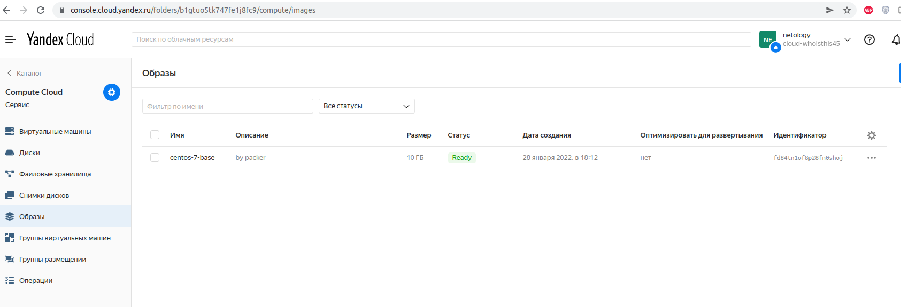
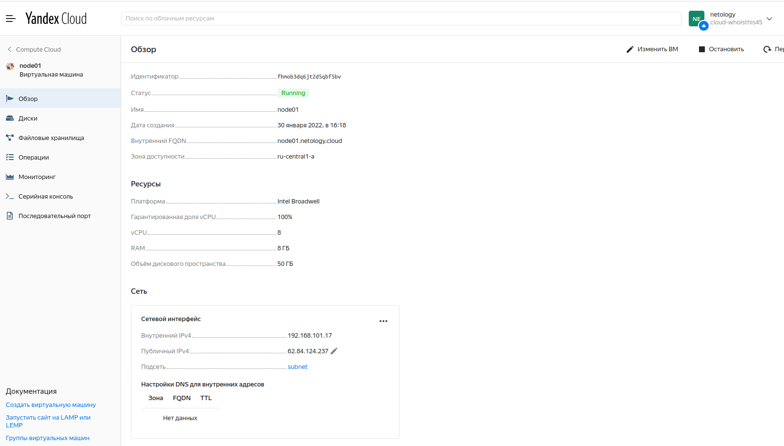
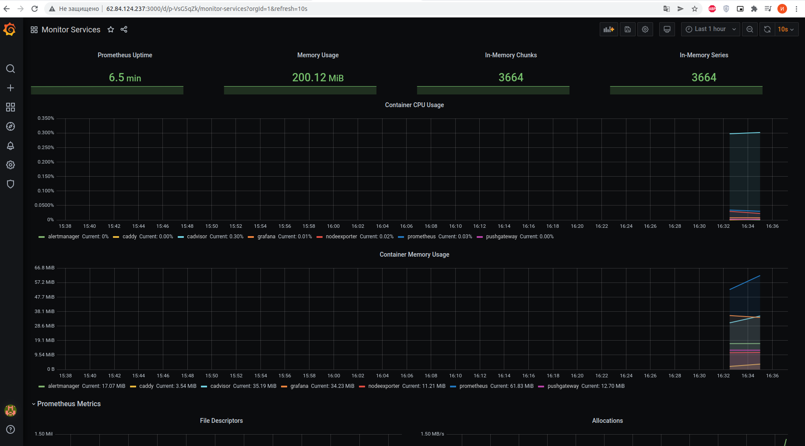
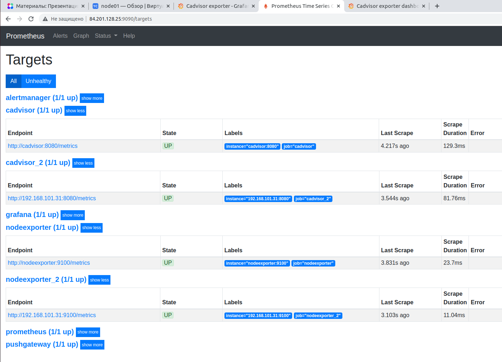
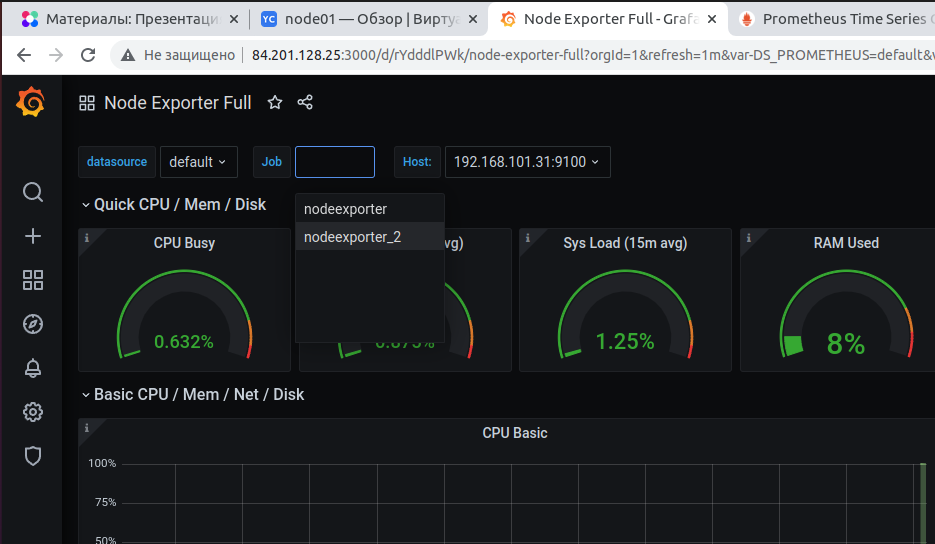
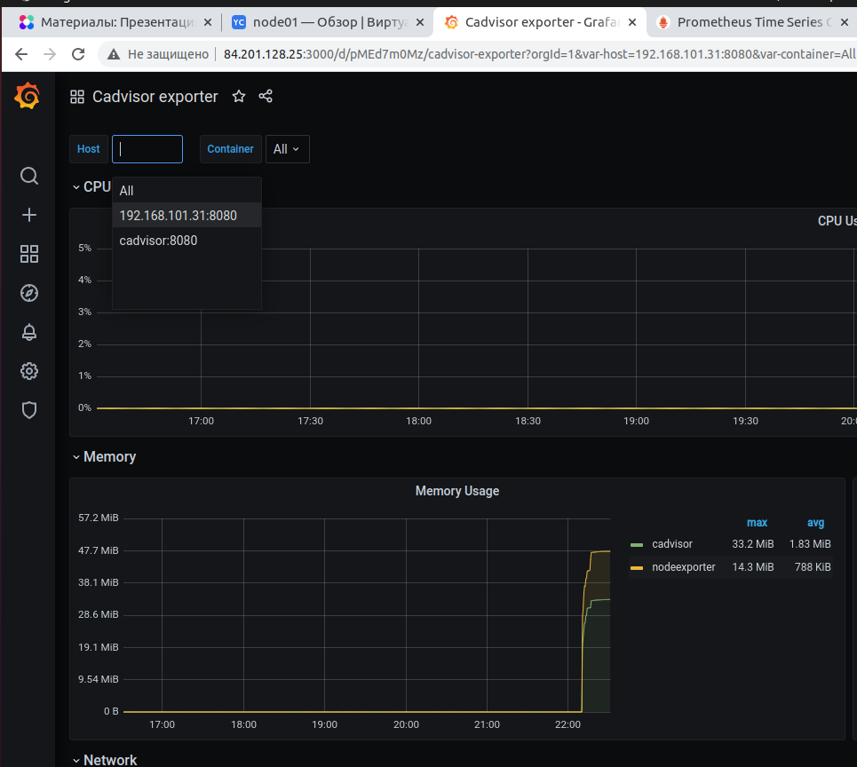

## Задача 1

Создать собственный образ операционной системы с помощью Packer.

Для получения зачета, вам необходимо предоставить:
- Скриншот страницы, как на слайде из презентации (слайд 37).

### Ответ:
```bash
$ curl https://storage.yandexcloud.net/yandexcloud-yc/install.sh | bash
$ yc init
$ yc vpc network create
$ yc vpc subnet create
$ sudo apt install packer
$ packer validate centos-7-base.json
$ packer build centos-7-base.json

Build 'yandex' finished after 2 minutes 12 seconds.

==> Wait completed after 2 minutes 12 seconds

==> Builds finished. The artifacts of successful builds are:
--> yandex: A disk image was created: centos-7-base (id: fd84tn1of8p28fn0shoj) with family name centos

$ yc compute image list

+----------------------+---------------+--------+----------------------+--------+
|          ID          |     NAME      | FAMILY |     PRODUCT IDS      | STATUS |
+----------------------+---------------+--------+----------------------+--------+
| fd84tn1of8p28fn0shoj | centos-7-base | centos | f2e6u62hbpkah20ftmhi | READY  |
+----------------------+---------------+--------+----------------------+--------+
```

<p align="center">
  
</p>

## Задача 2

Создать вашу первую виртуальную машину в Яндекс.Облаке.

Для получения зачета, вам необходимо предоставить:
- Скриншот страницы свойств созданной ВМ, как на примере ниже:

<p align="center">
  
</p>

### Ответ:
```bash
curl -fsSL https://apt.releases.hashicorp.com/gpg | sudo apt-key add -
sudo apt-add-repository "deb [arch=amd64] https://apt.releases.hashicorp.com $(lsb_release -cs) main"
sudo apt-get update && sudo apt-get install terraform


https://cloud.yandex.ru/docs/iam/operations/iam-token/create-for-sa#via-cli

terraform$ yc iam key create --service-account-name netology --output key.json
yc iam create-token

terraform init
terraform plan
yc vpc subnet delete --name my-yc-subnet-a && yc vpc network delete --name my-yc-network
terraform apply -auto-approve

Outputs:

external_ip_address_node01_yandex_cloud = "62.84.124.237"
internal_ip_address_node01_yandex_cloud = "192.168.101.17"
```
<p align="center">
  
</p>

## Задача 3

Создать ваш первый готовый к боевой эксплуатации компонент мониторинга, состоящий из стека микросервисов.

Для получения зачета, вам необходимо предоставить:
- Скриншот работающего веб-интерфейса Grafana с текущими метриками, как на примере ниже
<p align="center">
  
</p>

### Ответ:
```bash
ansible-playbook provision.yml 

ansible$ ssh centos@62.84.124.237
[centos@node01 ~]$ ls
[centos@node01 ~]$ sudo -i
[root@node01 ~]# cd /opt/stack/
[root@node01 stack]# docker-compose ps
    Name                  Command                  State                                                   Ports                                             
-------------------------------------------------------------------------------------------------------------------------------------------------------------
alertmanager   /bin/alertmanager --config ...   Up             9093/tcp                                                                                      
caddy          /sbin/tini -- caddy -agree ...   Up             0.0.0.0:3000->3000/tcp, 0.0.0.0:9090->9090/tcp, 0.0.0.0:9091->9091/tcp, 0.0.0.0:9093->9093/tcp
cadvisor       /usr/bin/cadvisor -logtostderr   Up (healthy)   8080/tcp                                                                                      
grafana        /run.sh                          Up             3000/tcp                                                                                      
nodeexporter   /bin/node_exporter --path. ...   Up             9100/tcp                                                                                      
prometheus     /bin/prometheus --config.f ...   Up             9090/tcp                                                                                      
pushgateway    /bin/pushgateway                 Up             9091/tcp  
```
<p align="center">
  
</p>

## Задача 4 (*)

Создать вторую ВМ и подключить её к мониторингу развёрнутому на первом сервере.

Для получения зачета, вам необходимо предоставить:
- Скриншот из Grafana, на котором будут отображаться метрики добавленного вами сервера.


### Ответ:
```bash
# добавил node02.tf в terraform
# но пришлось удалить 1ую виртуалку, что бы поднялись две виртуалки, была ошибка yc об ограничении сети.
# спустя долгие мучения(5hours), увидел файл docker-compose.exporter.yaml))) и сделал отдельный ansible02

# reload prometheus
curl -s -u admin -XPOST localhost:9090/-/reload
```
```json
# ip cloud machine
    "external_ip_address_node01_yandex_cloud": {
      "value": "84.201.128.25",
      "type": "string"
    },
    "external_ip_address_node02_yandex_cloud": {
      "value": "84.201.159.47",
      "type": "string"
    },
    "internal_ip_address_node01_yandex_cloud": {
      "value": "192.168.101.11",
      "type": "string"
    },
    "internal_ip_address_node02_yandex_cloud": {
      "value": "192.168.101.31",
      "type": "string"
    }
```
<p align="center">
  
</p>

<p align="center">
  
</p>

<p align="center">
  
</p>