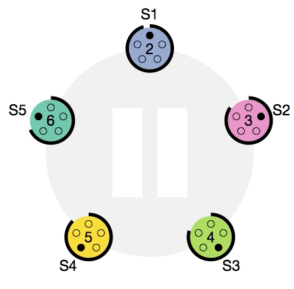
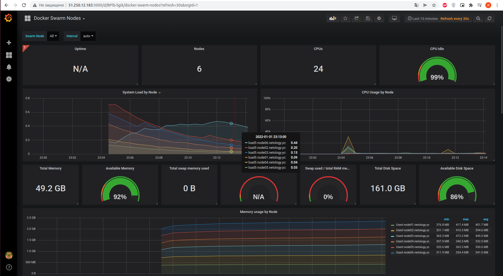
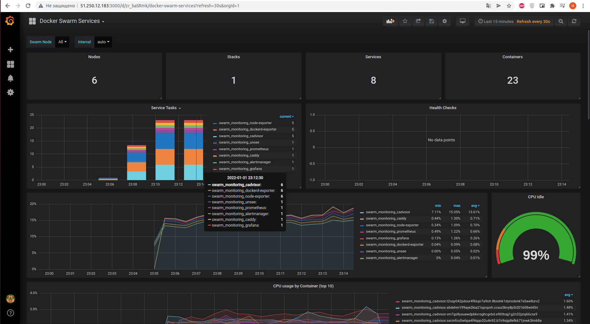

## Задача 1

Дайте письменые ответы на следующие вопросы:

- В чём отличие режимов работы сервисов в Docker Swarm кластере: replication и global?
- Какой алгоритм выбора лидера используется в Docker Swarm кластере?
- Что такое Overlay Network?

### Ответ:
```text
- В чём отличие режимов работы сервисов в Docker Swarm кластере: replication и global?

В краце, реплика на конкретное количество нод, а глобал на все.

Replication
Для реплицированного сервиса мы указываем, сколько идентичных задач мы хотим запустить.
Например, мы решили развернуть сервис HTTP с тремя репликами, каждая из которых обслуживает один и тот же контент.

Global
Сервис, который запускает одну задачу на каждой ноде. Предварительно заданного количества задач нет.
Каждый раз, когда мы добавляете ноду в swarm, оркестратор создает задачу, а планировщик назначает задачу новой ноде.
По официальной документации, хорошими кандидатами на роль глобальных сервисов являются агенты мониторинга,
антивирусные сканеры или другие типы контейнеров, которые мы хотим запустить на каждой ноде в swarm. 
```
```text
- Какой алгоритм выбора лидера используется в Docker Swarm кластере?

Лидер нода выбирается из управляючих нод путем Raft согласованного алгоритма.
Сам Raft-алгоритм имеет ограничение на количество управляющих нод.
Распределенные решения должны быть одобрены большинством управляющих узлов, называемых кворумом.
Это означает, что рекомендуется нечетное количество управляющих узлов.

https://raft.github.io/
```
<p align="center">
  
</p>

```text
- Что такое Overlay Network?

Оверлейная сеть - это многоуровневая компьютерная сеть поверх другой сети.

Overlay-сети используются в контексте кластеров (Docker Swarm), где виртуальная сеть, 
которую используют контейнеры, связывает несколько физических хостов, на которых запущен Docker. 
Когда вы запускаете контейнер на swarm-кластере (как часть сервиса), множество сетей присоединяется по умолчанию,
и каждая из них соответствует разным требованиям связи.

Overlay-сеть создает подсеть, которую могут использовать контейнеры в разных хостах swarm-кластера.
Контейнеры на разных физических хостах могут обмениваться данными по overlay-сети (если все они прикреплены к одной сети).
```
## Задача 2

Создать ваш первый Docker Swarm кластер в Яндекс.Облаке

Для получения зачета, вам необходимо предоставить скриншот из терминала (консоли), с выводом команды:
``` 
docker node ls
```

### Ответ:
```bash
$ yd init
$ yc vpc network create
$ yc vpc subnet create --range 192.168.101.0/24 --network-id ***
$ packer validate centos-7-base.json
$ packer build centos-7-base.json
$ yc compute image list
+----------------------+---------------+--------+----------------------+--------+
|          ID          |     NAME      | FAMILY |     PRODUCT IDS      | STATUS |
+----------------------+---------------+--------+----------------------+--------+
| fd88jm1mhmmr329m4j1f | centos-7-base | centos | f2eacrudv331nbat9ehb | READY  |
+----------------------+---------------+--------+----------------------+--------+


$ yc vpc subnet delete --id *** && yc vpc network delete --id ***
terraform$ yc iam key create --service-account-name netology --output key.json
$ yc iam create-token
$ terraform init
$ terraform plan
$ terraform apply -auto-approve
#terraform destroy -auto-approve

Apply complete! Resources: 13 added, 0 changed, 0 destroyed.

Outputs:

external_ip_address_node01 = "51.250.12.183"
external_ip_address_node02 = "51.250.1.104"
external_ip_address_node03 = "51.250.15.151"
external_ip_address_node04 = "51.250.11.210"
external_ip_address_node05 = "51.250.0.200"
external_ip_address_node06 = "51.250.14.115"
internal_ip_address_node01 = "192.168.101.11"
internal_ip_address_node02 = "192.168.101.12"
internal_ip_address_node03 = "192.168.101.13"
internal_ip_address_node04 = "192.168.101.14"
internal_ip_address_node05 = "192.168.101.15"
internal_ip_address_node06 = "192.168.101.16"

$ ssh centos@51.250.12.183
[centos@node01 ~]$ sudo -i
[root@node01 ~]# docker node ls
ID                            HOSTNAME             STATUS    AVAILABILITY   MANAGER STATUS   ENGINE VERSION
sxcmfcu5whpa4f4qqo32u4n92 *   node01.netology.yc   Ready     Active         Leader           20.10.12
s6dehm199aye2kia21xprqorh     node02.netology.yc   Ready     Active         Reachable        20.10.12
ttisg7bc9fkrws3vn901vkg80     node03.netology.yc   Ready     Active         Reachable        20.10.12
hpp3qf2qst6erejq4vevycrfe     node04.netology.yc   Ready     Active                          20.10.12
vm7gs8ysuawdpbkvrsghcgvbd     node05.netology.yc   Ready     Active                          20.10.12
t2oqy042pdour4f6lujn7a9oh     node06.netology.yc   Ready     Active                          20.10.12
```

## Задача 3

Создать ваш первый, готовый к боевой эксплуатации кластер мониторинга, состоящий из стека микросервисов.

Для получения зачета, вам необходимо предоставить скриншот из терминала (консоли), с выводом команды:
```
docker service ls
```
### Ответ:
```bash
[root@node01 ~]# docker service ls
ID             NAME                                MODE         REPLICAS   IMAGE                                          PORTS
rjrwmptmkm19   swarm_monitoring_alertmanager       replicated   1/1        stefanprodan/swarmprom-alertmanager:v0.14.0    
l4d3n6euarcm   swarm_monitoring_caddy              replicated   1/1        stefanprodan/caddy:latest                      *:3000->3000/tcp, *:9090->9090/tcp, *:9093-9094->9093-9094/tcp
oqv1qexylc3j   swarm_monitoring_cadvisor           global       6/6        google/cadvisor:latest                         
9ervn5fchlz4   swarm_monitoring_dockerd-exporter   global       6/6        stefanprodan/caddy:latest                      
zzzz2e2mqy6n   swarm_monitoring_grafana            replicated   1/1        stefanprodan/swarmprom-grafana:5.3.4           
jfwsj3e9pgnx   swarm_monitoring_node-exporter      global       6/6        stefanprodan/swarmprom-node-exporter:v0.16.0   
s8o5xio4juwt   swarm_monitoring_prometheus         replicated   1/1        stefanprodan/swarmprom-prometheus:v2.5.0       
rzqyxoawb863   swarm_monitoring_unsee              replicated   1/1        cloudflare/unsee:v0.8.0    
```
<p align="center">
  
</p>

<p align="center">
  
</p>

## Задача 4 (*)

Выполнить на лидере Docker Swarm кластера команду (указанную ниже) и дать письменное описание её функционала, что она делает и зачем она нужна:
```
# см.документацию: https://docs.docker.com/engine/swarm/swarm_manager_locking/
docker swarm update --autolock=true
```
### Ответ:
```bash
[root@node01 ~]# docker swarm update --autolock=true
Swarm updated.
To unlock a swarm manager after it restarts, run the `docker swarm unlock`
command and provide the following key:

    SWMKEY-1-PFcIFoXjOUmZnS2XpJH1bKAm6SrtBIvquwlljF+29FA

Please remember to store this key in a password manager, since without it you
will not be able to restart the manager.

[root@node01 ~]# sudo service docker restart
Redirecting to /bin/systemctl restart docker.service

[root@node01 ~]# docker service ls
Error response from daemon: Swarm is encrypted and needs to be unlocked before it can be used. Please use "docker swarm unlock" to unlock it.

[root@node01 ~]# docker swarm unlock
Please enter unlock key: SWMKEY-1-PFcIFoXjOUmZnS2XpJH1bKAm6SrtBIvquwlljF+29FA

[root@node01 ~]# docker service ls
ID             NAME                                MODE         REPLICAS   IMAGE                                          PORTS
rjrwmptmkm19   swarm_monitoring_alertmanager       replicated   1/1        stefanprodan/swarmprom-alertmanager:v0.14.0    
l4d3n6euarcm   swarm_monitoring_caddy              replicated   1/1        stefanprodan/caddy:latest                      *:3000->3000/tcp, *:9090->9090/tcp, *:9093-9094->9093-9094/tcp
oqv1qexylc3j   swarm_monitoring_cadvisor           global       6/6        google/cadvisor:latest                         
9ervn5fchlz4   swarm_monitoring_dockerd-exporter   global       6/6        stefanprodan/caddy:latest                      
zzzz2e2mqy6n   swarm_monitoring_grafana            replicated   1/1        stefanprodan/swarmprom-grafana:5.3.4           
jfwsj3e9pgnx   swarm_monitoring_node-exporter      global       6/6        stefanprodan/swarmprom-node-exporter:v0.16.0   
s8o5xio4juwt   swarm_monitoring_prometheus         replicated   1/1        stefanprodan/swarmprom-prometheus:v2.5.0       
rzqyxoawb863   swarm_monitoring_unsee              replicated   1/1        cloudflare/unsee:v0.8.0  
```

```text
Команда ставит блокировку на swarm при запуске.

Журналы Raft, используемые менеджерами, по умолчанию зашифрованы на диске.
Это шифрование в состоянии покоя защищает конфигурацию и данные вашего сервиса от злоумышленников,
которые получают доступ к зашифрованным журналам Raft.
Одна из причин, по которой эта функция была введена, заключалась в поддержке функции секретов Docker.

При перезапуске Docker в память каждого узла менеджера загружаются как ключ TLS,
используемые для шифрования связи между узлами swarm, так и ключ, используемый для шифрования и расшифровки журналов Raft на диске.
Docker может защитить общий ключ шифрования TLS и ключ, используемый для шифрования и расшифровки журналов Raft в состоянии покоя,
позволяя вам стать владельцем этих ключей и требовать ручной разблокировки ваших менеджеров.
Эта функция называется автоблокировкой.

Когда Docker перезапустится, вы должны сначала разблокировать swarm, используя ключ шифрования, сгенерированный Docker.
Вы можете изменить этот ключ шифрования в любое время.
```
