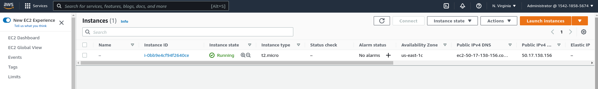
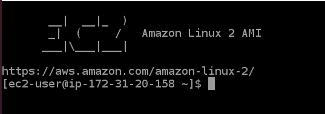
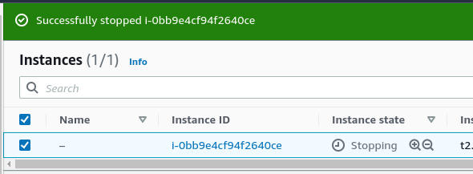
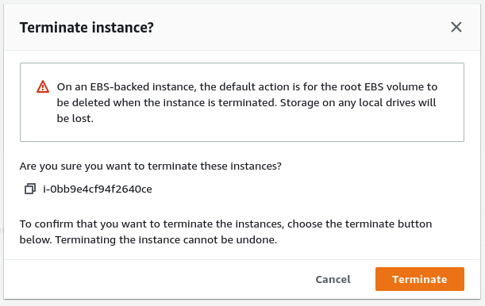

# Домашнее задание к занятию "7.2. Облачные провайдеры и синтаксис Terraform."

## Задача 1 (вариант с AWS). Регистрация в aws и знакомство с основами (необязательно, но крайне желательно).

Остальные задания можно будет выполнять и без этого аккаунта, но с ним можно будет увидеть полный цикл процессов. 

AWS предоставляет достаточно много бесплатных ресурсов в первый год после регистрации, подробно описано [здесь](https://aws.amazon.com/free/).
1. Создайте аккаут aws.
1. Установите [aws-cli](https://aws.amazon.com/cli/)
1. Выполните первичную настройку [aws-cli](https://docs.aws.amazon.com/cli/latest/userguide/cli-configure-quickstart.html)
1. Создайте IAM политику для терраформа c правами
    * AmazonEC2FullAccess
    * AmazonS3FullAccess
    * AmazonDynamoDBFullAccess
    * AmazonRDSFullAccess
    * CloudWatchFullAccess
    * IAMFullAccess
1. Добавьте переменные окружения 
    ```
    export AWS_ACCESS_KEY_ID=(your access key id)
    export AWS_SECRET_ACCESS_KEY=(your secret access key)
    ```
1. Создайте, остановите и удалите ec2 инстанс (любой с пометкой `free tier`) через веб интерфейс. 

В виде результата задания приложите вывод команды `aws configure list`.

## Задача 1 (Вариант с Yandex.Cloud). Регистрация в ЯО и знакомство с основами (необязательно, но крайне желательно).

1. Подробная инструкция на русском языке содержится [здесь](https://cloud.yandex.ru/docs/solutions/infrastructure-management/terraform-quickstart).
2. Обратите внимание на период бесплатного использования после регистрации аккаунта. 
3. Используйте раздел "Подготовьте облако к работе" для регистрации аккаунта. Далее раздел "Настройте провайдер" для подготовки
базового терраформ конфига.
4. Воспользуйтесь [инструкцией](https://registry.terraform.io/providers/yandex-cloud/yandex/latest/docs) на сайте терраформа, что бы 
не указывать авторизационный токен в коде, а терраформ провайдер брал его из переменных окружений.

## Ответ:
### AWS:
```text
Created root account
------------------------------------------------------------------------------------------------------------------------
https://docs.aws.amazon.com/cli/latest/userguide/getting-started-prereqs.html

Create an Identity and Access Management (IAM) user account and Permissions
User:       Administrator
Group:      Administrators
Policies:   AdministratorAccess
            AmazonEC2FullAccess
            AmazonS3FullAccess
            AmazonDynamoDBFullAccess
            AmazonRDSFullAccess
            CloudWatchFullAccess
            IAMFullAccess

Create an access key ID and secret access key .csv
------------------------------------------------------------------------------------------------------------------------
https://docs.aws.amazon.com/cli/latest/userguide/getting-started-install.html

curl "https://awscli.amazonaws.com/awscli-exe-linux-x86_64.zip" -o "awscliv2.zip"
unzip awscliv2.zip
sudo ./aws/install

ivan@ivan-N76VZ:$ aws --version
aws-cli/2.5.1 Python/3.9.11 Linux/5.13.0-39-generic exe/x86_64.ubuntu.20 prompt/off
------------------------------------------------------------------------------------------------------------------------
https://docs.aws.amazon.com/cli/latest/userguide/getting-started-quickstart.html

aws configure
aws configure set region us-west-2
aws configure import --csv file://02_VM_DB_Terraform/03_Terraform/7.2/aws/Administrator_accessKeys.csv

or

export AWS_ACCESS_KEY_ID=AKIA**********627U
export AWS_SECRET_ACCESS_KEY=9byrYyUoe6H6m5****************eJWf
export AWS_DEFAULT_REGION=us-west-2
------------------------------------------------------------------------------------------------------------------------
aws configure list
      Name                    Value             Type    Location
      ----                    -----             ----    --------
   profile                <not set>             None    None
access_key     ****************627U              env    
secret_key     ****************eJWf              env    
    region                us-west-2              env    ['AWS_REGION', 'AWS_DEFAULT_REGION']
```
###Create instance
<p align="center">
  
</p>

###
###Web connection instance
<p align="center">
  
</p>

###
###Stop instance
<p align="center">
  
</p>

###
###Delete (terminate) instance
<p align="center">
  
</p>

###
### YC
```text
install cli
https://cloud.yandex.ru/docs/cli/operations/install-cli

curl https://storage.yandexcloud.net/yandexcloud-yc/install.sh | bash
------------------------------------------------------------------------------------------------------------------------
authentication
https://cloud.yandex.ru/docs/cli/operations/authentication/user

yc init
------------------------------------------------------------------------------------------------------------------------
terraform Yandex.Cloud provider
https://registry.terraform.io/providers/yandex-cloud/yandex/latest/docs

export YC_TOKEN=AQAAAAAGJ9*****
export YC_CLOUD_ID=b1ghqnp2h5j***
export YC_FOLDER_ID=b1gdeou2apr**

or key file

yc iam service-account create admin
yc iam service-account add-access-binding admin --role admin --service-account-name admin
yc iam key create --service-account-name admin --output key.json
yc config profile create admin-profile
yc config set service-account-key key.json

export YC_SERVICE_ACCOUNT_KEY_FILE=/path_to_service_account_key_file
service_account_key_file = "path_to_service_account_key_file"

or token service user

yc iam create-token
------------------------------------------------------------------------------------------------------------------------

yc config profile get default
token: AQAAAAAGJ9syAATuwc5**
cloud-id: b1ghqnp2h5jhkdi**
folder-id: b1gdeou2anihbe**
```

## Задача 2. Создание aws ec2 или yandex_compute_instance через терраформ. 

1. В каталоге `terraform` вашего основного репозитория, который был создан в начале курсе, создайте файл `main.tf` и `versions.tf`.
2. Зарегистрируйте провайдер 
   1. для [aws](https://registry.terraform.io/providers/hashicorp/aws/latest/docs). В файл `main.tf` добавьте
   блок `provider`, а в `versions.tf` блок `terraform` с вложенным блоком `required_providers`. Укажите любой выбранный вами регион 
   внутри блока `provider`.
   2. либо для [yandex.cloud](https://registry.terraform.io/providers/yandex-cloud/yandex/latest/docs). Подробную инструкцию можно найти 
   [здесь](https://cloud.yandex.ru/docs/solutions/infrastructure-management/terraform-quickstart).
3. Внимание! В гит репозиторий нельзя пушить ваши личные ключи доступа к аккаунту. Поэтому в предыдущем задании мы указывали
их в виде переменных окружения. 
4. В файле `main.tf` воспользуйтесь блоком `data "aws_ami"` для поиска ami образа последнего Ubuntu.  
5. В файле `main.tf` создайте ресурс 
   1. либо [ec2 instance](https://registry.terraform.io/providers/hashicorp/aws/latest/docs/resources/instance).
   Постарайтесь указать как можно больше параметров для его определения. Минимальный набор параметров указан в первом блоке 
   `Example Usage`, но желательно, указать большее количество параметров.
   2. либо [yandex_compute_image](https://registry.terraform.io/providers/yandex-cloud/yandex/latest/docs/resources/compute_image).
6. Также в случае использования aws:
   1. Добавьте data-блоки `aws_caller_identity` и `aws_region`.
   2. В файл `outputs.tf` поместить блоки `output` с данными об используемых в данный момент: 
       * AWS account ID,
       * AWS user ID,
       * AWS регион, который используется в данный момент, 
       * Приватный IP ec2 инстансы,
       * Идентификатор подсети в которой создан инстанс.  
7. Если вы выполнили первый пункт, то добейтесь того, что бы команда `terraform plan` выполнялась без ошибок. 


В качестве результата задания предоставьте:
1. Ответ на вопрос: при помощи какого инструмента (из разобранных на прошлом занятии) можно создать свой образ ami?
1. Ссылку на репозиторий с исходной конфигурацией терраформа.  

## Ответ:
### AWS
```url
https://github.com/keqpup232/DevOpsNetology/tree/master/02_VM_DB_Terraform/03_Terraform/7.2/aws
```
### YC
```url
https://github.com/keqpup232/DevOpsNetology/tree/master/02_VM_DB_Terraform/03_Terraform/7.2/yc
```