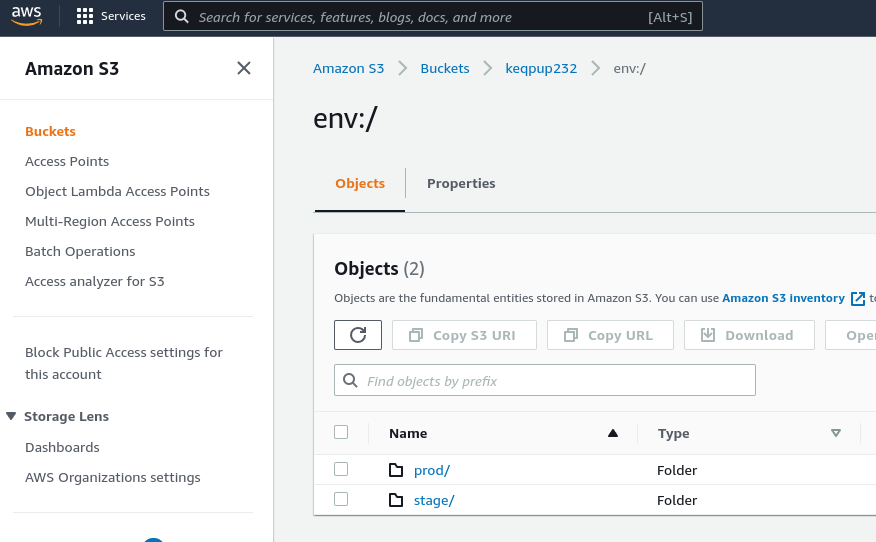
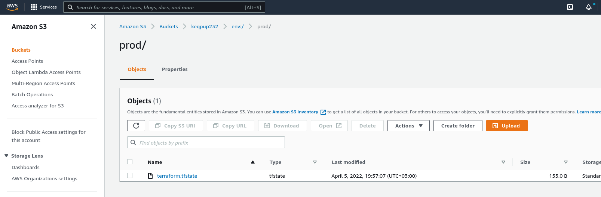
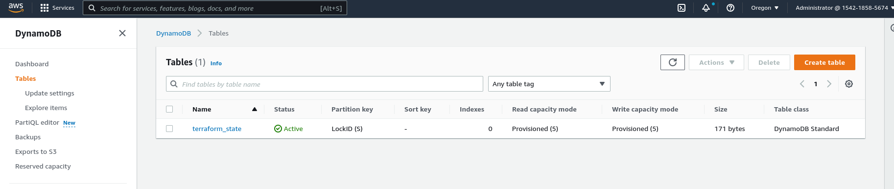
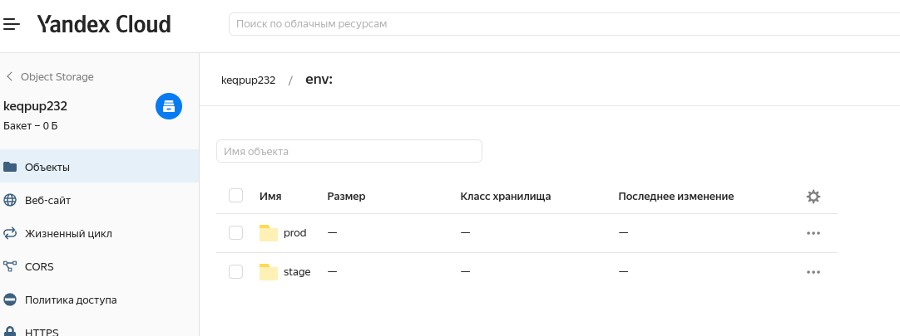
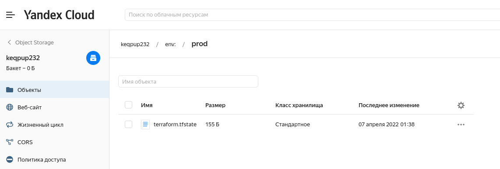

## Задача 1. Создадим бэкэнд в S3 (необязательно, но крайне желательно).

Если в рамках предыдущего задания у вас уже есть аккаунт AWS, то давайте продолжим знакомство со взаимодействием
терраформа и aws. 

1. Создайте s3 бакет, iam роль и пользователя от которого будет работать терраформ. Можно создать отдельного пользователя,
а можно использовать созданного в рамках предыдущего задания, просто добавьте ему необходимы права, как описано 
[здесь](https://www.terraform.io/docs/backends/types/s3.html).
1. Зарегистрируйте бэкэнд в терраформ проекте как описано по ссылке выше. 

##Ответ:
###AWS
Хорошая [ссылочка](https://angelo-malatacca83.medium.com/aws-terraform-s3-and-dynamodb-backend-3b28431a76c1) мануала на создание бека в terraform
```bash
# cli create bucket
aws s3api create-bucket \
    --bucket keqpup232 \
    --region us-west-2 \
    --object-ownership BucketOwnerEnforced \
    --create-bucket-configuration LocationConstraint=us-west-2
    
# result
{
    "Location": "http://keqpup232.s3.amazonaws.com/"
}

# cli create dynamodb table
aws dynamodb create-table \
    --table-name terraform_state \
    --attribute-definitions AttributeName=LockID,AttributeType=S \
    --key-schema AttributeName=LockID,KeyType=HASH \
    --provisioned-throughput ReadCapacityUnits=5,WriteCapacityUnits=5
    
# result
{
    "TableDescription": {
        "AttributeDefinitions": [
            {
                "AttributeName": "LockID",
                "AttributeType": "S"
            }
        ],
        "TableName": "terraform_state",
        "KeySchema": [
            {
                "AttributeName": "LockID",
                "KeyType": "HASH"
            }
        ],
        "TableStatus": "CREATING",
        "CreationDateTime": "2022-04-05T19:40:24.446000+03:00",
        "ProvisionedThroughput": {
            "NumberOfDecreasesToday": 0,
            "ReadCapacityUnits": 5,
            "WriteCapacityUnits": 5
        },
        "TableSizeBytes": 0,
        "ItemCount": 0,
        "TableArn": "arn:aws:dynamodb:us-west-2:154218585674:table/terraform_state1",
        "TableId": "be10e7ad-236c-4f97-ba9c-f6a66544a0a0"
    }
} 
```

###AWS Bucket
<p align="center">
  
</p>

###
###AWS Workspace terraform.tfstate
<p align="center">
  
</p>

###
###AWS DynamoDB table
<p align="center">
  
</p>


###
##YC
```bash
cli command так и не нашел на создание бакета( создал в вебе

# need create key from user for connect backend
yc iam access-key create --service-account-name admin
access_key:
  id: ajekbtt020
  service_account_id: aje4phfg8
  created_at: "2022-04-06T22:32:59.626676303Z"
  key_id: YCAJEksfRdBy
secret: YCMjtIkcy5333HmMjRCBTO
```

###YC Bucket
<p align="center">
  
</p>

###
###YC Workspace terraform.tfstate
<p align="center">
  
</p>


## Задача 2. Инициализируем проект и создаем воркспейсы. 

1. Выполните `terraform init`:
    * если был создан бэкэнд в S3, то терраформ создат файл стейтов в S3 и запись в таблице 
dynamodb.
    * иначе будет создан локальный файл со стейтами.  
1. Создайте два воркспейса `stage` и `prod`.
1. В уже созданный `aws_instance` добавьте зависимость типа инстанса от вокспейса, что бы в разных ворскспейсах 
использовались разные `instance_type`.
1. Добавим `count`. Для `stage` должен создаться один экземпляр `ec2`, а для `prod` два. 
1. Создайте рядом еще один `aws_instance`, но теперь определите их количество при помощи `for_each`, а не `count`.
1. Что бы при изменении типа инстанса не возникло ситуации, когда не будет ни одного инстанса добавьте параметр
жизненного цикла `create_before_destroy = true` в один из рессурсов `aws_instance`.
1. При желании поэкспериментируйте с другими параметрами и рессурсами.

В виде результата работы пришлите:
* Вывод команды `terraform workspace list`.
* Вывод команды `terraform plan` для воркспейса `prod`.

##Ответ:
```bash
terraform workspace new stage
terraform workspace new prod

terraform workspace list
  default
  prod
* stage

terraform workspace select prod
Switched to workspace "prod".

terraform plan -no-color > tfplan.txt
```
Ссылки на репозитории с исходной конфигурацией терраформа + tfplan.  
### [AWS Terraform](https://github.com/keqpup232/DevOpsNetology/tree/master/02_VM_DB_Terraform/03_Terraform/7.3/aws)
### [AWS Terraform plan](https://github.com/keqpup232/DevOpsNetology/blob/master/02_VM_DB_Terraform/03_Terraform/7.3/aws/tfplan.txt)

---

### [YC Terraform](https://github.com/keqpup232/DevOpsNetology/tree/master/02_VM_DB_Terraform/03_Terraform/7.3/yc)
### [YC Terraform plan](https://github.com/keqpup232/DevOpsNetology/blob/master/02_VM_DB_Terraform/03_Terraform/7.3/yc/tfplan.txt)

