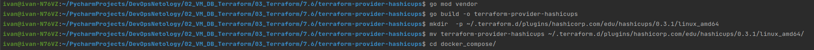
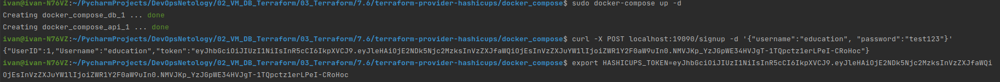
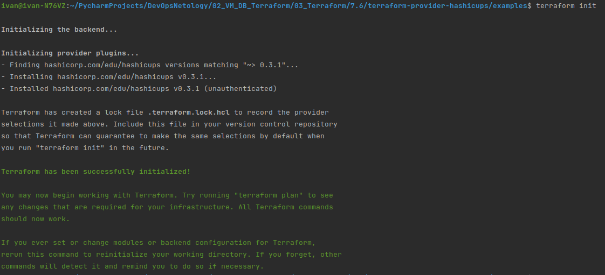

# Домашнее задание к занятию "7.6. Написание собственных провайдеров для Terraform."

Бывает, что
* общедоступная документация по терраформ ресурсам не всегда достоверна,
* в документации не хватает каких-нибудь правил валидации или неточно описаны параметры,
* понадобиться использовать провайдер без официальной документации,
* может возникнуть необходимость написать свой провайдер для системы используемой в ваших проектах.

## Задача 1.
Давайте потренируемся читать исходный код AWS провайдера, который можно склонировать от сюда:
[https://github.com/hashicorp/terraform-provider-aws.git](https://github.com/hashicorp/terraform-provider-aws.git).
Просто найдите нужные ресурсы в исходном коде и ответы на вопросы станут понятны.


1. Найдите, где перечислены все доступные `resource` и `data_source`, приложите ссылку на эти строки в коде на
гитхабе.
1. Для создания очереди сообщений SQS используется ресурс `aws_sqs_queue` у которого есть параметр `name`.
    * С каким другим параметром конфликтует `name`? Приложите строчку кода, в которой это указано.
    * Какая максимальная длина имени?
    * Какому регулярному выражению должно подчиняться имя?

## Ответ:

1. где перечислены все доступные `resource` и `data_source`
   * resource https://github.com/hashicorp/terraform-provider-aws/blob/main/internal/provider/provider.go#L871
   * data_source https://github.com/hashicorp/terraform-provider-aws/blob/main/internal/provider/provider.go#L412
2. С каким другим параметром конфликтует `name`?
   * ConflictsWith: []string{"name_prefix"} https://github.com/hashicorp/terraform-provider-aws/blob/main/internal/service/sqs/queue.go#L87
3. Какая максимальная длина имени?
   * не нашел ограничений в main ветке
4. Какому регулярному выражению должно подчиняться имя?
   * не нашел ругелярку в main ветке

## Задача 2. (Не обязательно)
В рамках вебинара и презентации мы разобрали как создать свой собственный провайдер на примере кофемашины.
Также вот официальная документация о создании провайдера:
[https://learn.hashicorp.com/collections/terraform/providers](https://learn.hashicorp.com/collections/terraform/providers).

1. Проделайте все шаги создания провайдера.
2. В виде результата приложение ссылку на исходный код.
3. Попробуйте скомпилировать провайдер, если получится то приложите снимок экрана с командой и результатом компиляции.

## Ответ:

Ссылка на код это репозиторий hashicups https://github.com/hashicorp/terraform-provider-hashicups


### build provider
<p align="center">
  
</p>

###
### up docker, create user and export key
<p align="center">
  
</p>

###
### terraform init
<p align="center">
  
</p>

###
### other command 
```bash
ivan@ivan-N76VZ:~/PycharmProjects/DevOpsNetology/02_VM_DB_Terraform/03_Terraform/7.6$ git clone https://github.com/hashicorp/terraform-provider-hashicups.git
Клонирование в «terraform-provider-hashicups»…
remote: Enumerating objects: 3482, done.
remote: Counting objects: 100% (132/132), done.
remote: Compressing objects: 100% (109/109), done.
remote: Total 3482 (delta 43), reused 71 (delta 18), pack-reused 3350
Получение объектов: 100% (3482/3482), 71.42 МиБ | 2.30 МиБ/с, готово.
Определение изменений: 100% (890/890), готово.
ivan@ivan-N76VZ:~/PycharmProjects/DevOpsNetology/02_VM_DB_Terraform/03_Terraform/7.6$ cd terraform-provider-hashicups/
ivan@ivan-N76VZ:~/PycharmProjects/DevOpsNetology/02_VM_DB_Terraform/03_Terraform/7.6/terraform-provider-hashicups$ go build -o terraform-provider-hashicups
ivan@ivan-N76VZ:~/PycharmProjects/DevOpsNetology/02_VM_DB_Terraform/03_Terraform/7.6/terraform-provider-hashicups$ go install github.com/goreleaser/goreleaser@latest
go: downloading github.com/goreleaser/goreleaser v1.7.0
***
go: downloading github.com/Azure/go-autorest/autorest/to v0.4.0
ivan@ivan-N76VZ:~/PycharmProjects/DevOpsNetology/02_VM_DB_Terraform/03_Terraform/7.6/terraform-provider-hashicups$ sudo snap install goreleaser --classic
goreleaser 1.7.0 от Carlos Alexandro Becker (caarlos0) установлен
ivan@ivan-N76VZ:~/PycharmProjects/DevOpsNetology/02_VM_DB_Terraform/03_Terraform/7.6/terraform-provider-hashicups$ make release
goreleaser release --rm-dist --snapshot --skip-publish  --skip-sign
   • releasing...     
   • loading config file       file=.goreleaser.yml
   • loading environment variables
   • getting and validating git state
      • building...               commit=103eaea3bb58843f7a39599d37cae81673c0a339 latest tag=v0.3.3
      • pipe skipped              error=disabled during snapshot mode
   • parsing tag      
   • running before hooks
      • running                   hook=go mod tidy
   • setting defaults 
   • snapshotting     
      • building snapshot...      version=0.3.3-SNAPSHOT-103eaea
   • checking distribution directory
   • loading go mod information
   • build prerequisites
   • writing effective config file
      • writing                   config=dist/config.yaml
   • building binaries
      • building                  binary=dist/terraform-provider-hashicups_darwin_arm64/terraform-provider-hashicups_v0.3.3-SNAPSHOT-103eaea
      ***
      • creating                  archive=dist/terraform-provider-hashicups_0.3.3-SNAPSHOT-103eaea_darwin_amd64.zip
   • calculating checksums
   • storing release metadata
      • writing                   file=dist/artifacts.json
      • writing                   file=dist/metadata.json
   • release succeeded after 250.50s
ivan@ivan-N76VZ:~/PycharmProjects/DevOpsNetology/02_VM_DB_Terraform/03_Terraform/7.6/terraform-provider-hashicups$ make install
go build -o terraform-provider-hashicups
mkdir -p ~/.terraform.d/plugins/hashicorp.com/edu/hashicups/0.3.1/darwin_amd64
mv terraform-provider-hashicups ~/.terraform.d/plugins/hashicorp.com/edu/hashicups/0.3.1/darwin_amd64
ivan@ivan-N76VZ:~/PycharmProjects/DevOpsNetology/02_VM_DB_Terraform/03_Terraform/7.6/terraform-provider-hashicups$ cd examples
ivan@ivan-N76VZ:~/PycharmProjects/DevOpsNetology/02_VM_DB_Terraform/03_Terraform/7.6/terraform-provider-hashicups/examples$ terraform init && terraform apply
Initializing modules...

Initializing the backend...

Initializing provider plugins...
- Finding hashicorp.com/edu/hashicups versions matching "~> 0.3.0"...
- Installing hashicorp.com/edu/hashicups v0.3.1...
- Installed hashicorp.com/edu/hashicups v0.3.1 (unauthenticated)

Terraform has created a lock file .terraform.lock.hcl to record the provider
selections it made above. Include this file in your version control repository
so that Terraform can guarantee to make the same selections by default when
you run "terraform init" in the future.

Terraform has been successfully initialized!

You may now begin working with Terraform. Try running "terraform plan" to see
any changes that are required for your infrastructure. All Terraform commands
should now work.

If you ever set or change modules or backend configuration for Terraform,
rerun this command to reinitialize your working directory. If you forget, other
commands will detect it and remind you to do so if necessary.

Terraform used the selected providers to generate the following execution plan. Resource actions are indicated with the following symbols:
  + create

Terraform will perform the following actions:

  # hashicups_order.edu will be created
  + resource "hashicups_order" "edu" {
      + id           = (known after apply)
      + last_updated = (known after apply)

      + items {
          + quantity = 2

          + coffee {
              + description = (known after apply)
              + id          = 3
              + image       = (known after apply)
              + name        = (known after apply)
              + price       = (known after apply)
              + teaser      = (known after apply)
            }
        }
      + items {
          + quantity = 3

          + coffee {
              + description = (known after apply)
              + id          = 2
              + image       = (known after apply)
              + name        = (known after apply)
              + price       = (known after apply)
              + teaser      = (known after apply)
            }
        }
    }

Plan: 1 to add, 0 to change, 0 to destroy.

Changes to Outputs:
  + edu_order   = {
      + id           = (known after apply)
      + items        = [
          + {
              + coffee   = [
                  + {
                      + description = (known after apply)
                      + id          = 3
                      + image       = (known after apply)
                      + name        = (known after apply)
                      + price       = (known after apply)
                      + teaser      = (known after apply)
                    },
                ]
              + quantity = 2
            },
          + {
              + coffee   = [
                  + {
                      + description = (known after apply)
                      + id          = 2
                      + image       = (known after apply)
                      + name        = (known after apply)
                      + price       = (known after apply)
                      + teaser      = (known after apply)
                    },
                ]
              + quantity = 3
            },
        ]
      + last_updated = (known after apply)
    }
  + first_order = {
      + id    = 1
      + items = []
    }
  + order       = {
      + id    = 1
      + items = []
    }
  + psl         = {
      + 1 = {
          + description = ""
          + id          = 1
          + image       = "/packer.png"
          + ingredients = [
              + {
                  + ingredient_id = 1
                },
              + {
                  + ingredient_id = 2
                },
              + {
                  + ingredient_id = 4
                },
            ]
          + name        = "Packer Spiced Latte"
          + price       = 350
          + teaser      = "Packed with goodness to spice up your images"
        }
    }

Do you want to perform these actions?
  Terraform will perform the actions described above.
  Only 'yes' will be accepted to approve.

  Enter a value: yes

hashicups_order.edu: Creating...
hashicups_order.edu: Creation complete after 1s [id=1]

Apply complete! Resources: 1 added, 0 changed, 0 destroyed.

Outputs:

edu_order = {
  "id" = "1"
  "items" = tolist([
    {
      "coffee" = tolist([
        {
          "description" = ""
          "id" = 3
          "image" = "/nomad.png"
          "name" = "Nomadicano"
          "price" = 150
          "teaser" = "Drink one today and you will want to schedule another"
        },
      ])
      "quantity" = 2
    },
    {
      "coffee" = tolist([
        {
          "description" = ""
          "id" = 2
          "image" = "/vault.png"
          "name" = "Vaulatte"
          "price" = 200
          "teaser" = "Nothing gives you a safe and secure feeling like a Vaulatte"
        },
      ])
      "quantity" = 3
    },
  ])
  "last_updated" = tostring(null)
}
first_order = {
  "id" = 1
  "items" = tolist([])
}
order = {
  "id" = 1
  "items" = tolist([])
}
psl = {
  "1" = {
    "description" = ""
    "id" = 1
    "image" = "/packer.png"
    "ingredients" = tolist([
      {
        "ingredient_id" = 1
      },
      {
        "ingredient_id" = 2
      },
      {
        "ingredient_id" = 4
      },
    ])
    "name" = "Packer Spiced Latte"
    "price" = 350
    "teaser" = "Packed with goodness to spice up your images"
  }
}
```