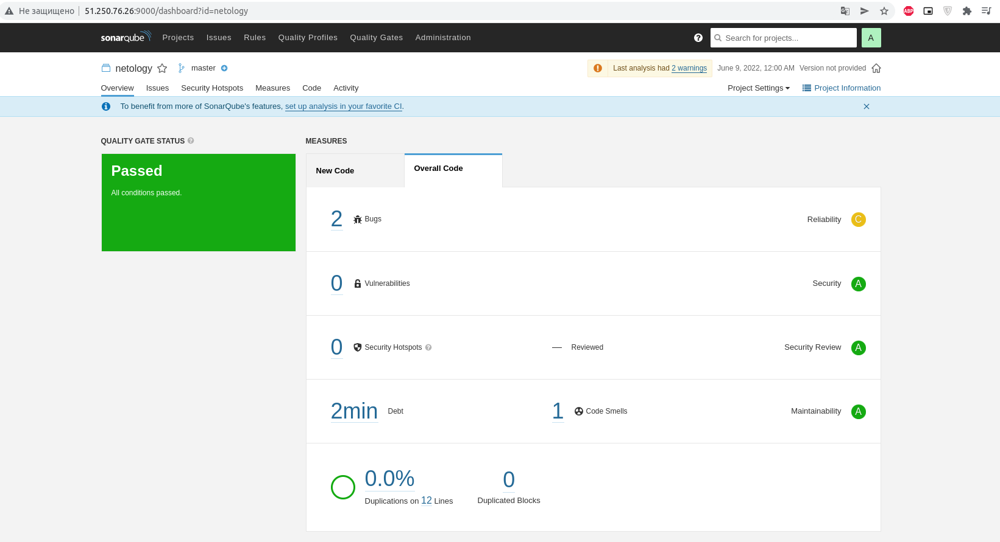
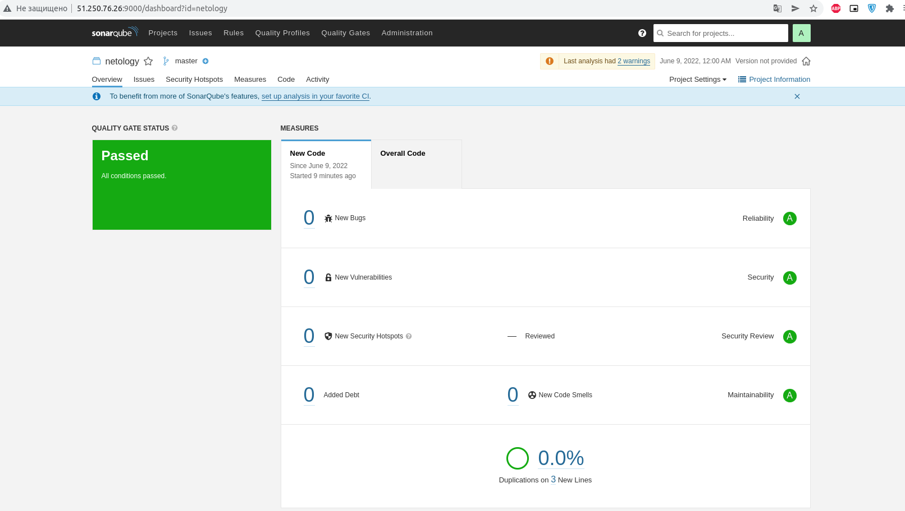
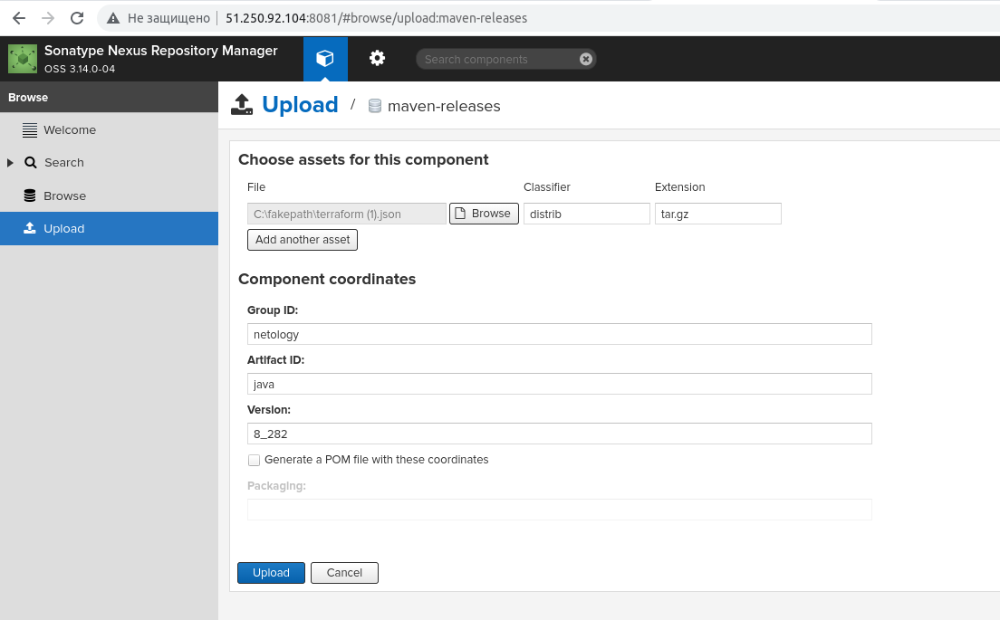
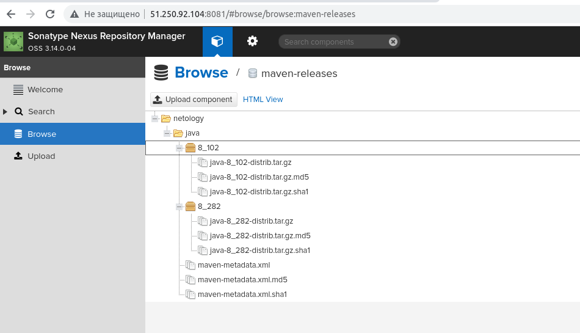

# Домашнее задание к занятию "09.03 CI\CD"

## Подготовка к выполнению

1. Создаём 2 VM в yandex cloud со следующими параметрами: 2CPU 4RAM Centos7(остальное по минимальным требованиям)
2. Прописываем в [inventory](./infrastructure/inventory/cicd/hosts.yml) [playbook'a](./infrastructure/site.yml) созданные хосты
3. Добавляем в [files](./infrastructure/files/) файл со своим публичным ключом (id_rsa.pub). Если ключ называется иначе - найдите таску в плейбуке, которая использует id_rsa.pub имя и исправьте на своё
4. Запускаем playbook, ожидаем успешного завершения
5. Проверяем готовность Sonarqube через [браузер](http://localhost:9000)
6. Заходим под admin\admin, меняем пароль на свой
7. Проверяем готовность Nexus через [бразуер](http://localhost:8081)
8. Подключаемся под admin\admin123, меняем пароль, сохраняем анонимный доступ

## Знакомоство с SonarQube

### Основная часть

1. Создаём новый проект, название произвольное
2. Скачиваем пакет sonar-scanner, который нам предлагает скачать сам sonarqube
3. Делаем так, чтобы binary был доступен через вызов в shell (или меняем переменную PATH или любой другой удобный вам способ)
4. Проверяем `sonar-scanner --version`
5. Запускаем анализатор против кода из директории [example](./example) с дополнительным ключом `-Dsonar.coverage.exclusions=fail.py`
6. Смотрим результат в интерфейсе
7. Исправляем ошибки, которые он выявил(включая warnings)
8. Запускаем анализатор повторно - проверяем, что QG пройдены успешно
9. Делаем скриншот успешного прохождения анализа, прикладываем к решению ДЗ

## Знакомство с Nexus

### Основная часть

1. В репозиторий `maven-public` загружаем артефакт с GAV параметрами:
   1. groupId: netology
   2. artifactId: java
   3. version: 8_282
   4. classifier: distrib
   5. type: tar.gz
2. В него же загружаем такой же артефакт, но с version: 8_102
3. Проверяем, что все файлы загрузились успешно
4. В ответе присылаем файл `maven-metadata.xml` для этого артефекта

### Знакомство с Maven

### Подготовка к выполнению

1. Скачиваем дистрибутив с [maven](https://maven.apache.org/download.cgi)
2. Разархивируем, делаем так, чтобы binary был доступен через вызов в shell (или меняем переменную PATH или любой другой удобный вам способ)
3. Удаляем из `apache-maven-<version>/conf/settings.xml` упоминание о правиле, отвергающем http соединение( раздел mirrors->id: my-repository-http-unblocker)
4. Проверяем `mvn --version`
5. Забираем директорию [mvn](./mvn) с pom

### Основная часть

1. Меняем в `pom.xml` блок с зависимостями под наш артефакт из первого пункта задания для Nexus (java с версией 8_282)
2. Запускаем команду `mvn package` в директории с `pom.xml`, ожидаем успешного окончания
3. Проверяем директорию `~/.m2/repository/`, находим наш артефакт
4. В ответе присылаем исправленный файл `pom.xml`

---

### Ответ:
## Подготовка к выполнению:
1) Cd terraform init plan apply
```bash
external_ip_address = [
  "node-nexus is 51.250.92.104",
  "node-sonar is 51.250.76.26",
]
```
2) Add external ip in files [inventory](./infrastructure/inventory/cicd/hosts.yml)
```yaml
sonar-01:
  ansible_host: 51.250.76.26
nexus-01:
  ansible_host: 51.250.92.104
```
3) Add ssh pub key in [files](./infrastructure/files/)
```bash
cp ~/.ssh/id_rsa.pub ~/PycharmProjects/DevOpsNetology/03_CI_ansible_mon/02_CI-CD/9.3_CI-CD/infrastructure/files/
```
4) Play playbook
```bash
cd infrastructure
ansible-playbook -i ./inventory/cicd/hosts.yml site.yml
```
&nbsp;&nbsp;&nbsp;5-6. Check sonar http://51.250.76.26:9000

&nbsp;&nbsp;&nbsp;7-8. Check nexus http://51.250.92.104:8081

## Знакомоство с SonarQube
1) Use manually project [netology] -> locally -> token netology: 194ae734b594d9e3facdabddac8f595a308b9a63 -> Other -> Linux
2) [Download](https://docs.sonarqube.org/latest/analysis/scan/sonarscanner/) sonarscanner
```bash
wget https://binaries.sonarsource.com/Distribution/sonar-scanner-cli/sonar-scanner-cli-4.7.0.2747-linux.zip
unzip sonar-scanner-cli-4.7.0.2747-linux.zip
```
3) Create Symlink
```bash
ln -s ~/Загрузки/sonar-scanner-4.7.0.2747-linux/bin/sonar-scanner /home/ivan/bin/
```
4) Check install
```bash
$ sonar-scanner --version
INFO: Scanner configuration file: /home/ivan/Загрузки/sonar-scanner-4.7.0.2747-linux/conf/sonar-scanner.properties
INFO: Project root configuration file: NONE
INFO: SonarScanner 4.7.0.2747
INFO: Java 11.0.14.1 Eclipse Adoptium (64-bit)
INFO: Linux 5.13.0-44-generic amd64
```
5) Start scaner on local file fail.py
```bash
$ cd example/
$ sonar-scanner \
  -Dsonar.projectKey=netology \
  -Dsonar.sources=. \
  -Dsonar.host.url=http://51.250.76.26:9000 \
  -Dsonar.login=194ae734b594d9e3facdabddac8f595a308b9a63 \
  -Dsonar.coverage.exclusions=fail.py
INFO: Scanner configuration file: /home/ivan/Загрузки/sonar-scanner-4.7.0.2747-linux/conf/sonar-scanner.properties
INFO: Project root configuration file: NONE
INFO: SonarScanner 4.7.0.2747
INFO: Java 11.0.14.1 Eclipse Adoptium (64-bit)
INFO: Linux 5.13.0-44-generic amd64
INFO: User cache: /home/ivan/.sonar/cache
INFO: Scanner configuration file: /home/ivan/Загрузки/sonar-scanner-4.7.0.2747-linux/conf/sonar-scanner.properties
INFO: Project root configuration file: NONE
INFO: Analyzing on SonarQube server 9.1.0
INFO: Default locale: "ru_RU", source code encoding: "UTF-8" (analysis is platform dependent)
INFO: Load global settings
INFO: Load global settings (done) | time=154ms
INFO: Server id: 9CFC3560-AYFE-4mNHeQGQl0tPt50
INFO: User cache: /home/ivan/.sonar/cache
INFO: Load/download plugins
INFO: Load plugins index
INFO: Load plugins index (done) | time=79ms
INFO: Load/download plugins (done) | time=37287ms
INFO: Process project properties
INFO: Process project properties (done) | time=9ms
INFO: Execute project builders
INFO: Execute project builders (done) | time=1ms
INFO: Project key: netology
INFO: Base dir: /home/ivan/PycharmProjects/DevOpsNetology/03_CI_ansible_mon/02_CI-CD/9.3_CI-CD/example
INFO: Working dir: /home/ivan/PycharmProjects/DevOpsNetology/03_CI_ansible_mon/02_CI-CD/9.3_CI-CD/example/.scannerwork
INFO: Load project settings for component key: 'netology'
INFO: Load project settings for component key: 'netology' (done) | time=173ms
INFO: Load quality profiles
INFO: Load quality profiles (done) | time=129ms
INFO: Load active rules
INFO: Load active rules (done) | time=4104ms
INFO: Indexing files...
INFO: Project configuration:
INFO:   Excluded sources for coverage: fail.py
INFO: 1 file indexed
INFO: 0 files ignored because of scm ignore settings
INFO: Quality profile for py: Sonar way
INFO: ------------- Run sensors on module netology
INFO: Load metrics repository
INFO: Load metrics repository (done) | time=61ms
INFO: Sensor Python Sensor [python]
WARN: Your code is analyzed as compatible with python 2 and 3 by default. This will prevent the detection of issues specific to python 2 or python 3. You can get a more precise analysis by setting a python version in your configuration via the parameter "sonar.python.version"
INFO: Starting global symbols computation
INFO: 1 source file to be analyzed
INFO: Load project repositories
INFO: Load project repositories (done) | time=30ms
INFO: 1/1 source file has been analyzed
INFO: Starting rules execution
INFO: 1 source file to be analyzed
INFO: 1/1 source file has been analyzed
INFO: Sensor Python Sensor [python] (done) | time=844ms
INFO: Sensor Cobertura Sensor for Python coverage [python]
INFO: Sensor Cobertura Sensor for Python coverage [python] (done) | time=14ms
INFO: Sensor PythonXUnitSensor [python]
INFO: Sensor PythonXUnitSensor [python] (done) | time=0ms
INFO: Sensor CSS Rules [cssfamily]
INFO: No CSS, PHP, HTML or VueJS files are found in the project. CSS analysis is skipped.
INFO: Sensor CSS Rules [cssfamily] (done) | time=1ms
INFO: Sensor JaCoCo XML Report Importer [jacoco]
INFO: 'sonar.coverage.jacoco.xmlReportPaths' is not defined. Using default locations: target/site/jacoco/jacoco.xml,target/site/jacoco-it/jacoco.xml,build/reports/jacoco/test/jacocoTestReport.xml
INFO: No report imported, no coverage information will be imported by JaCoCo XML Report Importer
INFO: Sensor JaCoCo XML Report Importer [jacoco] (done) | time=4ms
INFO: Sensor C# Project Type Information [csharp]
INFO: Sensor C# Project Type Information [csharp] (done) | time=1ms
INFO: Sensor C# Analysis Log [csharp]
INFO: Sensor C# Analysis Log [csharp] (done) | time=14ms
INFO: Sensor C# Properties [csharp]
INFO: Sensor C# Properties [csharp] (done) | time=0ms
INFO: Sensor JavaXmlSensor [java]
INFO: Sensor JavaXmlSensor [java] (done) | time=1ms
INFO: Sensor HTML [web]
INFO: Sensor HTML [web] (done) | time=3ms
INFO: Sensor VB.NET Project Type Information [vbnet]
INFO: Sensor VB.NET Project Type Information [vbnet] (done) | time=1ms
INFO: Sensor VB.NET Analysis Log [vbnet]
INFO: Sensor VB.NET Analysis Log [vbnet] (done) | time=13ms
INFO: Sensor VB.NET Properties [vbnet]
INFO: Sensor VB.NET Properties [vbnet] (done) | time=1ms
INFO: ------------- Run sensors on project
INFO: Sensor Zero Coverage Sensor
INFO: Sensor Zero Coverage Sensor (done) | time=0ms
INFO: SCM Publisher SCM provider for this project is: git
INFO: SCM Publisher 1 source file to be analyzed
INFO: SCM Publisher 0/1 source files have been analyzed (done) | time=156ms
WARN: Missing blame information for the following files:
WARN:   * fail.py
WARN: This may lead to missing/broken features in SonarQube
INFO: CPD Executor Calculating CPD for 1 file
INFO: CPD Executor CPD calculation finished (done) | time=6ms
INFO: Analysis report generated in 76ms, dir size=103,3 kB
INFO: Analysis report compressed in 17ms, zip size=14,3 kB
INFO: Analysis report uploaded in 64ms
INFO: ANALYSIS SUCCESSFUL, you can browse http://51.250.76.26:9000/dashboard?id=netology
INFO: Note that you will be able to access the updated dashboard once the server has processed the submitted analysis report
INFO: More about the report processing at http://51.250.76.26:9000/api/ce/task?id=AYFFHjaDHeQGQl0tPy-7
INFO: Analysis total time: 7.673 s
INFO: ------------------------------------------------------------------------
INFO: EXECUTION SUCCESS
INFO: ------------------------------------------------------------------------
INFO: Total time: 51.646s
INFO: Final Memory: 8M/34M
INFO: ------------------------------------------------------------------------
```
6) View result
<p align="center">
  
</p>

7) Fix bugs
```python
def increment(index_def):
    index_def += 1
    return index_def
def get_square(numb):
    return numb*numb
def print_numb(numb):
    print("Number is {}".format(numb))
index = 0
while (index < 10):
    index = increment(index)
    print(get_square(index))
```

&nbsp;&nbsp;&nbsp;8-9. Run scaner again and watch result
<p align="center">
  
</p>

## Знакомство с Nexus

&nbsp;&nbsp;&nbsp;1-2. in maven-public won`t let upload, i upload on maven-release
<p align="center">
  
</p>

&nbsp;&nbsp;&nbsp;3. Result
<p align="center">
  
</p>

&nbsp;&nbsp;&nbsp;4. [maven-metadata.xml](./files/maven-metadata.xml)

## Знакомство с Maven

### Подготовка к выполнению

1) Download maven
```bash
wget https://dlcdn.apache.org/maven/maven-3/3.8.5/binaries/apache-maven-3.8.5-bin.zip
unzip apache-maven-3.8.5-bin.zip
```
2) Create Symlink
```bash
ln -s ~/Загрузки/apache-maven-3.8.5/bin/mvn /home/ivan/bin/
```
3) rm tags [ mirrors id: maven-default-http-blocker ] in apache-maven-<version>/conf/settings.xml
```bash
$ nano /apache-maven-3.8.5/conf/settings.xml
```
4) Install JAVA JDK and Check install
```bash
$ wget https://download.oracle.com/java/18/latest/jdk-18_linux-x64_bin.deb
$ sudo dpkg -i jdk-18_linux-x64_bin.deb
$ export JAVA_HOME=/usr/lib/jvm/jdk-18/
$ mvn --version
Apache Maven 3.8.5 (3599d3414f046de2324203b78ddcf9b5e4388aa0)
Maven home: /home/ivan/Загрузки/apache-maven-3.8.5
Java version: 18.0.1.1, vendor: Oracle Corporation, runtime: /usr/lib/jvm/jdk-18
Default locale: ru_RU, platform encoding: UTF-8
OS name: "linux", version: "5.13.0-44-generic", arch: "amd64", family: "unix"
```
5) Get POM [mvn](./mvn)

### Основная часть

1. Change `pom.xml`
```xml
<url>http://51.250.92.104:8081/repository/maven-public/</url>
<groupId>netology</groupId>
<artifactId>java</artifactId>
<version>8_282</version>
<classifier>distrib</classifier>
<type>tar.gz</type>
```
2. Start `mvn package` in directory `pom.xml`
```bash
$ mvn package
[INFO] Scanning for projects...
[INFO] 
[INFO] --------------------< com.netology.app:simple-app >---------------------
[INFO] Building simple-app 1.0-SNAPSHOT
[INFO] --------------------------------[ jar ]---------------------------------
...
[INFO] Building jar: /home/ivan/PycharmProjects/DevOpsNetology/03_CI_ansible_mon/02_CI-CD/9.3_CI-CD/mvn/target/simple-app-1.0-SNAPSHOT.jar
[INFO] ------------------------------------------------------------------------
[INFO] BUILD SUCCESS
[INFO] ------------------------------------------------------------------------
[INFO] Total time:  16.939 s
[INFO] Finished at: 2022-06-09T01:14:16+03:00
[INFO] ------------------------------------------------------------------------
```
3. Check artifact in `~/.m2/repository/`
```bash
$ ls ~/.m2/repository/netology/java/8_282/
java-8_282-distrib.tar.gz  java-8_282-distrib.tar.gz.sha1  java-8_282.pom.lastUpdated  _remote.repositories
```
4. Result [POM.xml](./mvn/pom.xml)