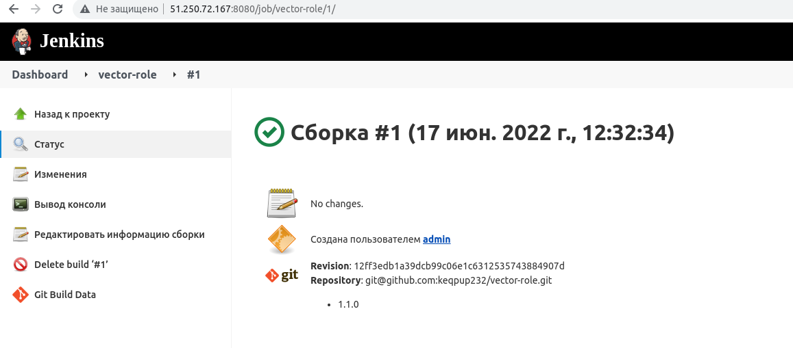
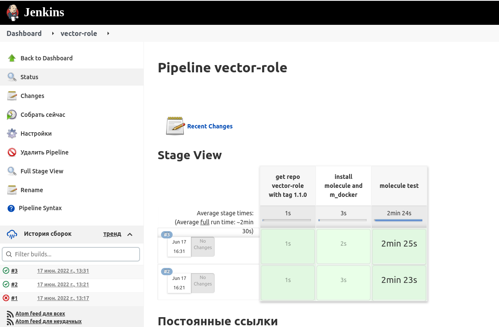
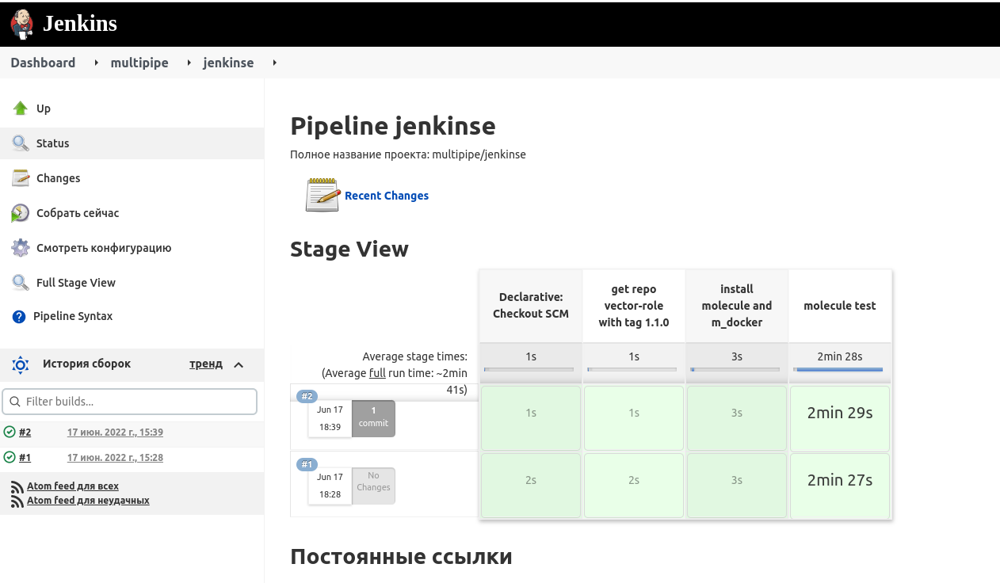

# Домашнее задание к занятию "09.04 Jenkins"

## Подготовка к выполнению

1. Создать 2 VM: для jenkins-master и jenkins-agent.
2. Установить jenkins при помощи playbook'a.
3. Запустить и проверить работоспособность.
4. Сделать первоначальную настройку.

## Основная часть

1. Сделать Freestyle Job, который будет запускать `molecule test` из любого вашего репозитория с ролью.
2. Сделать Declarative Pipeline Job, который будет запускать `molecule test` из любого вашего репозитория с ролью.
3. Перенести Declarative Pipeline в репозиторий в файл `Jenkinsfile`.
4. Создать Multibranch Pipeline на запуск `Jenkinsfile` из репозитория.
5. Создать Scripted Pipeline, наполнить его скриптом из [pipeline](./pipeline).
6. Внести необходимые изменения, чтобы Pipeline запускал `ansible-playbook` без флагов `--check --diff`, если не установлен параметр при запуске джобы (prod_run = True), по умолчанию параметр имеет значение False и запускает прогон с флагами `--check --diff`.
7. Проверить работоспособность, исправить ошибки, исправленный Pipeline вложить в репозиторий в файл `ScriptedJenkinsfile`.
8. Отправить ссылку на репозиторий с ролью и Declarative Pipeline и Scripted Pipeline.

## Необязательная часть

1. Создать скрипт на groovy, который будет собирать все Job, которые завершились хотя бы раз неуспешно. Добавить скрипт в репозиторий с решением с названием `AllJobFailure.groovy`.
2. Создать Scripted Pipeline таким образом, чтобы он мог сначала запустить через Ya.Cloud CLI необходимое количество инстансов, прописать их в инвентори плейбука и после этого запускать плейбук. Тем самым, мы должны по нажатию кнопки получить готовую к использованию систему.

---
### Ответ:
## Подготовка к выполнению:
1.0) Cd terraform init plan apply
```bash
external_ip_address = [
  "node-jenkins-agent is 51.250.71.119",
  "node-jenkins-master is 51.250.78.171",
]
```
1.1) Add external ip in files [inventory](./infrastructure/inventory/cicd/hosts.yml)
```yaml
jenkins-master-01:
  ansible_host: 51.250.78.171
jenkins-agent-01:
  ansible_host: 51.250.71.119
```
2) Play playbook
```bash
cd infrastructure
ansible-playbook -i ./inventory/cicd/hosts.yml site.yml
```
3) Check master jenkins
```text
http://51.250.78.171:8080/login?from=%2F
```
4) First configuration
```text
->  ssh centos@51.250.78.171
    sudo cat /var/lib/jenkins/secrets/initialAdminPassword
    paste on site
->  install suggested plugins
->  set user and pass
->  manage jenkins -> manage nodes and clouds -> master -> config -> number executors [0]
->  in manage nodes -> new node -> add name node [agent-1] -> Permanent Agent [up] -> create
->  Number of executors [2] -> root folder [/opt/jenkins_agent/] -> labels [centos8stream] -> usage [only build jobs]
->  launch method [Launch agent via execution of command] -> Launch command [ssh 51.250.71.119 java -jar /opt/jenkins_agent/agent.jar] 
->  Disable deferred wipeout on this node [up] -> SAVE -> Launch agent
```

## Основная часть
1. Create Freestyle Job `molecule test` in vector-role
```text
Для начала я взял centos 8 stream с python3.8,
т.к. в yandex cloud image centos 7 доступен из коробки только python3.6, а с ним не отрабатывает molecule как надо
Переписал чуть плейбук на yum install python3.8 и убрал переустановку selinux
-> Create Freestyle Job name [vector-role]
-> Ограничить лейблы сборщиков, которые могут исполнять данную задачу [Up]-> Label Expression [centos8stream]
-> Управление исходным кодом [git] ->  Repository URL [git@github.com:keqpup232/vector-role.git]
-> Credentials add -> kind [ssh] -> username [ivan] -> up Private Key [cat ~/.ssh/id_rsa] -> ADD
-> Additional Behaviours [Check out to a sub-directory] -> Local subdirectory for repo [vector-role]
-> Branch Specifier[1.1.0] -> Delete workspace before build starts [Up]
-> Добавить команду сборки [команда shell] -> 
    cd vector-role
    pip3 install "molecule==3.4.0" "molecule_docker" 
    molecule --version
    molecule test
-> Послесборочные операции [Delete workspace] -> Save
```

<h3 align="center"> out job freestyle ->  <a href='./files/out_freestyle.txt'>file</a></h3>
<p align="center">
  
</p>


2) Create Declarative Pipeline Job `molecule test` in vector-role
<h3 align="center"> out job declarative ->  <a href='./files/out_declarative.txt'>file</a></h3>
<p align="center">
  
</p>

3) ->  <a href='./files/Jenkinsfile'>Jenkinsfile</a>

4) Create Multibranch Pipeline on start `Jenkinsfile` in repo.
<h3 align="center"> Jenkinsfile in vector-role ->  <a href='https://github.com/keqpup232/vector-role/blob/jenkinse/Jenkinsfile'>file</a></h3>
<h3 align="center"> out job multi ->  <a href='./files/out_multi.txt'>file</a></h3>
<p align="center">
  
</p>

5) Create Scripted Pipeline
6) Change pipeline
7) Все очень криво, но что бы это взлетело надо:
   - Добавить ключи гитхаба в пользователя jenkins или выкачать роль java с репозитория
   - Обязательно выполнить действия на агенте
   ```bash
   sudo su    
   visudo -f /etc/sudoers

   #add add following line at the end.
   jenkins ALL= NOPASSWD: ALL
   
   mkdir /opt/jdk
   mkdir /opt/jdk/openjdk-11
   
   sudo yum install wget
   wget https://download.java.net/java/ga/jdk11/openjdk-11_linux-x64_bin.tar.gz
   mv openjdk-11_linux-x64_bin.tar.gz /tmp/jdk-openjdk-11-linux.tar.gz
   ```
8) Declarative [Pipeline](./files/Jenkinsfile)  --  Scripted [Pipeline](./pipeline/Jenkinsfile)