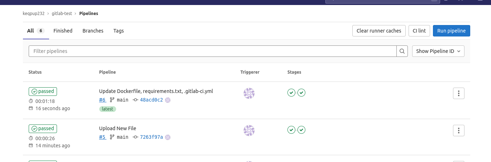

# Домашнее задание к занятию "09.06 Gitlab"

## Подготовка к выполнению

1. Необходимо [подготовить gitlab к работе по инструкции](https://cloud.yandex.ru/docs/tutorials/infrastructure-management/gitlab-containers)
2. Создайте свой новый проект
3. Создайте новый репозиторий в gitlab, наполните его [файлами](./repository)
4. Проект должен быть публичным, остальные настройки по желанию

## Основная часть

### DevOps

В репозитории содержится код проекта на python. Проект - RESTful API сервис. Ваша задача автоматизировать сборку образа с выполнением python-скрипта:
1. Образ собирается на основе [centos:7](https://hub.docker.com/_/centos?tab=tags&page=1&ordering=last_updated)
2. Python версии не ниже 3.7
3. Установлены зависимости: `flask` `flask-jsonpify` `flask-restful`
4. Создана директория `/python_api`
5. Скрипт из репозитория размещён в /python_api
6. Точка вызова: запуск скрипта
7. Если сборка происходит на ветке `master`: должен подняться pod kubernetes на основе образа `python-api`, иначе этот шаг нужно пропустить

### Product Owner

Вашему проекту нужна бизнесовая доработка: необходимо поменять JSON ответа на вызов метода GET `/rest/api/get_info`, необходимо создать Issue в котором указать:
1. Какой метод необходимо исправить
2. Текст с `{ "message": "Already started" }` на `{ "message": "Running"}`
3. Issue поставить label: feature

### Developer

Вам пришел новый Issue на доработку, вам необходимо:
1. Создать отдельную ветку, связанную с этим issue
2. Внести изменения по тексту из задания
3. Подготовить Merge Requst, влить необходимые изменения в `master`, проверить, что сборка прошла успешно


### Tester

Разработчики выполнили новый Issue, необходимо проверить валидность изменений:
1. Поднять докер-контейнер с образом `python-api:latest` и проверить возврат метода на корректность
2. Закрыть Issue с комментарием об успешности прохождения, указав желаемый результат и фактически достигнутый

## Итог

После успешного прохождения всех ролей - отправьте ссылку на ваш проект в гитлаб, как решение домашнего задания

## Необязательная часть

Автомазируйте работу тестировщика, пусть у вас будет отдельный конвейер, который автоматически поднимает контейнер и выполняет проверку, например, при помощи curl. На основе вывода - будет приниматься решение об успешности прохождения тестирования

---
## Ответ:
## Подготовка к выполнению
1. Необходимо [подготовить gitlab к работе по инструкции](https://cloud.yandex.ru/docs/tutorials/infrastructure-management/gitlab-containers)
   - Создать сервисные аккаунты
   - Создать сеть и подсеть
   - Создать кластер Managed Service for Kubernetes и группу узлов
   - Создать сервисный аккаунт Kubernetes
   - Создать инстанс Managed Service for GitLab
   - Создать реестр Container Registry
   - Создать GitLab Runner
   - Настроить сборку и развертывание Docker-образа из CI

<p align="center">
  
</p>

2. Создайте свой новый проект
3. Создайте новый репозиторий в gitlab, наполните его [файлами](./repository)
4. Проект должен быть публичным, остальные настройки по желанию

<p align="center">
  
</p>

## Основная часть

---
### DevOps

Залил скрипт и автоматизировал его сборку 
<p align="center">
  
</p>

### Repo [файлы](./gitlab-test)

---
### Product Owner

Создал issues
<p align="center">
  
</p>

---
### Developer

В новой ветке изменил скрипт и выполнил merge
<p align="center">
  
</p>

---
### Tester
Контейнер уже поднят
```bash
$ kubectl logs deployment/hello-world-deployment -n hello-world
 * Serving Flask app 'python-api' (lazy loading)
 * Environment: production
   WARNING: This is a development server. Do not use it in a production deployment.
   Use a production WSGI server instead.
 * Debug mode: off
 * Running on all addresses.
   WARNING: This is a development server. Do not use it in a production deployment.
 * Running on http://10.112.128.24:5290/ (Press CTRL+C to quit)
```
В контейнере проверяем работоспособность
```bash
ivan@cl1jeh94okigqigqoje4-ibam:~$ curl http://10.112.128.24:5290/get_info
{"version": 3, "method": "GET", "message": "Running"}
```
---
## Итог Gitlab [REPO](https://keqpup232.gitlab.yandexcloud.net/keqpup232/gitlab-test.git)