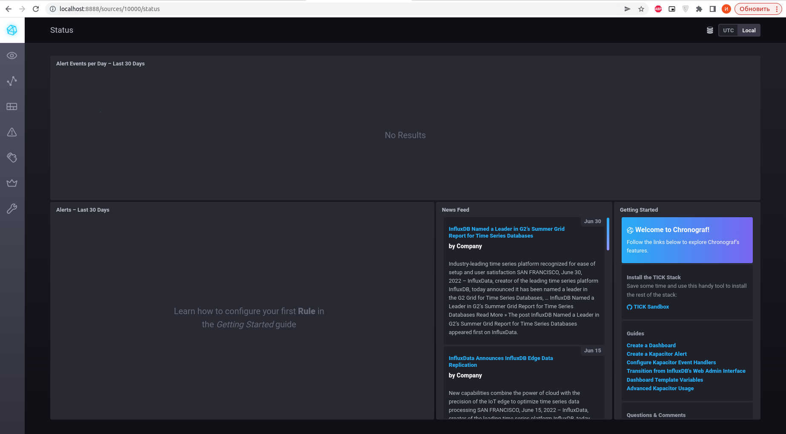
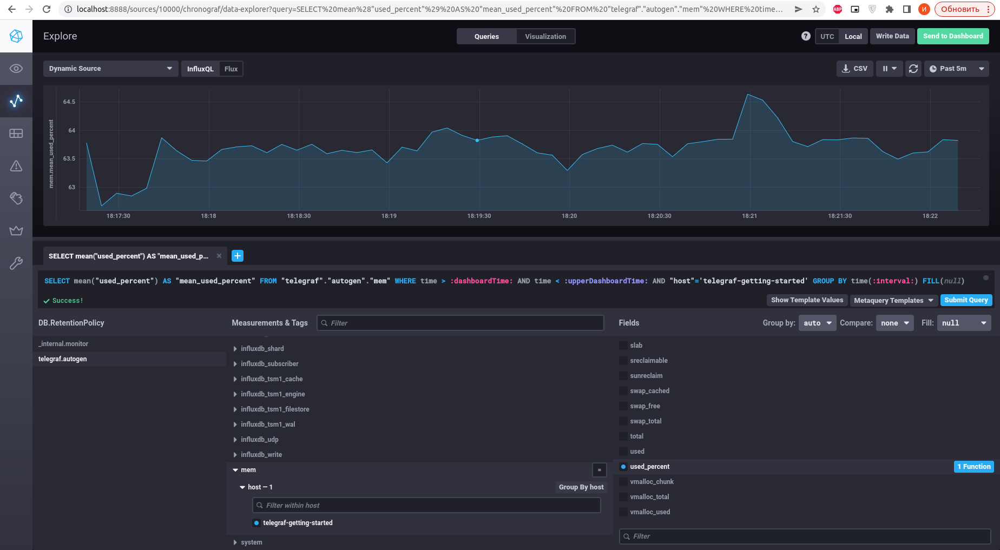
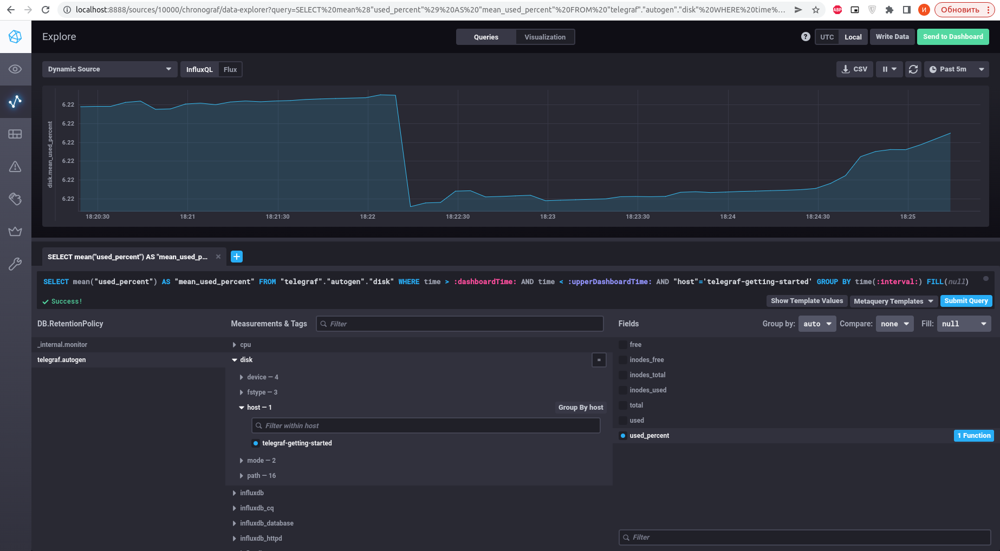
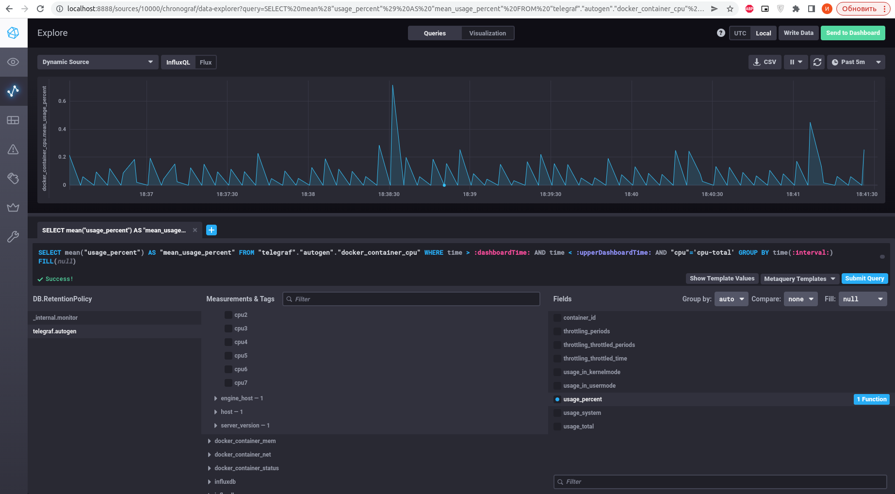
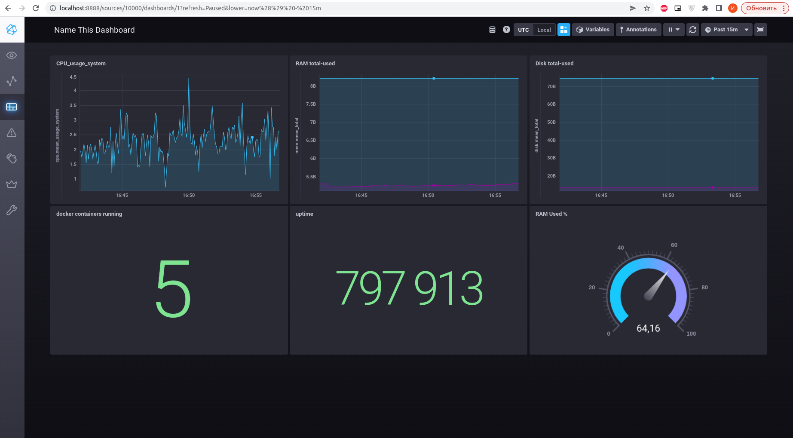

# Домашнее задание к занятию "10.02. Системы мониторинга"

## Обязательные задания

1. Опишите основные плюсы и минусы pull и push систем мониторинга.

```text
Push - когда сервер мониторинга ожидает подключений от агентов для получения метрик.
- Более гибкая настройка отправки пакетов данных с метриками
- Является менее затратным способом передачи данных

Pull - когда сервер мониторинга сам подключается к агентам мониторинга и забирает данные.
- Легче контролировать подлинность данных
- Можно настроить единый proxy-server до всех агентов с TLS
- Упрощенная отладка получения данных с агентов
```

2. Какие из ниже перечисленных систем относятся к push модели, а какие к pull? А может есть гибридные?

    - Prometheus - Pull
    - TICK - Push
    - Zabbix - Push и Pull
    - VictoriaMetrics - Push
    - Nagios - Pull

3. Склонируйте себе [репозиторий](https://github.com/influxdata/sandbox/tree/master) и запустите TICK-стэк, 
используя технологии docker и docker-compose.

В виде решения на это упражнение приведите выводы команд с вашего компьютера (виртуальной машины):

    - curl http://localhost:8086/ping
    - curl http://localhost:8888
    - curl http://localhost:9092/kapacitor/v1/ping

А также скриншот веб-интерфейса ПО chronograf (`http://localhost:8888`). 

P.S.: если при запуске некоторые контейнеры будут падать с ошибкой - проставьте им режим `Z`, например
`./data:/var/lib:Z`

4. Перейдите в веб-интерфейс Chronograf (`http://localhost:8888`) и откройте вкладку `Data explorer`.

    - Нажмите на кнопку `Add a query`
    - Изучите вывод интерфейса и выберите БД `telegraf.autogen`
    - В `measurments` выберите mem->host->telegraf_container_id , а в `fields` выберите used_percent. 
    Внизу появится график утилизации оперативной памяти в контейнере telegraf.
    - Вверху вы можете увидеть запрос, аналогичный SQL-синтаксису. 
    Поэкспериментируйте с запросом, попробуйте изменить группировку и интервал наблюдений.

Для выполнения задания приведите скриншот с отображением метрик утилизации места на диске 
(disk->host->telegraf_container_id) из веб-интерфейса.

5. Изучите список [telegraf inputs](https://github.com/influxdata/telegraf/tree/master/plugins/inputs). 
Добавьте в конфигурацию telegraf следующий плагин - [docker](https://github.com/influxdata/telegraf/tree/master/plugins/inputs/docker):
```
[[inputs.docker]]
  endpoint = "unix:///var/run/docker.sock"
```

Дополнительно вам может потребоваться донастройка контейнера telegraf в `docker-compose.yml` дополнительного volume и 
режима privileged:
```
  telegraf:
    image: telegraf:1.4.0
    privileged: true
    volumes:
      - ./etc/telegraf.conf:/etc/telegraf/telegraf.conf:Z
      - /var/run/docker.sock:/var/run/docker.sock:Z
    links:
      - influxdb
    ports:
      - "8092:8092/udp"
      - "8094:8094"
      - "8125:8125/udp"
```

После настройке перезапустите telegraf, обновите веб интерфейс и приведите скриншотом список `measurments` в 
веб-интерфейсе базы telegraf.autogen. Там должны появиться метрики, связанные с docker.

Факультативно можете изучить какие метрики собирает telegraf после выполнения данного задания.

## Дополнительное задание (со звездочкой*) - необязательно к выполнению

В веб-интерфейсе откройте вкладку `Dashboards`. Попробуйте создать свой dashboard с отображением:

    - утилизации ЦПУ
    - количества использованного RAM
    - утилизации пространства на дисках
    - количество поднятых контейнеров
    - аптайм
    - ...
    - фантазируйте)
    
    ---
---

## Ответ:

## Обязательные задания

1. Опишите основные плюсы и минусы pull и push систем мониторинга.

```text
Push - когда сервер мониторинга ожидает подключений от агентов для получения метрик.
- Более гибкая настройка отправки пакетов данных с метриками
- Является менее затратным способом передачи данных

Pull - когда сервер мониторинга сам подключается к агентам мониторинга и забирает данные.
- Легче контролировать подлинность данных
- Можно настроить единый proxy-server до всех агентов с TLS
- Упрощенная отладка получения данных с агентов
```

2. Какие из ниже перечисленных систем относятся к push модели, а какие к pull? А может есть гибридные?

    - Prometheus - Pull
    - TICK - Push
    - Zabbix - Push и Pull
    - VictoriaMetrics - Push
    - Nagios - Pull
   
3. Склонируйте себе [репозиторий](https://github.com/influxdata/sandbox/tree/master) и запустите TICK-стэк, 
используя технологии docker и docker-compose.

```bash
git clone git@github.com:influxdata/sandbox.git
cd sandbox
./sandbox up
```

В виде решения на это упражнение приведите выводы команд с вашего компьютера (виртуальной машины):

    - curl http://localhost:8086/ping
    - curl http://localhost:8888
    - curl http://localhost:9092/kapacitor/v1/ping

```bash
curl http://localhost:8086/ping -v
*   Trying 127.0.0.1:8086...
* TCP_NODELAY set
* Connected to localhost (127.0.0.1) port 8086 (#0)
> GET /ping HTTP/1.1
> Host: localhost:8086
> User-Agent: curl/7.68.0
> Accept: */*
> 
* Mark bundle as not supporting multiuse
< HTTP/1.1 204 No Content
< Content-Type: application/json
< Request-Id: 3897dba9-fae1-11ec-803c-0242ac120003
< X-Influxdb-Build: OSS
< X-Influxdb-Version: 1.8.10
< X-Request-Id: 3897dba9-fae1-11ec-803c-0242ac120003
< Date: Sun, 03 Jul 2022 15:02:56 GMT
< 
* Connection #0 to host localhost left intact
```
```bash
curl http://localhost:8888
<!DOCTYPE html>
<html>
<head>
  <meta http-equiv="Content-type" content="text/html; charset=utf-8">
  <title>Chronograf</title>
  <link rel="icon shortcut" href="/favicon.fa749080.ico">
  <link rel="stylesheet" href="/src.9cea3e4e.css">
</head>
<body>
  <div id="react-root" data-basepath=""></div>
  <script src="/src.a969287c.js"></script>
</body>
</html>
```
```bash
curl http://localhost:9092/kapacitor/v1/ping -v
*   Trying 127.0.0.1:9092...
* TCP_NODELAY set
* Connected to localhost (127.0.0.1) port 9092 (#0)
> GET /kapacitor/v1/ping HTTP/1.1
> Host: localhost:9092
> User-Agent: curl/7.68.0
> Accept: */*
> 
* Mark bundle as not supporting multiuse
< HTTP/1.1 204 No Content
< Content-Type: application/json; charset=utf-8
< Request-Id: 88b15a17-fae1-11ec-8058-000000000000
< X-Kapacitor-Version: 1.6.4
< Date: Sun, 03 Jul 2022 15:05:10 GMT
< 
* Connection #0 to host localhost left intact
```

А также скриншот веб-интерфейса ПО chronograf (`http://localhost:8888`). 

<p align="center">
  
</p>


4. Перейдите в веб-интерфейс Chronograf (`http://localhost:8888`) и откройте вкладку `Data explorer`.

    - Нажмите на кнопку `Add a query`
    - Изучите вывод интерфейса и выберите БД `telegraf.autogen`
    - В `measurments` выберите mem->host->telegraf_container_id , а в `fields` выберите used_percent. 
    Внизу появится график утилизации оперативной памяти в контейнере telegraf.
    - Вверху вы можете увидеть запрос, аналогичный SQL-синтаксису. 
    Поэкспериментируйте с запросом, попробуйте изменить группировку и интервал наблюдений.

Для выполнения задания приведите скриншот с отображением метрик утилизации места на диске 
(disk->host->telegraf_container_id) из веб-интерфейса.

---

Для начала надо добавить в telegraf.conf
```bash
[[inputs.mem]]
[[inputs.disk]]
```
После перезагрузить тестовую среду
```bash
./sandbox restart
```
mem->host->telegraf_container_id by `fields` used_percent. 

<p align="center">
  
</p>

disk->host->telegraf_container_id by `fields` used_percent. 

<p align="center">
  
</p>

5. Изучите список [telegraf inputs](https://github.com/influxdata/telegraf/tree/master/plugins/inputs). 
Добавьте в конфигурацию telegraf следующий плагин - [docker](https://github.com/influxdata/telegraf/tree/master/plugins/inputs/docker):
```
[[inputs.docker]]
  endpoint = "unix:///var/run/docker.sock"
```

---
Уже был добавлен [[inputs.docker]], но метрик не было, решилось добавлением переменной для определения группы владельца сокета docker
```bash
export GID=$(stat -c '%g' /var/run/docker.sock)
```
И добавление пользователей в docker-compose.yml
```bash
telegraf:
  user: "telegraf:$GID"
```

После настройке перезапустите telegraf, обновите веб интерфейс и приведите скриншотом список `measurments` в 
веб-интерфейсе базы telegraf.autogen. Там должны появиться метрики, связанные с docker.

<p align="center">
  
</p>

## Дополнительное задание (со звездочкой*) - необязательно к выполнению

В веб-интерфейсе откройте вкладку `Dashboards`. Попробуйте создать свой dashboard с отображением:

    - утилизации ЦПУ
    - количества использованного RAM
    - утилизации пространства на дисках
    - количество поднятых контейнеров
    - аптайм
    - ...
    - фантазируйте)

<p align="center">
  
</p>