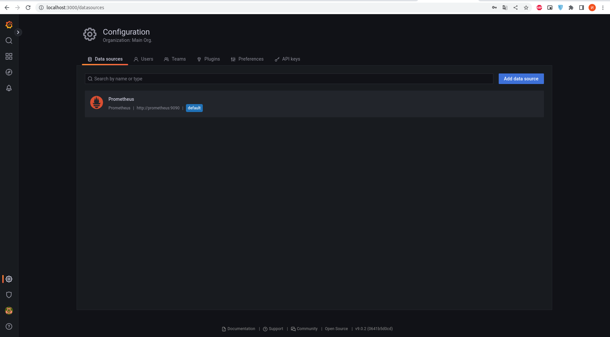
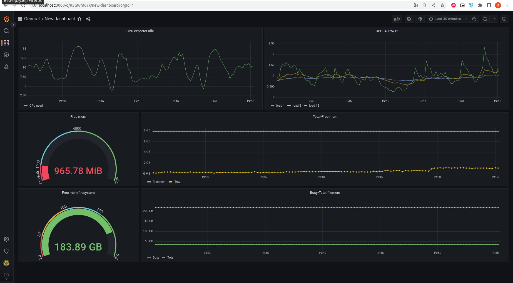
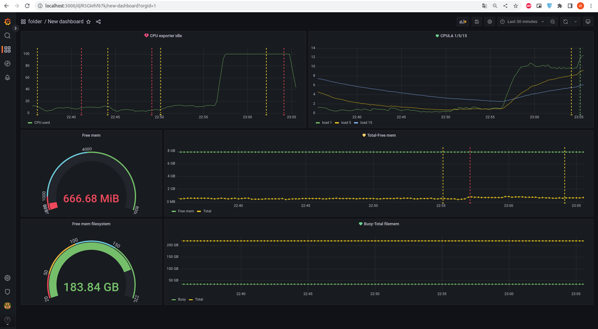
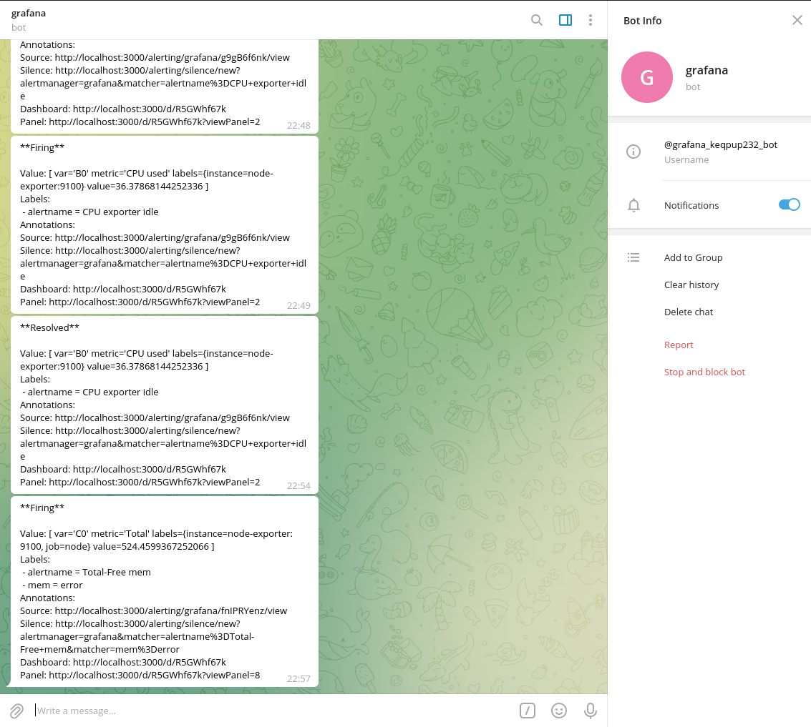

# Домашнее задание к занятию "10.03. Grafana"

## Задание повышенной сложности

**В части задания 1** не используйте директорию [help](./help) для сборки проекта, самостоятельно разверните grafana, где в 
роли источника данных будет выступать prometheus, а сборщиком данных node-exporter:
- grafana
- prometheus-server
- prometheus node-exporter

За дополнительными материалами, вы можете обратиться в официальную документацию grafana и prometheus.

В решении к домашнему заданию приведите также все конфигурации/скрипты/манифесты, которые вы 
использовали в процессе решения задания.

**В части задания 3** вы должны самостоятельно завести удобный для вас канал нотификации, например Telegram или Email
и отправить туда тестовые события.

В решении приведите скриншоты тестовых событий из каналов нотификаций.

## Обязательные задания

### Задание 1
Используя директорию [help](./help) внутри данного домашнего задания - запустите связку prometheus-grafana.

Зайдите в веб-интерфейс графана, используя авторизационные данные, указанные в манифесте docker-compose.

Подключите поднятый вами prometheus как источник данных.

Решение домашнего задания - скриншот веб-интерфейса grafana со списком подключенных Datasource.

## Задание 2
Изучите самостоятельно ресурсы:
- [promql-for-humans](https://timber.io/blog/promql-for-humans/#cpu-usage-by-instance)
- [understanding prometheus cpu metrics](https://www.robustperception.io/understanding-machine-cpu-usage)

Создайте Dashboard и в ней создайте следующие Panels:
- Утилизация CPU для nodeexporter (в процентах, 100-idle)
- CPULA 1/5/15
- Количество свободной оперативной памяти
- Количество места на файловой системе

Для решения данного ДЗ приведите promql запросы для выдачи этих метрик, а также скриншот получившейся Dashboard.

## Задание 3
Создайте для каждой Dashboard подходящее правило alert (можно обратиться к первой лекции в блоке "Мониторинг").

Для решения ДЗ - приведите скриншот вашей итоговой Dashboard.

## Задание 4
Сохраните ваш Dashboard.

Для этого перейдите в настройки Dashboard, выберите в боковом меню "JSON MODEL".

Далее скопируйте отображаемое json-содержимое в отдельный файл и сохраните его.

В решении задания - приведите листинг этого файла.

---

## Ответ:

1) Погуглил и сделал сам [docker-compose](./files/docker-compose.yml), в общем и целом очень похож на тот что в папке [help](./help)
```bash
https://grafana.com/docs/grafana-cloud/quickstart/docker-compose-linux/
https://grafana.com/docs/grafana/latest/setup-grafana/installation/docker/

docker-compose up -d
Creating network "files_monitoring" with driver "bridge"
Creating volume "files_prometheus_data" with default driver
Creating prometheus    ... done
Creating grafana       ... done
Creating node-exporter ... done

http://localhost:3000/login -> login:admin pass:admin
В графане добавляем url http://prometheus:9090 в data prometheus
```

<p align="center">
  
</p>

2) Создайте Dashboard и в ней создайте следующие Panels

Утилизация CPU для nodeexporter (в процентах, 100-idle)
```bash
100 - (avg by (instance) (rate(node_cpu_seconds_total{job="node",mode="idle"}[1m])) * 100)
```

CPULA 1/5/15
```bash
node_load1{job="node"}
node_load5{job="node"}
node_load15{job="node"}
```

Количество свободной оперативной памяти
```bash
node_memory_MemFree_bytes{job="node"} / (1024*1024)
```

Количество места на файловой системе
```bash
node_filesystem_free_bytes{fstype!~"tmpfs|fuse.lxcfs|squashfs|vfat"} / (1024 * 1024 *1024)
```

<p align="center">
  
</p>

3) Создал плерты и бота
<p align="center">
  
</p>

<p align="center">
  
</p>

4) Дашбоард -> [Dashboard.json](./files/Dashboard.json)
