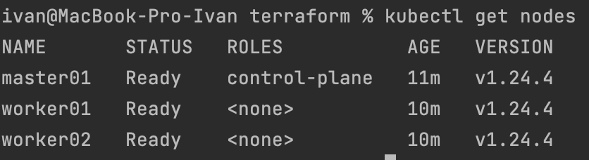
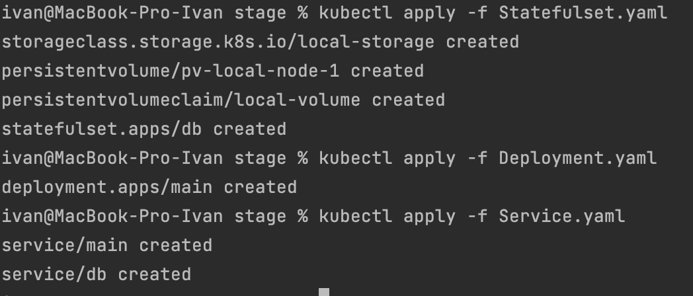
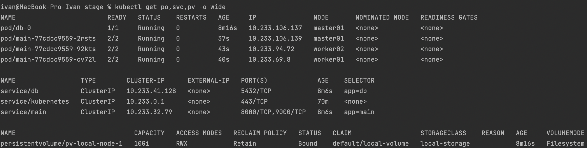
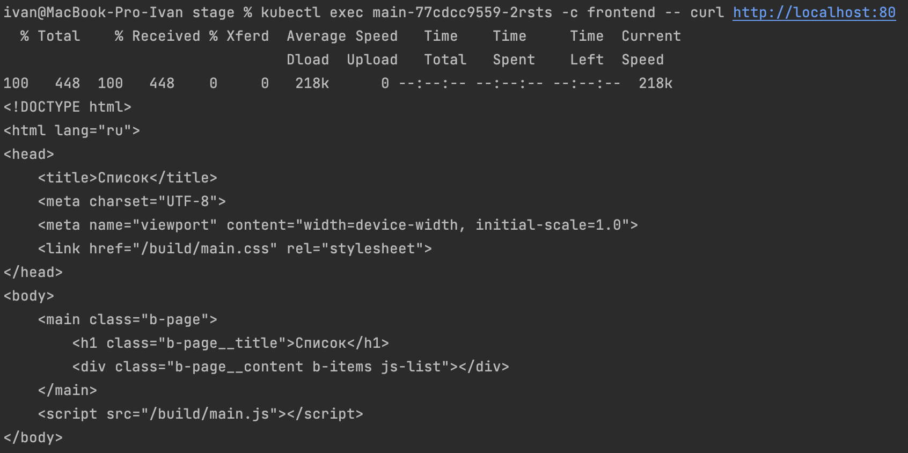
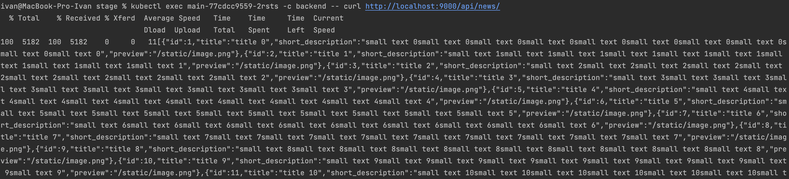
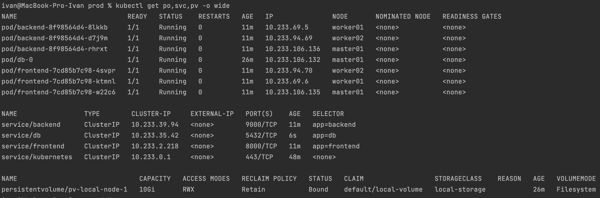
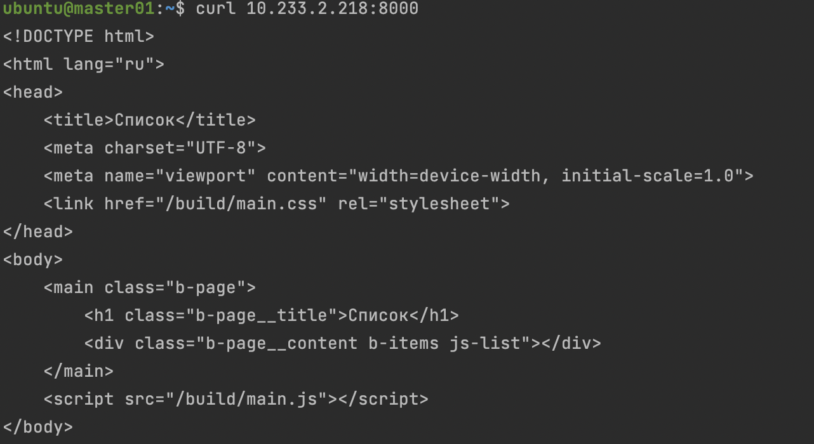
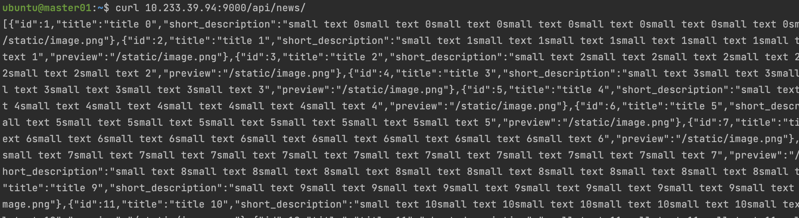
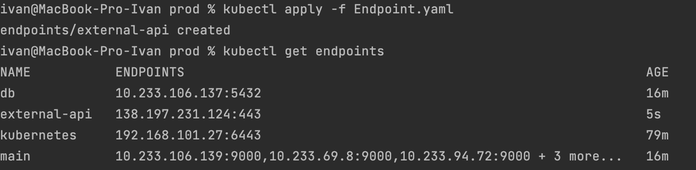

# Домашнее задание к занятию "13.1 контейнеры, поды, deployment, statefulset, services, endpoints"
Настроив кластер, подготовьте приложение к запуску в нём. Приложение стандартное: бекенд, фронтенд, база данных. Его можно найти в папке 13-kubernetes-config.

## Задание 1: подготовить тестовый конфиг для запуска приложения
Для начала следует подготовить запуск приложения в stage окружении с простыми настройками. Требования:
* под содержит в себе 2 контейнера — фронтенд, бекенд;
* регулируется с помощью deployment фронтенд и бекенд;
* база данных — через statefulset.

## Задание 2: подготовить конфиг для production окружения
Следующим шагом будет запуск приложения в production окружении. Требования сложнее:
* каждый компонент (база, бекенд, фронтенд) запускаются в своем поде, регулируются отдельными deployment’ами;
* для связи используются service (у каждого компонента свой);
* в окружении фронта прописан адрес сервиса бекенда;
* в окружении бекенда прописан адрес сервиса базы данных.

## Задание 3 (*): добавить endpoint на внешний ресурс api
Приложению потребовалось внешнее api, и для его использования лучше добавить endpoint в кластер, направленный на это api. Требования:
* добавлен endpoint до внешнего api (например, геокодер).

---

### Как оформить ДЗ?

Выполненное домашнее задание пришлите ссылкой на .md-файл в вашем репозитории.

В качестве решения прикрепите к ДЗ конфиг файлы для деплоя. Прикрепите скриншоты вывода команды kubectl со списком запущенных объектов каждого типа (pods, deployments, statefulset, service) или скриншот из самого Kubernetes, что сервисы подняты и работают.

---
## Ответ:

### Задание 1:

Делаю build и push в докерхаб
```bash
docker login
docker buildx build --platform=linux/amd64 -t keqpup232/backend:1.1 .
docker push keqpup232/backend:1.1
docker buildx build --platform=linux/amd64 -t keqpup232/frontend:1.1 .
docker push keqpup232/frontend:1.1

# 1) need create dir /mnt/local-storage in master
# 2) You can run below command to remove the taint from master node and then you should be able to deploy your pod on that node
kubectl taint nodes --all node-role.kubernetes.io/master-
```

<br>

Запускаем кластер

<p align="center">
  
</p>

<br>

Запускаем манифесты stage и смотрим:
- [Deployment.yaml](./files/stage/Deployment.yaml)
- [Service.yaml](./files/stage/Service.yaml)
- [Statefulset.yaml](./files/stage/Statefulset.yaml)

```bash
kubectl apply -f Statefulset.yaml
kubectl apply -f Deployment.yaml
kubectl apply -f Service.yaml
```

<p align="center">
  
</p>

<br>

Смотрим статусы подов, сервисов и PV
```bash
kubectl get po,svc,pv -o wide
```

<p align="center">
  
</p>

<br>

Проверяем доступность фронта

```bash
kubectl exec main-77cdcc9559-2rsts -c frontend -- curl http://localhost:80
```

<p align="center">
  
</p>

<br>

выполняем курл в контейнере и смотрим что бек видит базу

```bash
kubectl exec main-77cdcc9559-2rsts -c backend -- curl http://localhost:9000/api/news/
```

<p align="center">
  
</p>

### Задание 2:

Запускаем манифесты prod и смотрим:
- [Deployment.yaml](./files/prod/Deployment.yaml)
- [Service.yaml](./files/prod/Service.yaml)
- [Statefulset.yaml](./files/prod/Statefulset.yaml)

```bash
kubectl apply -f Statefulset.yaml
kubectl apply -f Deployment.yaml
kubectl apply -f Service.yaml
kubectl get po,svc,pv -o wide
```

<p align="center">
  
</p>

<br>

Проверяем доступность фронта через сервис фронта на мастер ноде
```bash
curl http://10.233.2.218:8000
```

<p align="center">
  
</p>

<br>

Проверяем доступность бека через червис на мастер ноде

```bash
curl http://localhost:9000/api/news/
```

<p align="center">
  
</p>

### Задание 3:

Запускаем манифесты Endpoint и смотрим:
- [Endpoint.yaml](./files/prod/Endpoint.yaml)

<p align="center">
  
</p>