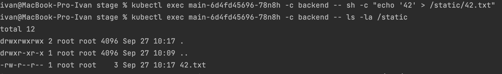
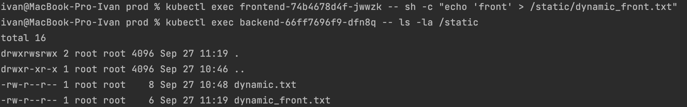

# Домашнее задание к занятию "13.2 разделы и монтирование"
Приложение запущено и работает, но время от времени появляется необходимость передавать между бекендами данные. А сам бекенд генерирует статику для фронта. Нужно оптимизировать это.
Для настройки NFS сервера можно воспользоваться следующей инструкцией (производить под пользователем на сервере, у которого есть доступ до kubectl):
* установить helm: curl https://raw.githubusercontent.com/helm/helm/master/scripts/get-helm-3 | bash
* добавить репозиторий чартов: helm repo add stable https://charts.helm.sh/stable && helm repo update
* установить nfs-server через helm: helm install nfs-server stable/nfs-server-provisioner

В конце установки будет выдан пример создания PVC для этого сервера.

## Задание 1: подключить для тестового конфига общую папку
В stage окружении часто возникает необходимость отдавать статику бекенда сразу фронтом. Проще всего сделать это через общую папку. Требования:
* в поде подключена общая папка между контейнерами (например, /static);
* после записи чего-либо в контейнере с беком файлы можно получить из контейнера с фронтом.

## Задание 2: подключить общую папку для прода
Поработав на stage, доработки нужно отправить на прод. В продуктиве у нас контейнеры крутятся в разных подах, поэтому потребуется PV и связь через PVC. Сам PV должен быть связан с NFS сервером. Требования:
* все бекенды подключаются к одному PV в режиме ReadWriteMany;
* фронтенды тоже подключаются к этому же PV с таким же режимом;
* файлы, созданные бекендом, должны быть доступны фронту.

---
## Ответ:

### Подготовка

```bash
curl https://raw.githubusercontent.com/helm/helm/master/scripts/get-helm-3 | bash
helm repo add stable https://charts.helm.sh/stable && helm repo update
helm install nfs-server stable/nfs-server-provisioner
    ---
    kind: PersistentVolumeClaim
    apiVersion: v1
    metadata:
      name: test-dynamic-volume-claim
    spec:
      storageClassName: "nfs"
      accessModes:
        - ReadWriteOnce
      resources:
        requests:
          storage: 100Mi
```
---

### Задание 1:

Запускаем манифесты stage и смотрим:
- [Deployment.yaml](./files/stage/Deployment.yaml)

```bash
kubectl get po,svc,pv -o wide
```
<p align="center">
  
</p>

<br>

Создаем файл в контейнере бекэнда и смотрим что он действительно создался

```bash
kubectl exec main-6d4fd45696-78n8h -c backend -- sh -c "echo '42' > /static/42.txt"
kubectl exec main-6d4fd45696-78n8h -c backend -- ls -la /static
```
<p align="center">
  
</p>

<br>

Проверяем что созданный ранее файл доступен в том же поде контейнера фронта

```bash
kubectl exec main-6d4fd45696-78n8h -c frontend -- ls -la /static
```

<p align="center">
  
</p>

<br>

Создаем еще один файл теперь в контейнере фрона и смотрим доступность обоих файлов в том же поде контейнера бека

```bash
kubectl exec main-6d4fd45696-78n8h -c frontend -- touch /static/43.56
kubectl exec main-6d4fd45696-78n8h -c backend -- ls -la /static
```

<p align="center">
  
</p>

---

### Задание 2:

```bash
# install in all nodes
sudo apt install nfs-common
```

Запускаем манифесты prod и смотрим:
- [Deployment.yaml](./files/prod/Deployment.yaml)
- [PVC.yaml](./files/prod/PVC.yaml)

```bash
ivan@MacBook-Pro-Ivan prod % kubectl apply -f PVC.yaml                                      
persistentvolumeclaim/pvc created
ivan@MacBook-Pro-Ivan prod % kubectl apply -f Deployment.yaml 
deployment.apps/backend created
deployment.apps/frontend created
```

<p align="center">
  
</p>

<br>

Создаем файл в поде бека и проверяем что он создался
```bash
kubectl exec backend-66ff7696f9-dfn8q -- ls -la /static
kubectl exec backend-66ff7696f9-dfn8q -- sh -c "echo 'dynamic' > /static/dynamic.txt"
kubectl exec backend-66ff7696f9-dfn8q -- ls -la /static
```

<p align="center">
  
</p>
<p align="center">
  
</p>
<p align="center">
  
</p>

<br>

Проверяем файл на доступность в поде фронта

```bash
kubectl exec frontend-74b4678d4f-jwwzk -- ls -la /static
```

<p align="center">
  
</p>

<br>

Создадим файл на поде фронта и проверим доступность в беке
```bash
kubectl exec frontend-74b4678d4f-jwwzk -- sh -c "echo 'front' > /static/dynamic_front.txt"
kubectl exec backend-66ff7696f9-dfn8q -- ls -la /static
```

<p align="center">
  
</p>

<br>

Определим в какой папке у нас хранятся данные
```bash
kubectl get pv -o yaml | grep '^\s*path:'
```

<p align="center">
  
</p>

```bash
sudo find / -name dynamic.txt
```
<p align="center">
  
</p>