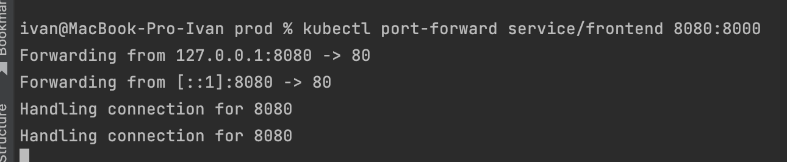

# Домашнее задание к занятию "13.3 работа с kubectl"
## Задание 1: проверить работоспособность каждого компонента
Для проверки работы можно использовать 2 способа: port-forward и exec. Используя оба способа, проверьте каждый компонент:
* сделайте запросы к бекенду;
* сделайте запросы к фронту;
* подключитесь к базе данных.

## Задание 2: ручное масштабирование

При работе с приложением иногда может потребоваться вручную добавить пару копий. Используя команду kubectl scale, попробуйте увеличить количество бекенда и фронта до 3. Проверьте, на каких нодах оказались копии после каждого действия (kubectl describe, kubectl get pods -o wide). После уменьшите количество копий до 1.

---

## Ответ:

### Задание 1:

```bash
kubectl get po,svc,pv -o wide
```
<p align="center">
  
</p>

- back
  - exec
  ```bash
  kubectl exec backend-bd8d64f4f-987wz -- curl -s localhost:9000/api/news/
  ```
  <p align="center">
  
  </p>
  <br>
  
  - port-forward
  ```bash
  kubectl port-forward service/backend 8080:9000
  ```
  <p align="center">
  
  </p>
    <p align="center">
  
  </p>
  <br>
  
- front
  - exec
  ```bash
  kubectl exec frontend-6f9b859f87-mmh5l -- curl -s localhost:80
  ```
  <p align="center">
  
  </p>
  <br>
  
  - port-forward
  ```bash
  kubectl port-forward service/frontend 8080:8000
  ```
  <p align="center">
  
  </p>
  <p align="center">
  
  </p>
  <br>
  
- db
  - exec
  ```bash
  kubectl exec db-0 -- psql -U postgres -d news -c \\dt
  ```
  <p align="center">
  
  </p>
  <br>
  
  - port-forward
  ```bash
  kubectl port-forward service/db 8080:5432
  ```
  <p align="center">
  
  </p>
  <p align="center">
  
  </p>
  <br>

### Задание 2:

Смотрим текущие поды
```bash
kubectl get po -o wide
```
<p align="center">

</p>
<br>

Увеличиваем количество реплик на 3 
```bash
kubectl scale --replicas=3 deploy/frontend
kubectl scale --replicas=3 deploy/backend
```
<p align="center">

</p>
<br>

Проверяем
```bash
kubectl get po -o wide
```
<p align="center">

</p>
<br>

Уменьшаем количество реплик на 1 и проверяем
```bash
kubectl scale --replicas=1 deploy/frontend
kubectl scale --replicas=1 deploy/backend
kubectl get po -o wide
```
<p align="center">

</p>