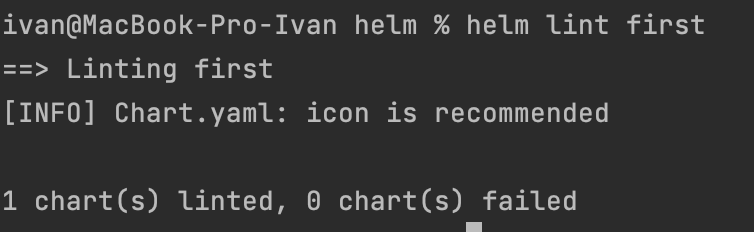
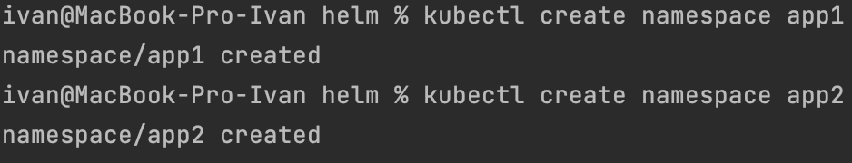
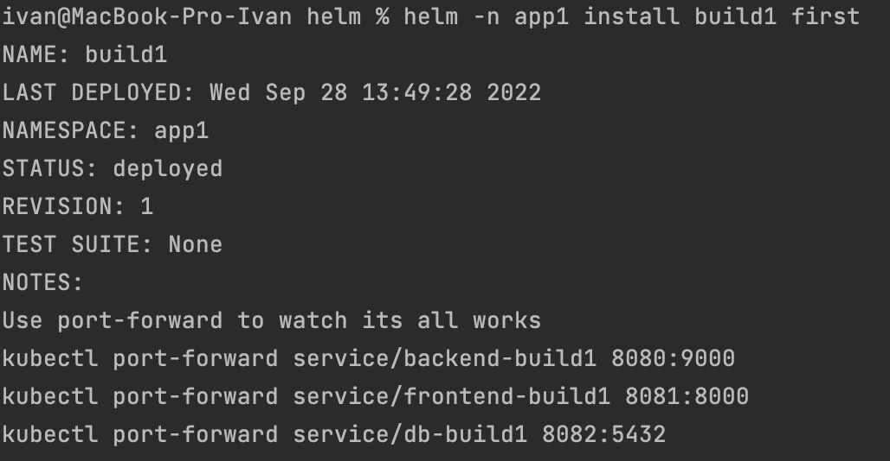
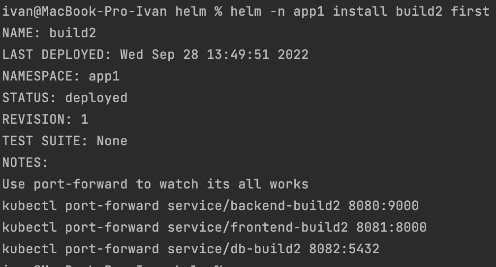
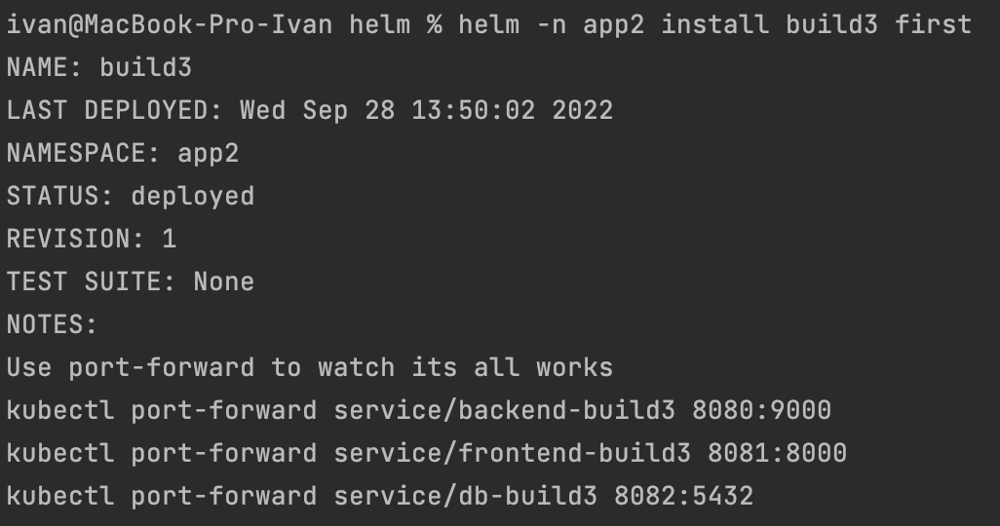
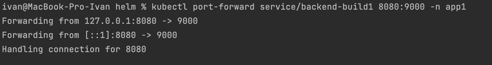
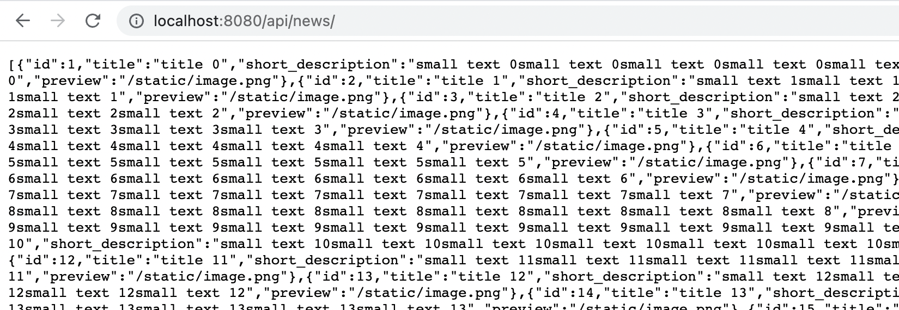

# Домашнее задание к занятию "13.4 инструменты для упрощения написания конфигурационных файлов. Helm и Jsonnet"
В работе часто приходится применять системы автоматической генерации конфигураций. Для изучения нюансов использования разных инструментов нужно попробовать упаковать приложение каждым из них.

## Задание 1: подготовить helm чарт для приложения
Необходимо упаковать приложение в чарт для деплоя в разные окружения. Требования:
* каждый компонент приложения деплоится отдельным deployment’ом/statefulset’ом;
* в переменных чарта измените образ приложения для изменения версии.

## Задание 2: запустить 2 версии в разных неймспейсах
Подготовив чарт, необходимо его проверить. Попробуйте запустить несколько копий приложения:
* одну версию в namespace=app1;
* вторую версию в том же неймспейсе;
* третью версию в namespace=app2.

## Задание 3 (*): повторить упаковку на jsonnet
Для изучения другого инструмента стоит попробовать повторить опыт упаковки из задания 1, только теперь с помощью инструмента jsonnet.

---

## Ответ:

### Задание 1:

Подготовка
```bash
ivan@MacBook-Pro-Ivan helm % helm create first
Creating first
# 1) need create dir /mnt/local-storage in master
# 2) You can run below command to remove the taint from master node and then you should be able to deploy your pod on that node
kubectl taint nodes --all node-role.kubernetes.io/master-
# 3) need install nfs-server
helm install nfs-server stable/nfs-server-provisioner
# 4) need install nfs-common in all nodes
sudo apt install nfs-common -y
```

Создал helm пакет :
- directory helm -> [first](./helm/first) 
- Вывод template ```bash helm template first > out.yaml ``` [out.yaml](./helm/out.yaml)

Линт проверка
```bash helm lint first ```
<p align="center">

</p>
<br>

Создаем неймспейсы
```bash 
kubectl create namespace app1
kubectl create namespace app2
```

<p align="center">

</p>
<br>

### Задание 2:

Деплоим приложения в заданные неймспейсы
```bash 
helm -n app1 install build1 first
helm -n app1 install build2 first
helm -n app2 install build3 first 
```

<p align="center">

</p>
<p align="center">

</p>
<p align="center">

</p>
<br>

Смотрим поды сервисы и пв
```bash
ivan@MacBook-Pro-Ivan helm % kubectl get po,svc,pv -A -o wide | grep app
app1          pod/backend-build1-784495c88c-k9ctl       1/1     Running   0             2m31s   10.233.94.68     worker02   <none>           <none>
app1          pod/backend-build2-544d4f4fb8-6m2n6       1/1     Running   0             2m8s    10.233.94.69     worker02   <none>           <none>
app1          pod/db-build1-0                           1/1     Running   0             2m30s   10.233.106.133   master01   <none>           <none>
app1          pod/db-build2-0                           1/1     Running   0             2m8s    10.233.106.134   master01   <none>           <none>
app1          pod/frontend-build1-5bff6fdb-9gg2n        1/1     Running   0             2m31s   10.233.69.4      worker01   <none>           <none>
app1          pod/frontend-build2-8b6c99dbf-xvjt4       1/1     Running   0             2m8s    10.233.69.5      worker01   <none>           <none>
app2          pod/backend-build3-69db6469cc-5n49b       1/1     Running   0             117s    10.233.94.70     worker02   <none>           <none>
app2          pod/db-build3-0                           1/1     Running   0             117s    10.233.106.135   master01   <none>           <none>
app2          pod/frontend-build3-784f79bfb4-8cns6      1/1     Running   0             117s    10.233.69.6      worker01   <none>           <none>

app1          service/backend-build1                      ClusterIP   10.233.25.106   <none>        9000/TCP                                                                2m32s   app=backend-build1
app1          service/backend-build2                      ClusterIP   10.233.28.147   <none>        9000/TCP                                                                2m9s    app=backend-build2
app1          service/db-build1                           ClusterIP   10.233.63.122   <none>        5432/TCP                                                                2m32s   app=db-build1
app1          service/db-build2                           ClusterIP   10.233.51.112   <none>        5432/TCP                                                                2m9s    app=db-build2
app1          service/frontend-build1                     ClusterIP   10.233.2.127    <none>        8000/TCP                                                                2m32s   app=frontend-build1
app1          service/frontend-build2                     ClusterIP   10.233.3.151    <none>        8000/TCP                                                                2m9s    app=frontend-build2
app2          service/backend-build3                      ClusterIP   10.233.13.153   <none>        9000/TCP                                                                118s    app=backend-build3
app2          service/db-build3                           ClusterIP   10.233.60.233   <none>        5432/TCP                                                                118s    app=db-build3
app2          service/frontend-build3                     ClusterIP   10.233.54.92    <none>        8000/TCP                                                                118s    app=frontend-build3
default       service/nfs-server-nfs-server-provisioner   ClusterIP   10.233.26.117   <none>        2049/TCP,2049/UDP,32803/TCP,32803/UDP,                                  51m     app=nfs-server-provisioner,release=nfs-server
                                                                                                    20048/TCP,20048/UDP,875/TCP,875/UDP,111/TCP,111/UDP,662/TCP,662/UDP
kube-system   service/coredns                             ClusterIP   10.233.0.3      <none>        53/UDP,53/TCP,9153/TCP                                                  95m     k8s-app=kube-dns

persistentvolume/pv-local-node-1-build1                     10Gi       RWX            Retain           Bound    app1/local-volume-build1   local-storage-build1            2m32s   Filesystem
persistentvolume/pv-local-node-1-build2                     10Gi       RWX            Retain           Bound    app1/local-volume-build2   local-storage-build2            2m9s    Filesystem
persistentvolume/pv-local-node-1-build3                     10Gi       RWX            Retain           Bound    app2/local-volume-build3   local-storage-build3            118s    Filesystem
persistentvolume/pvc-4a92e923-86ea-4795-aef2-6637b16b85ea   100Mi      RWX            Delete           Bound    app1/pvc-build1            nfs                             2m32s   Filesystem
persistentvolume/pvc-73fd47ef-0665-4294-8170-79bb7adf06a4   100Mi      RWX            Delete           Bound    app1/pvc-build2            nfs                             2m9s    Filesystem
persistentvolume/pvc-d897298d-3e33-47b0-bf64-7438eb033bbe   100Mi      RWX            Delete           Bound    app2/pvc-build3            nfs                             118s    Filesystem
```

Проверяю доступность бека первого билда
```bash
kubectl port-forward service/backend-build1 8080:9000 -n app1
```

<p align="center">

</p>
<p align="center">

</p>