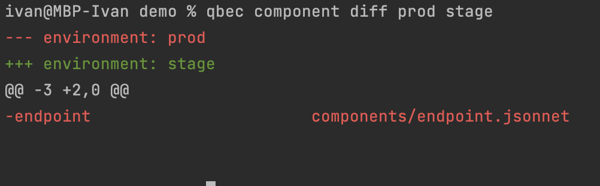

# Домашнее задание к занятию "13.5 поддержка нескольких окружений на примере Qbec"
Приложение обычно существует в нескольких окружениях. Для удобства работы следует использовать соответствующие инструменты, например, Qbec.

## Задание 1: подготовить приложение для работы через qbec
Приложение следует упаковать в qbec. Окружения должно быть 2: stage и production. 

Требования:
* stage окружение должно поднимать каждый компонент приложения в одном экземпляре;
* production окружение — каждый компонент в трёх экземплярах;
* для production окружения нужно добавить endpoint на внешний адрес.

---

### Как оформить ДЗ?

Выполненное домашнее задание пришлите ссылкой на .md-файл в вашем репозитории.

---

## Ответ:

### Задание 1:

Создал demo qbec проект
```bash
ivan@MacBook-Pro-Ivan qbec % qbec init demo --with-example
using server URL "https://51.250.93.74:6443" and default namespace "default" for the default environment
wrote demo/params.libsonnet
wrote demo/environments/base.libsonnet
wrote demo/environments/default.libsonnet
wrote demo/components/hello.jsonnet
wrote demo/qbec.yaml
```

Создал неймспейсы
```bash
ivan@MBP-Ivan demo % kubectl create namespace prod
namespace/prod created
ivan@MBP-Ivan demo % kubectl create namespace stage
namespace/stage created
```

Создал qbec project для stage и prod :
- directory qbec project -> [demo](./qbec/demo) 
- Вывод show ```bash qbec show default > out.yaml ``` [out.yaml](./qbec/out.yaml)
- Вывод show ```bash qbec show stage > out_stage.yaml ``` [out_stage.yaml](./qbec/out.yaml)
- Вывод show ```bash qbec show prod > out_prod.yaml ``` [out_prod.yaml](./qbec/out.yaml)

Показываю разницу компонентов между stage и prod
<p align="center">

</p>

Применяю stage qbec
```bash
ivan@MBP-Ivan demo % qbec apply stage
setting cluster to cluster.local
setting context to kubernetes-admin@cluster.local
cluster metadata load took 116ms
5 components evaluated in 5ms

will synchronize 8 object(s)

Do you want to continue [y/n]: y
5 components evaluated in 7ms
create persistentvolumeclaims pvc -n stage (source pvc)
create persistentvolumeclaims pvc-db -n stage (source pvc)
create deployments backend -n stage (source backend)
create deployments frontend -n stage (source frontend)
create statefulsets db -n stage (source statefulset)
create services backend -n stage (source services)
create services db -n stage (source services)
create services frontend -n stage (source services)
server objects load took 1.012s
---
stats:
  created:
  - persistentvolumeclaims pvc -n stage (source pvc)
  - persistentvolumeclaims pvc-db -n stage (source pvc)
  - deployments backend -n stage (source backend)
  - deployments frontend -n stage (source frontend)
  - statefulsets db -n stage (source statefulset)
  - services backend -n stage (source services)
  - services db -n stage (source services)
  - services frontend -n stage (source services)

waiting for readiness of 3 objects
  - deployments backend -n stage
  - deployments frontend -n stage
  - statefulsets db -n stage

  0s    : deployments backend -n stage :: 0 of 1 updated replicas are available
✓ 0s    : statefulsets db -n stage :: 1 new pods updated (2 remaining)
  0s    : deployments frontend -n stage :: 0 of 1 updated replicas are available
✓ 0s    : deployments backend -n stage :: successfully rolled out (1 remaining)
✓ 1s    : deployments frontend -n stage :: successfully rolled out (0 remaining)

✓ 1s: rollout complete
command took 4.83s
```

Смотрим что все создалось на stage
```bash
ivan@MBP-Ivan demo % kubectl get po,svc,pv,pvc -o wide -n stage
NAME                           READY   STATUS    RESTARTS   AGE   IP             NODE       NOMINATED NODE   READINESS GATES
pod/backend-85cc4f6cdc-k4t7w   1/1     Running   0          58s   10.233.94.80   worker02   <none>           <none>
pod/db-0                       1/1     Running   0          58s   10.233.69.14   worker01   <none>           <none>
pod/frontend-7f6f4f977-fqfx7   1/1     Running   0          58s   10.233.69.15   worker01   <none>           <none>

NAME               TYPE        CLUSTER-IP      EXTERNAL-IP   PORT(S)    AGE   SELECTOR
service/backend    ClusterIP   10.233.22.122   <none>        9000/TCP   57s   app=backend
service/db         ClusterIP   10.233.22.245   <none>        5432/TCP   56s   app=db
service/frontend   ClusterIP   10.233.41.143   <none>        8000/TCP   56s   app=frontend

NAME                                                        CAPACITY   ACCESS MODES   RECLAIM POLICY   STATUS   CLAIM          STORAGECLASS   REASON   AGE   VOLUMEMODE
persistentvolume/pvc-0a393901-7e35-4e72-8e07-99d3c029ae77   1Gi        RWX            Delete           Bound    stage/pvc-db   nfs                     58s   Filesystem
persistentvolume/pvc-66ed51af-3431-4372-813a-70f1df951153   100Mi      RWX            Delete           Bound    stage/pvc      nfs                     58s   Filesystem

NAME                           STATUS   VOLUME                                     CAPACITY   ACCESS MODES   STORAGECLASS   AGE   VOLUMEMODE
persistentvolumeclaim/pvc      Bound    pvc-66ed51af-3431-4372-813a-70f1df951153   100Mi      RWX            nfs            58s   Filesystem
persistentvolumeclaim/pvc-db   Bound    pvc-0a393901-7e35-4e72-8e07-99d3c029ae77   1Gi        RWX            nfs            58s   Filesystem
```

Применяю prod qbec
```bash
ivan@MBP-Ivan demo % qbec apply prod 
setting cluster to cluster.local
setting context to kubernetes-admin@cluster.local
cluster metadata load took 65ms
6 components evaluated in 4ms

will synchronize 9 object(s)

Do you want to continue [y/n]: y
6 components evaluated in 8ms
update endpoints external-api -n prod (source endpoint)
create persistentvolumeclaims pvc -n prod (source pvc)
create persistentvolumeclaims pvc-db -n prod (source pvc)
create deployments backend -n prod (source backend)
create deployments frontend -n prod (source frontend)
create statefulsets db -n prod (source statefulset)
create services backend -n prod (source services)
create services db -n prod (source services)
create services frontend -n prod (source services)
server objects load took 414ms
---
stats:
  created:
  - persistentvolumeclaims pvc -n prod (source pvc)
  - persistentvolumeclaims pvc-db -n prod (source pvc)
  - deployments backend -n prod (source backend)
  - deployments frontend -n prod (source frontend)
  - statefulsets db -n prod (source statefulset)
  - services backend -n prod (source services)
  - services db -n prod (source services)
  - services frontend -n prod (source services)
  updated:
  - endpoints external-api -n prod (source endpoint)

waiting for readiness of 3 objects
  - deployments backend -n prod
  - deployments frontend -n prod
  - statefulsets db -n prod

  0s    : deployments frontend -n prod :: 0 of 3 updated replicas are available
  0s    : statefulsets db -n prod :: 1 of 3 updated
  0s    : deployments backend -n prod :: 0 of 3 updated replicas are available
  2s    : deployments frontend -n prod :: 1 of 3 updated replicas are available
  3s    : deployments frontend -n prod :: 2 of 3 updated replicas are available
  3s    : deployments backend -n prod :: 1 of 3 updated replicas are available
  3s    : deployments backend -n prod :: 2 of 3 updated replicas are available
✓ 4s    : deployments backend -n prod :: successfully rolled out (2 remaining)
  4s    : statefulsets db -n prod :: 2 of 3 updated
✓ 4s    : deployments frontend -n prod :: successfully rolled out (1 remaining)
✓ 16s   : statefulsets db -n prod :: 3 new pods updated (0 remaining)

✓ 16s: rollout complete
command took 19.77s
```

Смотрим что все создалось на prod
```bash
ivan@MBP-Ivan demo % kubectl get po,svc,pv,pvc -o wide -n prod 
NAME                           READY   STATUS    RESTARTS   AGE   IP               NODE       NOMINATED NODE   READINESS GATES
pod/backend-85cc4f6cdc-6jdsg   1/1     Running   0          50s   10.233.106.144   master01   <none>           <none>
pod/backend-85cc4f6cdc-pbcbc   1/1     Running   0          50s   10.233.69.16     worker01   <none>           <none>
pod/backend-85cc4f6cdc-s7xjb   1/1     Running   0          50s   10.233.94.82     worker02   <none>           <none>
pod/db-0                       1/1     Running   0          50s   10.233.69.18     worker01   <none>           <none>
pod/db-1                       1/1     Running   0          45s   10.233.94.83     worker02   <none>           <none>
pod/db-2                       1/1     Running   0          33s   10.233.106.145   master01   <none>           <none>
pod/frontend-7f6f4f977-2z42q   1/1     Running   0          50s   10.233.94.81     worker02   <none>           <none>
pod/frontend-7f6f4f977-mclct   1/1     Running   0          50s   10.233.106.143   master01   <none>           <none>
pod/frontend-7f6f4f977-zg7zt   1/1     Running   0          50s   10.233.69.17     worker01   <none>           <none>

NAME               TYPE        CLUSTER-IP      EXTERNAL-IP   PORT(S)    AGE   SELECTOR
service/backend    ClusterIP   10.233.35.128   <none>        9000/TCP   50s   app=backend
service/db         ClusterIP   10.233.58.25    <none>        5432/TCP   50s   app=db
service/frontend   ClusterIP   10.233.0.197    <none>        8000/TCP   49s   app=frontend

NAME                                                        CAPACITY   ACCESS MODES   RECLAIM POLICY   STATUS   CLAIM          STORAGECLASS   REASON   AGE     VOLUMEMODE
persistentvolume/pvc-0a393901-7e35-4e72-8e07-99d3c029ae77   1Gi        RWX            Delete           Bound    stage/pvc-db   nfs                     2m39s   Filesystem
persistentvolume/pvc-66ed51af-3431-4372-813a-70f1df951153   100Mi      RWX            Delete           Bound    stage/pvc      nfs                     2m39s   Filesystem
persistentvolume/pvc-6c6a187e-3de6-4d26-8b5f-6ea3a07dff2a   100Mi      RWX            Delete           Bound    prod/pvc       nfs                     51s     Filesystem
persistentvolume/pvc-7b9a782a-4cf4-43ca-b0fe-958e8ee8b432   1Gi        RWX            Delete           Bound    prod/pvc-db    nfs                     50s     Filesystem

NAME                           STATUS   VOLUME                                     CAPACITY   ACCESS MODES   STORAGECLASS   AGE   VOLUMEMODE
persistentvolumeclaim/pvc      Bound    pvc-6c6a187e-3de6-4d26-8b5f-6ea3a07dff2a   100Mi      RWX            nfs            51s   Filesystem
persistentvolumeclaim/pvc-db   Bound    pvc-7b9a782a-4cf4-43ca-b0fe-958e8ee8b432   1Gi        RWX            nfs            50s   Filesystem
```

Проверяем что компонент endpoints есть только в prod namespace
```bash
ivan@MBP-Ivan demo % kubectl get endpoints -n prod                
NAME           ENDPOINTS                                                 AGE
backend        10.233.106.147:9000,10.233.69.19:9000,10.233.94.84:9000   18m
db             10.233.106.145:5432,10.233.69.18:5432,10.233.94.83:5432   18m
external-api   138.197.231.124:443                                       47m
frontend       10.233.106.143:8000,10.233.69.17:8000,10.233.94.81:8000   18m

ivan@MBP-Ivan demo % kubectl get endpoints -n stage
NAME       ENDPOINTS           AGE
backend    10.233.94.80:9000   20m
db         10.233.69.14:5432   20m
frontend   10.233.69.15:8000   20m
```