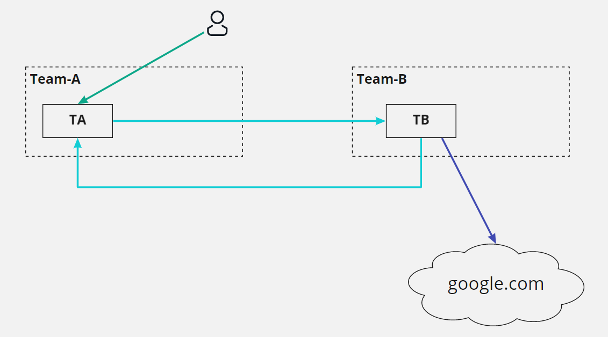
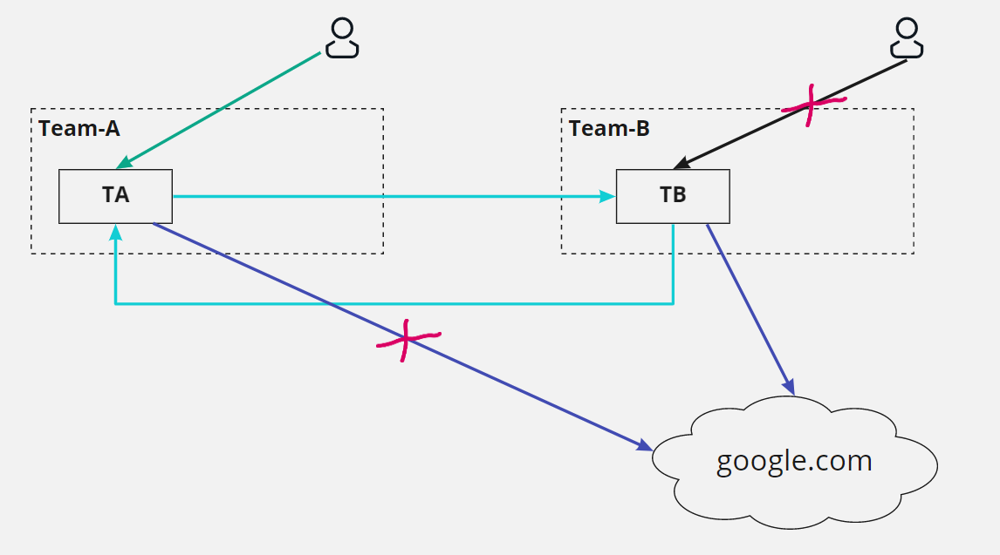

# Домашнее задание к занятию "14.5 SecurityContext, NetworkPolicies"

## Задача 1: Рассмотрите пример 14.5/example-security-context.yml

Создайте модуль

```
kubectl apply -f 14.5/example-security-context.yml
```

Проверьте установленные настройки внутри контейнера

```
kubectl logs security-context-demo
uid=1000 gid=3000 groups=3000
```

## Задача 2 (*): Рассмотрите пример 14.5/example-network-policy.yml

Создайте два модуля. Для первого модуля разрешите доступ к внешнему миру
и ко второму контейнеру. Для второго модуля разрешите связь только с
первым контейнером. Проверьте корректность настроек.

---

## Ответ:

### Задание 1:

Создал модуль и проверил
```bash
ivan@MBP-Ivan 14.05_SecNetwork % kubectl apply -f 14.5/example-security-context.yml
pod/security-context-demo created

ivan@MBP-Ivan 14.05_SecNetwork % kubectl logs security-context-demo
uid=1000 gid=3000 groups=3000
```

### Задание 2:

Повторяем практику предоставленную на лекции

Перезапускаем миникуб для включения калико
```bash
minikube delete
minikube start --cni calico
minikube addons enable ingress
```

Создадим namespace
```bash
ivan@MBP-Ivan 14.05_SecNetwork % kubectl create ns team-a
namespace/team-a created
ivan@MBP-Ivan 14.05_SecNetwork % kubectl create ns team-b
namespace/team-b created
```

Назначим метки
```bash
ivan@MBP-Ivan 14.05_SecNetwork % kubectl label namespace team-a app=team-a
namespace/team-a labeled
ivan@MBP-Ivan 14.05_SecNetwork % kubectl label namespace team-b app=team-b
namespace/team-b labeled
```

Запускаем поды и сервисы -> [app.yaml](./14.5/app.yaml) 
```bash
ivan@MBP-Ivan 14.5 % kubectl apply -f app.yaml
pod/ta created
service/ta created
pod/tb created
service/tb created

ivan@MBP-Ivan 14.5 % kubectl get po,services -o wide -n team-a
NAME     READY   STATUS    RESTARTS   AGE   IP           NODE       NOMINATED NODE   READINESS GATES
pod/ta   1/1     Running   0          22m   172.17.0.6   minikube   <none>           <none>
NAME         TYPE        CLUSTER-IP       EXTERNAL-IP   PORT(S)   AGE   SELECTOR
service/ta   ClusterIP   10.105.209.201   <none>        80/TCP    22m   app=ta

ivan@MBP-Ivan 14.5 % kubectl get po,services -o wide -n team-b
NAME     READY   STATUS    RESTARTS   AGE   IP           NODE       NOMINATED NODE   READINESS GATES
pod/tb   1/1     Running   0          22m   172.17.0.7   minikube   <none>           <none>
NAME         TYPE        CLUSTER-IP     EXTERNAL-IP   PORT(S)   AGE   SELECTOR
service/tb   ClusterIP   10.110.41.86   <none>        80/TCP    22m   app=tb
```

Проверяем трафик между подами и вне
```bash
ivan@MBP-Ivan 14.5 % kubectl exec -it ta -n team-a -- bash
root@ta:/# curl -I tb.team-b 2>/dev/null | head -n 1 | cut -d$' ' -f2
200
root@ta:/# curl -I google.com 2>/dev/null | head -n 1 | cut -d$' ' -f2
301

ivan@MBP-Ivan 14.5 % kubectl exec -it tb -n team-b -- bash
root@tb:/# curl -I ta.team-a 2>/dev/null | head -n 1 | cut -d$' ' -f2
200
root@tb:/# curl -I google.com 2>/dev/null | head -n 1 | cut -d$' ' -f2
301
```

<p align="center">

</p>

Применяем политику и проверяем -> [NetworkPolicy.yaml](./14.5/NetworkPolicy.yaml) 
```bash
ivan@MBP-Ivan 14.5 % kubectl apply -f NetworkPolicy.yaml             
networkpolicy.networking.k8s.io/team-a-egress created
networkpolicy.networking.k8s.io/team-b-ingress created

#Приложение 1(tb)
ivan@MBP-Ivan 14.5 % curl 10.110.41.86
curl: (28) Failed to connect to 10.110.41.86 port 80 after 75005 ms: Operation timed out
ivan@MBP-Ivan 14.5 % kubectl exec -it tb -n team-b -- bash
root@tb:/# curl -I ta.team-a 2>/dev/null | head -n 1 | cut -d$' ' -f2
200
root@tb:/# curl -I google.com 2>/dev/null | head -n 1 | cut -d$' ' -f2
301

#Приложение 2(ta)
ivan@MBP-Ivan 14.5 % kubectl exec -it ta -n team-a -- bash
root@ta:/# curl -I tb.team-b 2>/dev/null | head -n 1 | cut -d$' ' -f2
200
root@ta:/# curl google.com
curl: (28) Connection timed out after 300687 milliseconds
```

<p align="center">

</p>