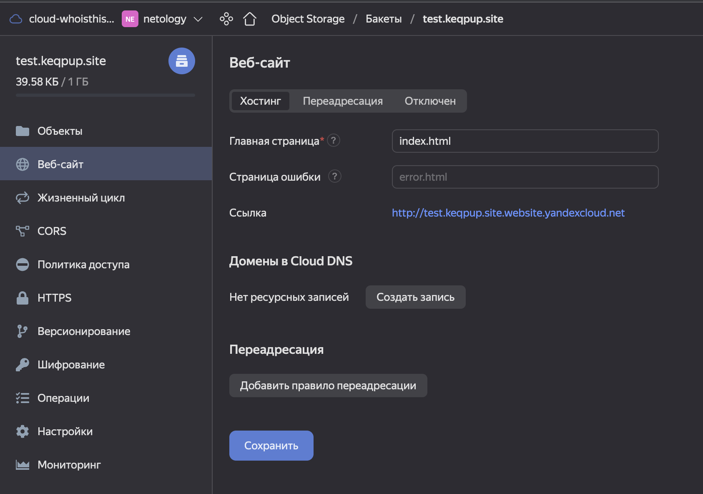
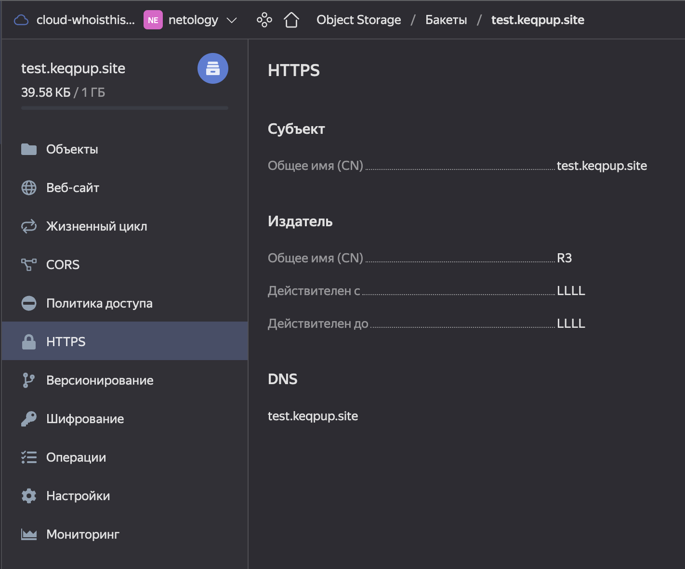
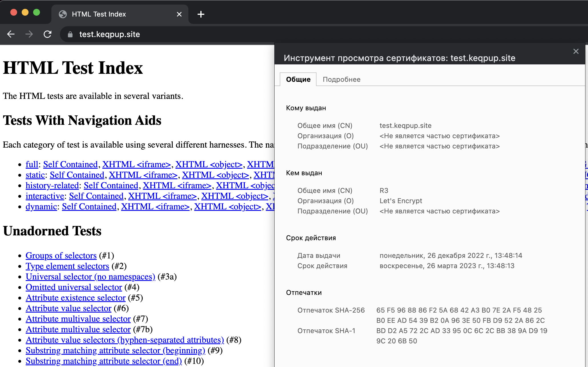

# Домашнее задание к занятию 15.3 "Безопасность в облачных провайдерах"
Используя конфигурации, выполненные в рамках предыдущих домашних заданиях, нужно добавить возможность шифрования бакета.

---
## Задание 1. Яндекс.Облако (обязательное к выполнению)
1. С помощью ключа в KMS необходимо зашифровать содержимое бакета:
- Создать ключ в KMS,
- С помощью ключа зашифровать содержимое бакета, созданного ранее.
2. (Выполняется НЕ в terraform) *Создать статический сайт в Object Storage c собственным публичным адресом и сделать доступным по HTTPS
- Создать сертификат,
- Создать статическую страницу в Object Storage и применить сертификат HTTPS,
- В качестве результата предоставить скриншот на страницу с сертификатом в заголовке ("замочек").

Документация
- [Настройка HTTPS статичного сайта](https://cloud.yandex.ru/docs/storage/operations/hosting/certificate)
- [Object storage bucket](https://registry.terraform.io/providers/yandex-cloud/yandex/latest/docs/resources/storage_bucket)
- [KMS key](https://registry.terraform.io/providers/yandex-cloud/yandex/latest/docs/resources/kms_symmetric_key)

---

<details><summary>Задание 2*. AWS (необязательное к выполнению)</summary>

1. С помощью роли IAM записать файлы ЕС2 в S3-бакет:
- Создать роль в IAM для возможности записи в S3 бакет;
- Применить роль к ЕС2-инстансу;
- С помощью бутстрап скрипта записать в бакет файл web-страницы.
2. Организация шифрования содержимого S3-бакета:
- Используя конфигурации, выполненные в рамках ДЗ на предыдущем занятии, добавить к созданному ранее bucket S3 возможность шифрования Server-Side, используя общий ключ;
- Включить шифрование SSE-S3 bucket S3 для шифрования всех вновь добавляемых объектов в данный bucket.
3. *Создание сертификата SSL и применение его к ALB:
- Создать сертификат с подтверждением по email;
- Сделать запись в Route53 на собственный поддомен, указав адрес LB;
- Применить к HTTPS запросам на LB созданный ранее сертификат.

Resource terraform
- [IAM Role](https://registry.terraform.io/providers/hashicorp/aws/latest/docs/resources/iam_role)
- [AWS KMS](https://registry.terraform.io/providers/hashicorp/aws/latest/docs/resources/kms_key)
- [S3 encrypt with KMS key](https://registry.terraform.io/providers/hashicorp/aws/latest/docs/resources/s3_bucket_object#encrypting-with-kms-key)

Пример bootstrap-скрипта:
```
#!/bin/bash
yum install httpd -y
service httpd start
chkconfig httpd on
cd /var/www/html
echo "<html><h1>My cool web-server</h1></html>" > index.html
aws s3 mb s3://mysuperbacketname2021
aws s3 cp index.html s3://mysuperbacketname2021
```

</details>


---

## Ответ:

### Задание 1:

1. С помощью ключа в KMS необходимо зашифровать содержимое бакета:
- Создать ключ в KMS, -> [kms-key.tf](./yc/kms-key.tf) 
```terraform
resource "yandex_kms_symmetric_key" "key-a" {
  name              = "example-symetric-key"
  description       = "description for key"
  default_algorithm = "AES_128"
  rotation_period   = "8760h" // equal to 1 year
} 
```
- С помощью ключа зашифровать содержимое бакета, созданного ранее -> [storage.tf](./yc/storage.tf) 
```terraform
resource "yandex_storage_bucket" "bucket" {
  access_key = yandex_iam_service_account_static_access_key.sa-static-key-bucket.access_key
  secret_key = yandex_iam_service_account_static_access_key.sa-static-key-bucket.secret_key
  bucket     = "keqpup232"
  acl    = "public-read"
  server_side_encryption_configuration {
    rule {
      apply_server_side_encryption_by_default {
        kms_master_key_id = yandex_kms_symmetric_key.key-a.id
        sse_algorithm     = "aws:kms"
      }
    }
  }
}
```

<br>

2. Создать статический сайт в Object Storage c собственным публичным адресом и сделать доступным по HTTPS

<br>

Делал по данной документации [certificate-manager](https://cloud.yandex.ru/docs/certificate-manager/quickstart/)

1) Создал бакет с именем test.keqpup.site и добавил файл index.html для теста

<p align="center">

</p>

2) Создал сертификат для домена test.keqpup.site

<p align="center">

</p>

3) Создал в DNS две записи
   - СNAME для валидации сертификата
   - CNAME для алиаса бакета

4) Проверяем работу
<p align="center">

</p>


