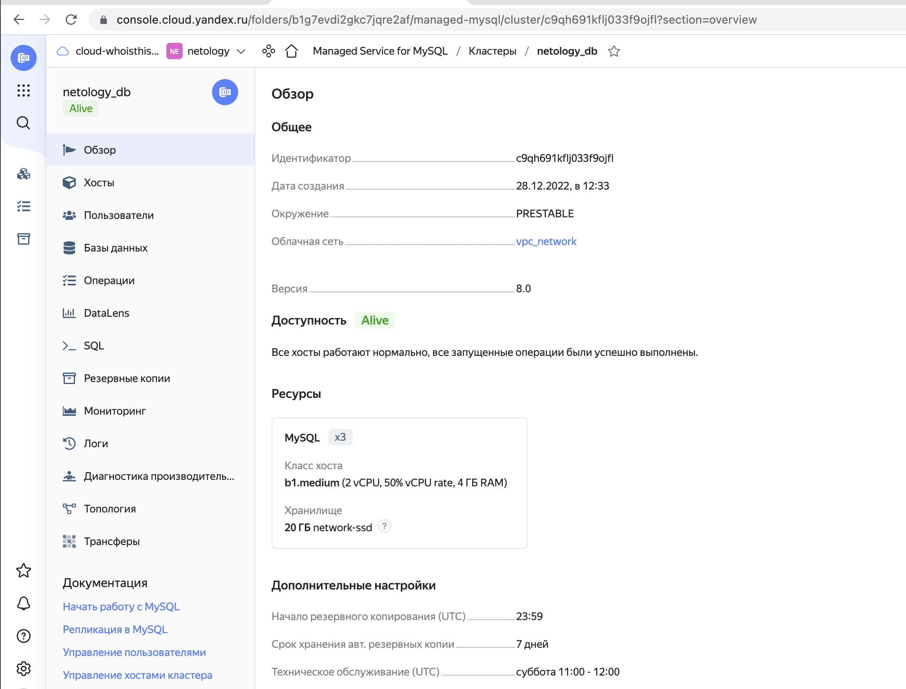
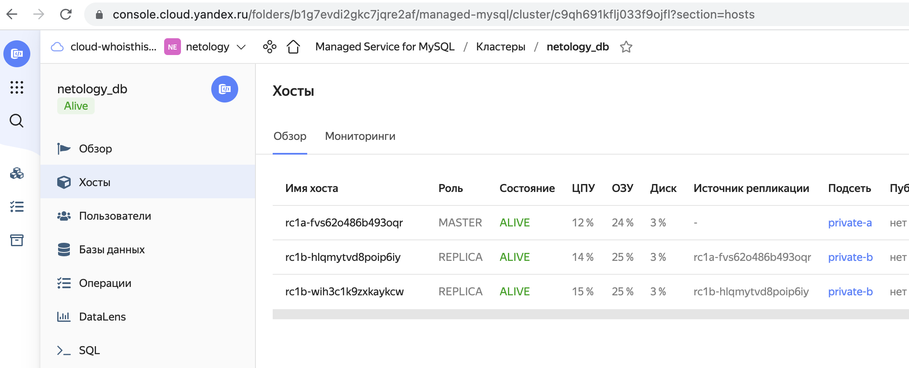
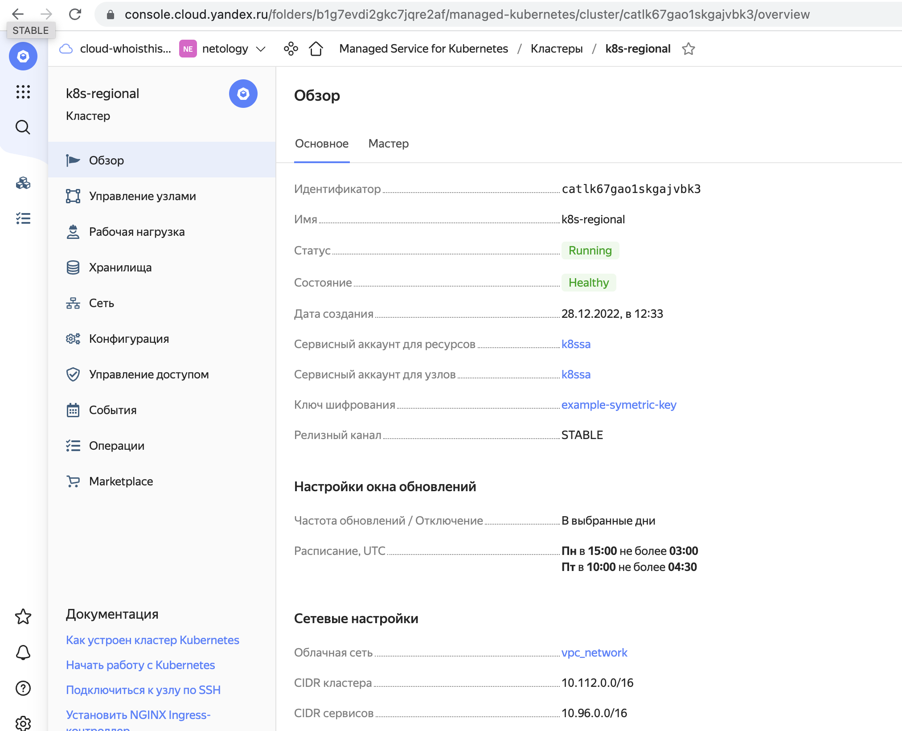
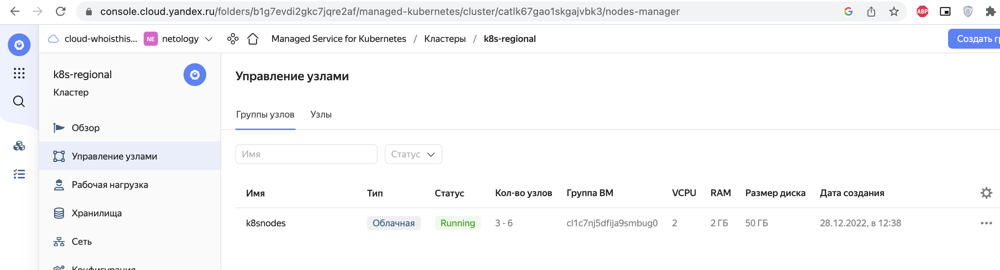
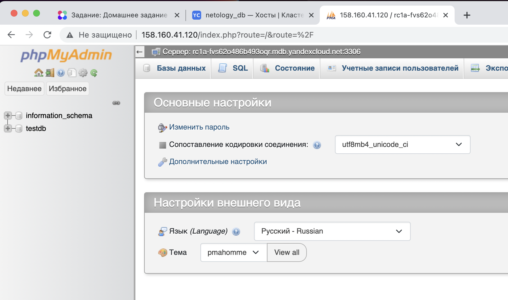

# Домашнее задание к занятию 15.4 "Кластеры. Ресурсы под управлением облачных провайдеров"

Организация кластера Kubernetes и кластера баз данных MySQL в отказоустойчивой архитектуре.
Размещение в private подсетях кластера БД, а в public - кластера Kubernetes.

---
## Задание 1. Яндекс.Облако (обязательное к выполнению)

1. Настроить с помощью Terraform кластер баз данных MySQL:
- Используя настройки VPC с предыдущих ДЗ, добавить дополнительно подсеть private в разных зонах, чтобы обеспечить отказоустойчивость 
- Разместить ноды кластера MySQL в разных подсетях
- Необходимо предусмотреть репликацию с произвольным временем технического обслуживания
- Использовать окружение PRESTABLE, платформу Intel Broadwell с производительностью 50% CPU и размером диска 20 Гб
- Задать время начала резервного копирования - 23:59
- Включить защиту кластера от непреднамеренного удаления
- Создать БД с именем `netology_db` c логином и паролем

2. Настроить с помощью Terraform кластер Kubernetes
- Используя настройки VPC с предыдущих ДЗ, добавить дополнительно 2 подсети public в разных зонах, чтобы обеспечить отказоустойчивость
- Создать отдельный сервис-аккаунт с необходимыми правами 
- Создать региональный мастер kubernetes с размещением нод в разных 3 подсетях
- Добавить возможность шифрования ключом из KMS, созданного в предыдущем ДЗ
- Создать группу узлов состояющую из 3 машин с автомасштабированием до 6
- Подключиться к кластеру с помощью `kubectl`
- *Запустить микросервис phpmyadmin и подключиться к БД, созданной ранее
- *Создать сервис типы Load Balancer и подключиться к phpmyadmin. Предоставить скриншот с публичным адресом и подключением к БД

Документация
- [MySQL cluster](https://registry.terraform.io/providers/yandex-cloud/yandex/latest/docs/resources/mdb_mysql_cluster)
- [Создание кластера kubernetes](https://cloud.yandex.ru/docs/managed-kubernetes/operations/kubernetes-cluster/kubernetes-cluster-create)
- [K8S Cluster](https://registry.terraform.io/providers/yandex-cloud/yandex/latest/docs/resources/kubernetes_cluster)
- [K8S node group](https://registry.terraform.io/providers/yandex-cloud/yandex/latest/docs/resources/kubernetes_node_group)
--- 

<details><summary>Задание 2. Вариант с AWS (необязательное к выполнению)</summary>

1. Настроить с помощью terraform кластер EKS в 3 AZ региона, а также RDS на базе MySQL с поддержкой MultiAZ для репликации и создать 2 readreplica для работы:
- Создать кластер RDS на базе MySQL
- Разместить в Private subnet и обеспечить доступ из public-сети c помощью security-group
- Настроить backup в 7 дней и MultiAZ для обеспечения отказоустойчивости
- Настроить Read prelica в кол-ве 2 шт на 2 AZ.

2. Создать кластер EKS на базе EC2:
- С помощью terraform установить кластер EKS на 3 EC2-инстансах в VPC в public-сети
- Обеспечить доступ до БД RDS в private-сети
- С помощью kubectl установить и запустить контейнер с phpmyadmin (образ взять из docker hub) и проверить подключение к БД RDS
- Подключить ELB (на выбор) к приложению, предоставить скрин

Документация
- [Модуль EKS](https://learn.hashicorp.com/tutorials/terraform/eks)

</details>

---

## Ответ:

### Задание 1. Яндекс.Облако

1. Настроить с помощью Terraform кластер баз данных MySQL:

Файлы:<br>
#### -> [subnet.tf](./yc/subnet.tf)<br>
#### -> [db.tf](./yc/db.tf)

<p align="center">

</p>

<p align="center">

</p>

2. Настроить с помощью Terraform кластер Kubernetes

Файлы:<br>
#### -> [k8s_cluster.tf](./yc/k8s_cluster.tf)<br>
#### -> [k8s_node.tf](./yc/k8s_node.tf)<br>
#### -> [k8s_sa.tf](./yc/k8s_sa.tf)

<p align="center">

</p>

<p align="center">

</p>

После разворачивания терраформом кластера, забираем конфиг файл
```bash
yc managed-kubernetes cluster get-credentials --id catj4c2r4u29b3oi3l8i --external
```

Добавляем репозиторий и устанавливаем под phpmyadmin
```bash
helm repo add bitnami https://charts.bitnami.com/bitnami --force-update
helm install phpmyadmin bitnami/phpmyadmin --set db.host=rc1a-fvs62o486b493oqr.mdb.yandexcloud.net
```

Добавляем сервис типа load-balancer для phpmyadmin -> [load-balancer.yml](./yc/load-balancer.yml)
```bash
kubectl apply -f load-balancer.yml
```

Получаем внешний ip для подключения к базе
```bash
ivan@MBP-Ivan yc % kubectl get service/phpmyadmin
NAME         TYPE           CLUSTER-IP      EXTERNAL-IP      PORT(S)                      AGE
phpmyadmin   LoadBalancer   10.96.243.204   158.160.41.120   80:32581/TCP,443:31478/TCP   38s
```

Результат(на скрине видно базу testdb, после поменял в конфиге на netology_db)
<p align="center">

</p>