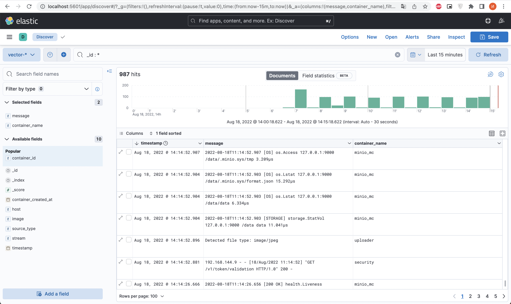
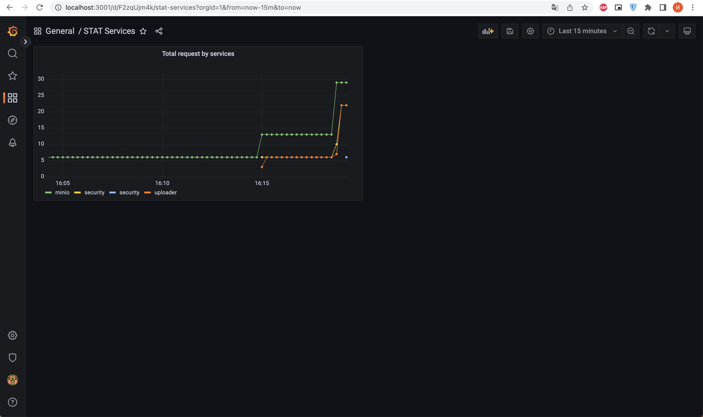

# Домашнее задание к занятию "11.03 Микросервисы: подходы"

Вы работаете в крупной компании, которая строит систему на основе микросервисной архитектуры.
Вам как DevOps специалисту необходимо выдвинуть предложение по организации инфраструктуры, для разработки и эксплуатации.

## Задача 1: Обеспечить разработку

Предложите решение для обеспечения процесса разработки: хранение исходного кода, непрерывная интеграция и непрерывная поставка. 
Решение может состоять из одного или нескольких программных продуктов и должно описывать способы и принципы их взаимодействия.

Решение должно соответствовать следующим требованиям:
- Облачная система;
- Система контроля версий Git;
- Репозиторий на каждый сервис;
- Запуск сборки по событию из системы контроля версий;
- Запуск сборки по кнопке с указанием параметров;
- Возможность привязать настройки к каждой сборке;
- Возможность создания шаблонов для различных конфигураций сборок;
- Возможность безопасного хранения секретных данных: пароли, ключи доступа;
- Несколько конфигураций для сборки из одного репозитория;
- Кастомные шаги при сборке;
- Собственные докер образы для сборки проектов;
- Возможность развернуть агентов сборки на собственных серверах;
- Возможность параллельного запуска нескольких сборок;
- Возможность параллельного запуска тестов;

Обоснуйте свой выбор.

---

*Ответ*

На ум сразу приходят два продукта `Gitlab` и `TeamCity`.

Лучше и проще обслуживать один инструмент, чем несколько разных.

Для данной задачи идеально подходит `Gitlab`, потому что в нем присутствует все выше перечисленное, а к TeamCity придется подключать репозиторий, к примеру Github.

## Задача 2: Логи

Предложите решение для обеспечения сбора и анализа логов сервисов в микросервисной архитектуре.
Решение может состоять из одного или нескольких программных продуктов и должно описывать способы и принципы их взаимодействия.

Решение должно соответствовать следующим требованиям:
- Сбор логов в центральное хранилище со всех хостов обслуживающих систему;
- Минимальные требования к приложениям, сбор логов из stdout;
- Гарантированная доставка логов до центрального хранилища;
- Обеспечение поиска и фильтрации по записям логов;
- Обеспечение пользовательского интерфейса с возможностью предоставления доступа разработчикам для поиска по записям логов;
- Возможность дать ссылку на сохраненный поиск по записям логов;

Обоснуйте свой выбор.

---

*Ответ*

Всем этим требованиям подходит стек ELK.

Данное решение будет достаточно удобным, надёжным и гибким в масштабировании.

## Задача 3: Мониторинг

Предложите решение для обеспечения сбора и анализа состояния хостов и сервисов в микросервисной архитектуре.
Решение может состоять из одного или нескольких программных продуктов и должно описывать способы и принципы их взаимодействия.

Решение должно соответствовать следующим требованиям:
- Сбор метрик со всех хостов, обслуживающих систему;
- Сбор метрик состояния ресурсов хостов: CPU, RAM, HDD, Network;
- Сбор метрик потребляемых ресурсов для каждого сервиса: CPU, RAM, HDD, Network;
- Сбор метрик, специфичных для каждого сервиса;
- Пользовательский интерфейс с возможностью делать запросы и агрегировать информацию;
- Пользовательский интерфейс с возможность настраивать различные панели для отслеживания состояния системы;

Обоснуйте свой выбор.

---

*Ответ*

Данным требованиям подходит связка `Prometheus` и `Grafana`

Prometheus позволит эффективно собирать все необходимые метрики со всех хостов, а так же имеет систему оповещения.

Grafana позволит визуализировать метрики с Prometheus, так же имеет возможность создавать собственные доски.

## Задача 4: Логи * (необязательная)

Продолжить работу по задаче API Gateway: сервисы используемые в задаче пишут логи в stdout. 

Добавить в систему сервисы для сбора логов Vector + ElasticSearch + Kibana со всех сервисов обеспечивающих работу API.

### Результат выполнения: 

docker compose файл запустив который можно перейти по адресу http://localhost:8081 по которому доступна Kibana.
Логин в Kibana должен быть admin пароль qwerty123456

## Задача 5: Мониторинг * (необязательная)

Продолжить работу по задаче API Gateway: сервисы используемые в задаче предоставляют набор метрик в формате prometheus:

- Сервис security по адресу /metrics
- Сервис uploader по адресу /metrics
- Сервис storage (minio) по адресу /minio/v2/metrics/cluster

Добавить в систему сервисы для сбора метрик (Prometheus и Grafana) со всех сервисов обеспечивающих работу API.
Построить в Graphana dashboard показывающий распределение запросов по сервисам.

### Результат выполнения: 

docker compose файл запустив который можно перейти по адресу http://localhost:8081 по которому доступна Grafana с настроенным Dashboard.
Логин в Grafana должен быть admin пароль qwerty123456

---

### Ответ

Конфиг [nginx.conf](../11.02_Principles/services/gateway/nginx.conf)

Конфиг [docker-compose](../11.02_Principles/services/docker-compose.yaml)

Конфиг [grafana](../11.02_Principles/services/grafana/)

Конфиг [kibana](../11.02_Principles/services/kibana/kibana.yml)

Конфиг [prometheus](../11.02_Principles/services/prometheus/prometheus.yml)

Конфиг [vector](../11.02_Principles/services/vector/vector.toml)

---

### Elasticsearch + vector + kibana 

url: http://localhost:5061

login: elastic

pass: qwerty123456

  

---

### Prometheus + Grafana

url: http://localhost:3001

login: admin

pass: qwerty123456

  

