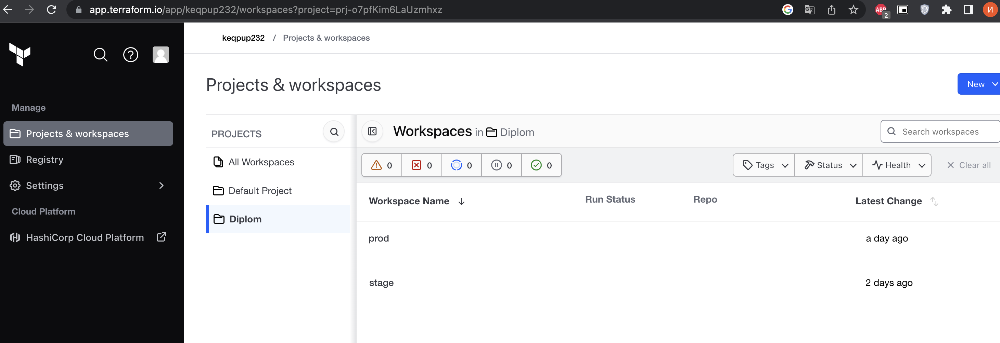
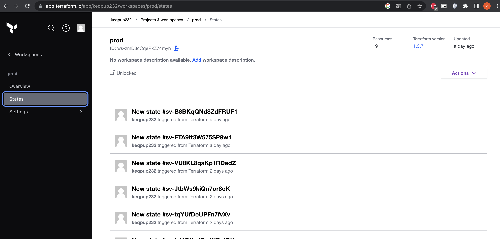
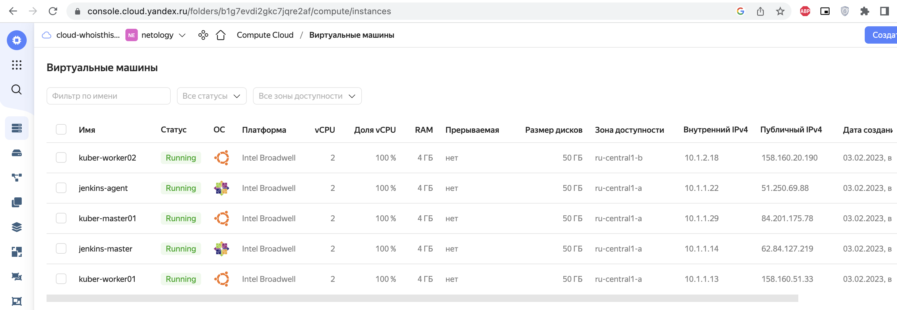
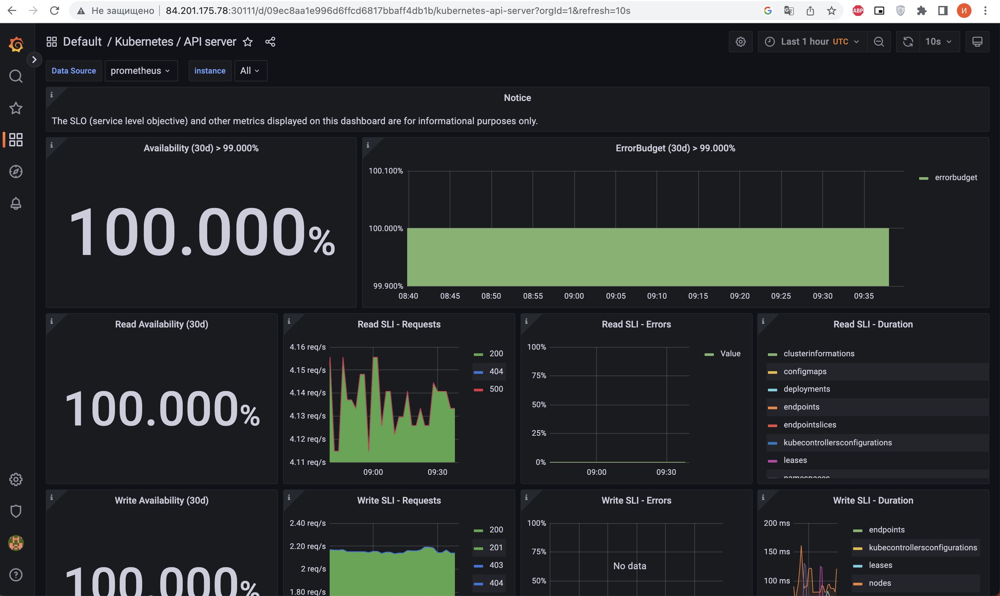
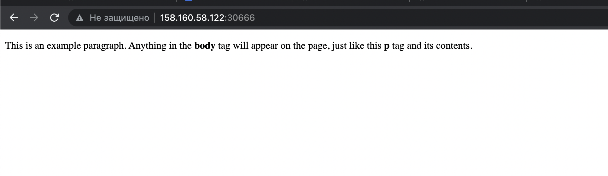
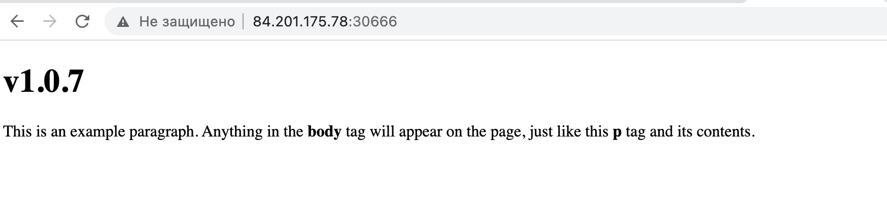

# Дипломный практикум в Yandex.Cloud
  * [Цели:](#цели)
  * [Этапы выполнения:](#этапы-выполнения)
     * [Создание облачной инфраструктуры](#создание-облачной-инфраструктуры)
     * [Создание Kubernetes кластера](#создание-kubernetes-кластера)
     * [Создание тестового приложения](#создание-тестового-приложения)
     * [Подготовка cистемы мониторинга и деплой приложения](#подготовка-cистемы-мониторинга-и-деплой-приложения)
     * [Установка и настройка CI/CD](#установка-и-настройка-cicd)

---
## Цели:

1. Подготовить облачную инфраструктуру на базе облачного провайдера Яндекс.Облако.
2. Запустить и сконфигурировать Kubernetes кластер.
3. Установить и настроить систему мониторинга.
4. Настроить и автоматизировать сборку тестового приложения с использованием Docker-контейнеров.
5. Настроить CI для автоматической сборки и тестирования.
6. Настроить CD для автоматического развёртывания приложения.

---
## Этапы выполнения:


### Создание облачной инфраструктуры

Для начала необходимо подготовить облачную инфраструктуру в ЯО при помощи [Terraform](https://www.terraform.io/).

Особенности выполнения:

- Бюджет купона ограничен, что следует иметь в виду при проектировании инфраструктуры и использовании ресурсов;
- Следует использовать последнюю стабильную версию [Terraform](https://www.terraform.io/).

```textmate
ivan@MacBook-Pro-Ivan yc % terraform -version
Terraform v1.3.7
on darwin_arm64
+ provider registry.terraform.io/yandex-cloud/yandex v0.84.0
```

Предварительная подготовка к установке и запуску Kubernetes кластера.

1. Создайте сервисный аккаунт, который будет в дальнейшем использоваться Terraform для работы с инфраструктурой с необходимыми и достаточными правами. Не стоит использовать права суперпользователя

```textmate
user: terraform	
group: vpc.admin compute.admin
```

2. Подготовьте [backend](https://www.terraform.io/docs/language/settings/backends/index.html) для Terraform:  
   а. Рекомендуемый вариант: [Terraform Cloud](https://app.terraform.io/)  
   б. Альтернативный вариант: S3 bucket в созданном ЯО аккаунте

```textmate
Использовал Terraform Cloud в роли Local
Your plans and applies occur on machines you control. Terraform Cloud is only used to store and synchronize state.
Необходимо API регистрация почле все стейты будут храниться в Terraform Cloud
```


3. Настройте [workspaces](https://www.terraform.io/docs/language/state/workspaces.html)  
   а. Рекомендуемый вариант: создайте два workspace: *stage* и *prod*. В случае выбора этого варианта все последующие шаги должны учитывать факт существования нескольких workspace.  
   б. Альтернативный вариант: используйте один workspace, назвав его *stage*. Пожалуйста, не используйте workspace, создаваемый Terraform-ом по-умолчанию (*default*).

```textmate
ivan@MacBook-Pro-Ivan yc % terraform workspace list     
  default
* prod
  stage
```

4. Создайте VPC с подсетями в разных зонах доступности.

-> [vpc.tf](./terraform/vpc.tf)  

-> [subnet.tf](./terraform/subnet.tf)  

5. Убедитесь, что теперь вы можете выполнить команды `terraform destroy` и `terraform apply` без дополнительных ручных действий.

```textmate
ivan@MacBook-Pro-Ivan terraform % terraform init
Apply complete! Resources: 7 added, 0 changed, 0 destroyed.
ivan@MacBook-Pro-Ivan terraform % terraform destroy
Destroy complete! Resources: 7 destroyed.
```

6. В случае использования [Terraform Cloud](https://app.terraform.io/) в качестве [backend](https://www.terraform.io/docs/language/settings/backends/index.html) убедитесь, что применение изменений успешно проходит, используя web-интерфейс Terraform cloud.

Terraform cloud screenshot
<p align="center">

</p>

<p align="center">

</p>

Ожидаемые результаты:

1. Terraform сконфигурирован и создание инфраструктуры посредством Terraform возможно без дополнительных ручных действий.
2. Полученная конфигурация инфраструктуры является предварительной, поэтому в ходе дальнейшего выполнения задания возможны изменения.

---
### Создание Kubernetes кластера

На этом этапе необходимо создать [Kubernetes](https://kubernetes.io/ru/docs/concepts/overview/what-is-kubernetes/) кластер на базе предварительно созданной инфраструктуры.   Требуется обеспечить доступ к ресурсам из Интернета.

Это можно сделать двумя способами:

1. Рекомендуемый вариант: самостоятельная установка Kubernetes кластера.  
   а. При помощи Terraform подготовить как минимум 3 виртуальных машины Compute Cloud для создания Kubernetes-кластера. Тип виртуальной машины следует выбрать самостоятельно с учётом требовании к производительности и стоимости. Если в дальнейшем поймете, что необходимо сменить тип инстанса, используйте Terraform для внесения изменений.  
   б. Подготовить [ansible](https://www.ansible.com/) конфигурации, можно воспользоваться, например [Kubespray](https://kubernetes.io/docs/setup/production-environment/tools/kubespray/)  
   в. Задеплоить Kubernetes на подготовленные ранее инстансы, в случае нехватки каких-либо ресурсов вы всегда можете создать их при помощи Terraform.
2. Альтернативный вариант: воспользуйтесь сервисом [Yandex Managed Service for Kubernetes](https://cloud.yandex.ru/services/managed-kubernetes)  
  а. С помощью terraform resource для [kubernetes](https://registry.terraform.io/providers/yandex-cloud/yandex/latest/docs/resources/kubernetes_cluster) создать региональный мастер kubernetes с размещением нод в разных 3 подсетях      
  б. С помощью terraform resource для [kubernetes node group](https://registry.terraform.io/providers/yandex-cloud/yandex/latest/docs/resources/kubernetes_node_group)
  
Ожидаемый результат:

1. Работоспособный Kubernetes кластер.
2. В файле `~/.kube/config` находятся данные для доступа к кластеру.
3. Команда `kubectl get pods --all-namespaces` отрабатывает без ошибок.

Разворачивается Kubernetes кластер из машин Compute Cloud и Ansible

-> [main.tf](./terraform/main.tf)

-> [locals.tf](./terraform/locals.tf)

-> [Ansible](./playbook/)

После отработки terraform генерируются inventory для jenkins и kuberspray, так же скрипт для дальнейшей установки.
Скрипт с помощью ansible установить Jenkins и Kubernetes кластер.
```bash
cd terraform
terraform apply
./playbook/kuber/inventory/install
```

<p align="center">

</p>

```bash
ivan@MacBook-Pro-Ivan app % kubectl get pods --all-namespaces
NAMESPACE     NAME                                       READY   STATUS    RESTARTS      AGE
kube-system   calico-kube-controllers-75748cc9fd-zmr6x   1/1     Running   0             42h
kube-system   calico-node-j4pkr                          1/1     Running   1 (42h ago)   42h
kube-system   calico-node-mjfgq                          1/1     Running   0             42h
kube-system   calico-node-n7dvm                          1/1     Running   0             42h
kube-system   coredns-588bb58b94-c69q5                   1/1     Running   0             42h
kube-system   coredns-588bb58b94-mv8qx                   1/1     Running   0             42h
kube-system   dns-autoscaler-5b9959d7fc-qgsvj            1/1     Running   0             42h
kube-system   kube-apiserver-master01                    1/1     Running   1 (42h ago)   43h
kube-system   kube-controller-manager-master01           1/1     Running   2 (42h ago)   43h
kube-system   kube-proxy-7pmsl                           1/1     Running   0             42h
kube-system   kube-proxy-8jrfb                           1/1     Running   0             42h
kube-system   kube-proxy-smzx5                           1/1     Running   0             42h
kube-system   kube-scheduler-master01                    1/1     Running   2 (42h ago)   43h
kube-system   nginx-proxy-worker01                       1/1     Running   0             42h
kube-system   nginx-proxy-worker02                       1/1     Running   0             42h
kube-system   nodelocaldns-28fwv                         1/1     Running   0             42h
kube-system   nodelocaldns-76hdc                         1/1     Running   0             42h
kube-system   nodelocaldns-stqz7                         1/1     Running   0             42h
monitoring    alertmanager-main-0                        2/2     Running   0             42h
monitoring    alertmanager-main-1                        2/2     Running   0             42h
monitoring    alertmanager-main-2                        2/2     Running   1 (42h ago)   42h
monitoring    blackbox-exporter-6fd586b445-ptcx6         3/3     Running   0             42h
monitoring    grafana-9f58f8675-52fz4                    1/1     Running   0             42h
monitoring    kube-state-metrics-66659c89c-2b48m         3/3     Running   0             42h
monitoring    node-exporter-4hzqn                        2/2     Running   0             42h
monitoring    node-exporter-6qpbf                        2/2     Running   0             42h
monitoring    node-exporter-smgq8                        2/2     Running   0             42h
monitoring    prometheus-adapter-757f9b4cf9-mwk5r        1/1     Running   0             42h
monitoring    prometheus-adapter-757f9b4cf9-wzrn6        1/1     Running   0             42h
monitoring    prometheus-k8s-0                           2/2     Running   0             42h
monitoring    prometheus-k8s-1                           2/2     Running   0             42h
monitoring    prometheus-operator-776c6c6b87-k57rq       2/2     Running   0             42h
prod          demoapp-66b8f988f6-jnd4g                   1/1     Running   0             24h
prod          demoapp-66b8f988f6-lp959                   1/1     Running   0             24h
```

---

### Создание тестового приложения

Для перехода к следующему этапу необходимо подготовить тестовое приложение, эмулирующее основное приложение разрабатываемое вашей компанией.

Способ подготовки:

1. Рекомендуемый вариант:  
   а. Создайте отдельный git репозиторий с простым nginx конфигом, который будет отдавать статические данные.  
   б. Подготовьте Dockerfile для создания образа приложения.  
2. Альтернативный вариант:  
   а. Используйте любой другой код, главное, чтобы был самостоятельно создан Dockerfile.

Ожидаемый результат:

1. Git репозиторий с тестовым приложением и Dockerfile.
2. Регистр с собранным docker image. В качестве регистра может быть DockerHub или [Yandex Container Registry](https://cloud.yandex.ru/services/container-registry), созданный также с помощью terraform.

-> [Github](https://github.com/keqpup232/app-diplom)

-> [Dockerhub](https://hub.docker.com/repository/docker/keqpup232/nginx/general)

test build
```bash
docker build -t nginx .
docker buildx build --platform linux/amd64 -f ./Dockerfile -t nginx .
docker tag nginx keqpup232/nginx:v1.0.0
docker push keqpup232/nginx:v1.0.0
docker run --name nginxv1.0.0 -d -p 80:80 keqpup232/nginx:v1.0.0
```

---
### Подготовка cистемы мониторинга и деплой приложения

Уже должны быть готовы конфигурации для автоматического создания облачной инфраструктуры и поднятия Kubernetes кластера.  
Теперь необходимо подготовить конфигурационные файлы для настройки нашего Kubernetes кластера.

Цель:
1. Задеплоить в кластер [prometheus](https://prometheus.io/), [grafana](https://grafana.com/), [alertmanager](https://github.com/prometheus/alertmanager), [экспортер](https://github.com/prometheus/node_exporter) основных метрик Kubernetes.
2. Задеплоить тестовое приложение, например, [nginx](https://www.nginx.com/) сервер отдающий статическую страницу.

Рекомендуемый способ выполнения:
1. Воспользовать пакетом [kube-prometheus](https://github.com/prometheus-operator/kube-prometheus), который уже включает в себя [Kubernetes оператор](https://operatorhub.io/) для [grafana](https://grafana.com/), [prometheus](https://prometheus.io/), [alertmanager](https://github.com/prometheus/alertmanager) и [node_exporter](https://github.com/prometheus/node_exporter). При желании можете собрать все эти приложения отдельно.
2. Для организации конфигурации использовать [qbec](https://qbec.io/), основанный на [jsonnet](https://jsonnet.org/). Обратите внимание на имеющиеся функции для интеграции helm конфигов и [helm charts](https://helm.sh/)
3. Если на первом этапе вы не воспользовались [Terraform Cloud](https://app.terraform.io/), то задеплойте в кластер [atlantis](https://www.runatlantis.io/) для отслеживания изменений инфраструктуры.

Альтернативный вариант:
1. Для организации конфигурации можно использовать [helm charts](https://helm.sh/)

Ожидаемый результат:
1. Git репозиторий с конфигурационными файлами для настройки Kubernetes.
2. Http доступ к web интерфейсу grafana.
3. Дашборды в grafana отображающие состояние Kubernetes кластера.
4. Http доступ к тестовому приложению.

Устанавливаем мониторинг [kube-prometheus](https://github.com/prometheus-operator/kube-prometheus), после клона репозитория необходимо поменять два манифеста

-> [grafana-networkPolicy.yaml](./kuber/manifest/grafana-networkPolicy.yaml)

-> [grafana-service.yaml](./kuber/manifest/grafana-service.yaml)

```bash
cd kuber
git clone https://github.com/prometheus-operator/kube-prometheus.git
cd kube-prometheus
#need change manifest
kubectl apply --server-side -f manifests/setup
kubectl wait \
	--for condition=Established \
	--all CustomResourceDefinition \
	--namespace=monitoring
kubectl apply -f manifests/
```

После apply grafana доступен по адресу: http://84.201.175.78:30111/
<br>
login: admin
<br>
pass: adm123

<p align="center">

</p>

Применяем неймспейсы и деплоим тестовое приложение через конфигурацию qbec

-> [namespaces.yml](./kuber/manifest/namespaces.yml)

-> [qbec](./kuber/qbec/)

```bash
kubectl apply -f ./kuber/manifest/namespaces.yml
cd ./kuber/qbec/
qbec apply prod
```

Тестовое приложение доступно по адресу: http://84.201.175.78:30666

<p align="center">

</p>

---
### Установка и настройка CI/CD

Осталось настроить ci/cd систему для автоматической сборки docker image и деплоя приложения при изменении кода.

Цель:

1. Автоматическая сборка docker образа при коммите в репозиторий с тестовым приложением.
2. Автоматический деплой нового docker образа.

Можно использовать [teamcity](https://www.jetbrains.com/ru-ru/teamcity/), [jenkins](https://www.jenkins.io/) либо [gitlab ci](https://about.gitlab.com/stages-devops-lifecycle/continuous-integration/)

Ожидаемый результат:

1. Интерфейс ci/cd сервиса доступен по http.
2. При любом коммите в репозиторие с тестовым приложением происходит сборка и отправка в регистр Docker образа.
3. При создании тега (например, v1.0.0) происходит сборка и отправка с соответствующим label в регистр, а также деплой соответствующего Docker образа в кластер Kubernetes.

Ранее был уже развернуть Jenkins, осталось все настроить http://62.84.127.219:8080/login?from=%2F

```bash
->  ssh cloud-user@62.84.127.219
    sudo cat /var/lib/jenkins/secrets/initialAdminPassword
    paste on site
->  install suggested plugins
->  set user and pass [admin/adm123]
->  manage jenkins -> manage nodes and clouds -> master -> config -> number executors [0]
->  in manage nodes -> new node -> add name node [agent] -> Permanent Agent [up] -> create
->  Number of executors [2] -> root folder [/opt/jenkins_agent/] 
->  launch method [Launch agent ssh] -> host [51.250.69.88] -> add cred[user:jenkins ; privat key master]
->  Host key Verification[Known host file] -> SAVE -> Launch agent
```

Надо создать пользователя для подключения и деплоя с Jenkins на мастер ноде kubernetes:
```bash
useradd usrdip
mkdir /home/usrdip
cd /home/usrdip

openssl genrsa -out usrdip.key 2048

openssl req -new -key usrdip.key \
-out usrdip.csr \
-subj "/CN=usrdip"

openssl x509 -req -in usrdip.csr \
-CA /etc/kubernetes/pki/ca.crt \
-CAkey /etc/kubernetes/pki/ca.key \
-CAcreateserial \
-out usrdip.crt -days 500

mkdir .certs && mv usrdip.crt usrdip.key .certs

chown -R usrdip: /home/usrdip/

kubectl config set-credentials usrdip \
--client-certificate=/home/usrdip/.certs/usrdip.crt \
--client-key=/home/usrdip/.certs/usrdip.key

kubectl config set-context usrdip-context \
--cluster=kubernetes --user=usrdip
```

Создадим роль в кластере и привяжем ее к пользователю:

-> [role.yml](./kuber/manifest/role.yml)

-> [role-bind.yml](./kuber/manifest/role-bind.yml)

```bash
kubectl apply -f ./kuber/manifest/role.yml
kubectl apply -f ./kuber/manifest/role-bind.yml
```

На jenkins agent ранее был устанавлен Kubectl осталось настроить ~/.kube/config под пользователем jenkins.
Сертификат и ключ копируем c мастер ноде kubernetes в папку jenkins agent /home/jenkins/.certs/

-> [config](./kuber/manifest/config)

Настраиваем в Github Webhook по адресу http://62.84.127.219:8080/github-webhook/ и тип подключени application/json
Так же добавляем публичные ключи мастера и агента jenkins из id_rsa.pub

Проверяем коннект из jenkins хостов:
```bash
ssh -T git@github.com
ssh-keyscan github.com >> ~/.ssh/known_hosts
```

В Jenkins настраиваем Credentials, доступ к Docker hub и Git репозиторию

При настройки pipline указываем репозиторий приложения и ставим отметку GitHub hook trigger for GITScm polling.

-> [Jenkinsfile](https://github.com/FreeNewMan/demoapp/blob/main/Jenkinsfile) 

Тестируем
```bash
git add .
git tag -a v1.0.7 -m "v1.0.7"
git commit -m "v1.0.7"
git push --atomic app main v1.0.7
```

<p align="center">

</p>

